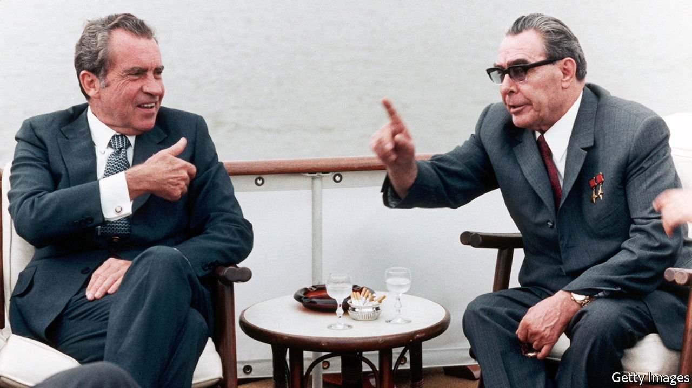

###### Method in the MADness

# A new psychological history of the cold war 

##### Martin Sixsmith gets inside the minds of the leaders—and their populations 

 

> Nov 11th 2021 

The War of Nerves. By Martin Sixsmith. Wellcome Collection; 592 pages; £25. To be published in America in July by Pegasus Books; $35

ON APRIL 25TH 1945 American and Soviet troops, who had swept through Nazi Germany from west and east, met at the Elbe river. A photograph that shows an embrace between two lieutenants was staged, but the sense of comradeship was sincere. “A new atmosphere of friendship and co-operation”, says Martin Sixsmith, “seemed the inevitable outcome of years of toil and shared effort.” It did not last.


Josef Stalin’s cynicism and paranoia, and the tougher line taken by Franklin Roosevelt’s successor, Harry Truman, ensured that the (relatively) good relations at the Yalta conference of February 1945 had soured five months later at Potsdam. There, mutual suspicion and facts on the ground paved the way for the carving up of Europe. The immediate flashpoint was Berlin, which both sides saw as a proving ground for their ideologies and a cockpit for testing the other’s resolve with psychological warfare and dirty tricks. The Soviets could deploy superior conventional forces, but it would be four years before they would have an atom bomb to match America’s. The “war of nerves” became the modus operandi of the cold war.

The term “cold war” was already in use—to describe a new kind of conflict, involving every instrument short of direct military confrontation—when, in April 1950, Truman received a document that became known as NSC-68. Eight months after the Soviet nuclear detonation, it called for a big boost in military spending and the development of the hydrogen bomb. It also framed the contest with the Soviets in Manichean terms: a global trial of strength between slavery and freedom that could be won only by appealing to hearts and minds. It became the template for America’s strategy for the next 40 years.

There have been many histories of the cold war, but the virtue and originality of Mr Sixsmith’s is to see almost every aspect of the stand-off in psychological terms. Deranged Stalin, volatile, bombastic Nikita Khrushchev, plodding, insecure Leonid Brezhnev, Mikhail Gorbachev’s desperate optimism—he sketches the leaders’ states of mind, and the means used to stimulate fear of “the other”. He chronicles the brinkmanship over Berlin and Cuba; the repression of the Hungarian and Czech uprisings; the propaganda and spying; the absurdities of the nuclear arms race and the effect on populations of living with the permanent threat of mutual extinction.

At every point the two sides were intent on demonstrating the superiority of their systems. The Soviet launch of the Sputnik satellite sent shockwaves through Washington; an agreement in 1959 to put on exhibitions in each other’s countries, showcasing economic and social achievements, backfired on Khrushchev when Muscovites were stunned by a gadget-laden American kitchen. Art, film and music were enlisted and exploited. The author, a Russian scholar and journalist who, as the BBC’s Moscow correspondent, covered Mr Gorbachev’s presidency and Boris Yeltsin’s, uses the tools of psychoanalysis to illuminate events and motivations.

He laments the swift dashing of hopes that liberal democracy would take root in post-Soviet Russia. In large part he blames the West (and the elder George Bush in particular) for triumphalism. Trampling over Russian sensibilities and pride, he thinks, helped ensure that the chaotic Yeltsin era gave way to the revanchism of Vladimir Putin and his gang of kleptocratic siloviki. In Mr Sixsmith’s view, such psychological factors have once again contributed to a tragic outcome.

Could the aftermath of the “war of nerves” have been happier? Mr Sixsmith also says that contrasting histories and national psyches would anyway have inclined America and Russia to divergent paths—one animated by the ideas of sturdy individualism and the rule of law, the other defined by autocracy and the collective efforts it demands. For all the differences in the two rivalries, something similar may now be true of America and China. ■

