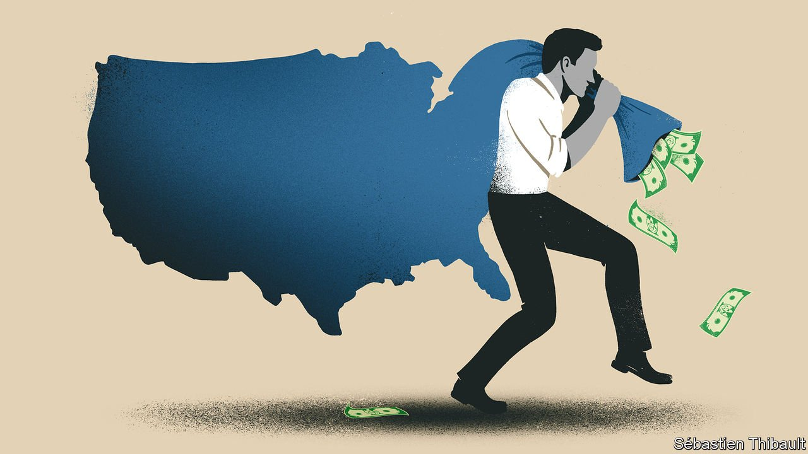

###### Dealing with dirty money

# Two books assess the fight against global corruption 

##### They point fingers at governments and “enablers” in the West 

 

> Nov 13th 2021 

American Kleptocracy. By Casey Michel. St Martin’s Press; 368 pages; $29.99. Scribe; £18.99

The Enablers. By Frank Vogl. Rowman &amp; Littlefield; 216 pages; $32 and £25


NEXT MONTH Joe Biden will host a virtual “Summit for Democracy”. The aim of the pow-wow is to galvanise like-minded leaders to counter the global growth of authoritarianism. One of its themes will be combating kleptocracy: the plunder and laundering of national wealth, typically using international banks as conduits for the ill-gotten gains and Western property markets as a destination. Campaigners hope the meeting will renew momentum in the fight against such looting—a fight Donald Trump did not exactly lead from the front. Leaked documents that highlight the use of offshore financial networks to move money in secret, from the Panama Papers in 2016 to the Pandora Papers this October, underline the urgency of the task.

Measuring the private wealth parked in “secrecy jurisdictions” is, by definition, impossible. Estimates range from a few trillion dollars to $32trn. The proportion that is dodgy is also hard to estimate. At one extreme is perfectly legitimate money—personal funds seeking privacy, or cross-border joint-ventures using offshore structures for the purposes of neutrality. At the other is black cash, stashed in shell companies or trusts to mask corruption or launder drug money. In between is a large grey area that includes legal but ethically dubious tax avoidance.

And where exactly is “offshore”? The stereotypical haven is a palm-fringed island with biddable politicians. Yet bigger states that harrumph at such places have questions to answer, too. The most comprehensive study of shell companies found that providers in members of the OECD, a club of mostly well-off countries, were more likely to offer true anonymity than those in classic offshore financial centres. British shell companies and partnerships feature prominently in giant “laundromat” schemes emanating from Russia and Azerbaijan. Several EU countries are conduits for tax trickery. And much of the world’s dirty money ends up invested in luxury pads in places like London, Paris and Miami.

Casey Michel’s title leaves no doubt where the journalist and fellow of the Hudson Institute, an American think-tank, believes much of the blame lies. For all its claims to moral leadership in finance, he argues, America has become “the world’s greatest offshore haven” and the largest provider of the “financial-secrecy services” that facilitate money-laundering. This has let it pull in unrivalled amounts of tainted cash from “the world’s worst”, from corrupt regimes to extremist networks.

America was one of the first countries to criminalise money-laundering and since the 1980s has been the most aggressive in trying to curb it. It drove efforts to create the Financial Action Task Force (FATF), a global anti-money-laundering standards-setter that was founded in 1989. Since the 9/11 attacks of 2001 it has taken the lead in disrupting terrorist-finance networks. It was an American law that instigated the global exchange of tax data to curb cross-border tax evasion.

Yet at home America tolerated many of the bad practices for which it hammered other countries. As American states competed against each other for corporate registrations, shell companies proliferated in Delaware, Wyoming and Nevada—the last being a crucial bridgehead for Mossack Fonseca, the law firm at the centre of the Panama Papers (and forced to close by those revelations). South Dakota developed a line in super-secretive trusts.

Mr Michel builds his book around two characters, both prolific users of America’s financial-secrecy infrastructure, deftly weaving together their stories and his analysis. The first is Teodoro “Teodorin” Nguema Obiang Mangue, the free-spending son of the president of Equatorial Guinea, a small, klepto-blighted state in central Africa. The other is Ihor Kolomoisky, a Ukrainian oligarch accused by America of stealing billions of dollars from a bank he owned and rinsing them in American property (accusations he denies).

The gloves are on

Mr Obiang’s story is the more lurid, and its outline is more widely known. He made headlines in 2011 when prosecutors moved to seize various assets he had acquired in America with allegedly corrupt money, including a mega-mansion, a fleet of supercars so extensive that he would try to match his ride with his shoes, and a trove of Michael Jackson memorabilia (including the star’s famous white glove). He spent much of his money in and around Malibu, a swanky beach city in California.

Mr Kolomoisky did his alleged laundering in less salubrious places. His representatives swept into Cleveland, Ohio, wowing local officials with talk of regeneration. But much of the city-centre property, once purchased, was left to fall into disrepair. Why let your assets rot? “Think of American real estate as a kleptocratic rainy-day fund,” explains Mr Michel. If money is stolen or illicitly earned, return on investment is secondary. The land beneath a crumbling building retains its value. As Cleveland discovered, this sort of calculus can devastate communities.

The co-founder of Transparency International, an anti-corruption NGO, Frank Vogl distributes blame more broadly in his book. The “enablers” of his title are the banks that move launderers’ money; the lawyers who set up their brass-plate companies or, alongside public-relations firms, fend off prosecutors and the media on the kleptocrats’ behalf; and the estate agents and yacht-dealers who help them procure trophy assets. Much of all this is legal, but, says Mr Vogl, it does not “serve the public interests of citizens in democratic nations, and indeed well beyond”.

Few would argue with that. But Mr Vogl’s book is a mess. Turgid lists of examples seem put together by an overexcited intern, not one of the anti-kleptocracy movement’s wisest coves. It repeatedly veers off-topic, such as in an account of a banking scandal in Italy caused by a derivatives blow-up, not dirty money. It gets some things badly wrong: it is a mystery why Mr Vogl singles out the UAE as one of the countries prioritising the fight against illicit finance, when in reality it remains a foot-dragger. He drops the names of a lot of people in finance, but doesn’t reveal anything very interesting about them. Did you know that the daughter of John Bond, HSBC’s former boss, set mountain-climbing records?

Mr Michel’s book is more fluid, coherent and entertaining. It also has more to say on what is supposed to be Mr Vogl’s big theme. American regulators have long worried about the enablers, but thanks to effective lobbying they have managed to crawl through loophole after loophole. Estate agents, luxury-goods vendors and others, for instance, won “temporary” exemptions from the Patriot Act (a post-9/11 law with strong anti-money-laundering provisions), which then became permanent. American lawyers are pretty much free to work with whomever they want—in many ways “the perfect friend to have if you’re a kleptocrat”, says Mr Michel.

His book has flaws, too. He sometimes gets carried away: the racy details of the Obiang story border on titillation. He devotes only half a dozen pages to Delaware, for so long America’s leading shell-company jurisdiction. He barely scratches the surface of the many ways in which American double standards shape the geopolitics of dirty money, at the FATF and beyond.

Neither book gets to the heart of what is needed to clean up global finance. The nub of the problem is that though money-laundering networks are increasingly sophisticated and transnational, regulation and law enforcement remain balkanised. Mr Biden’s priority at that summit should be to push for more co-operation. ■

