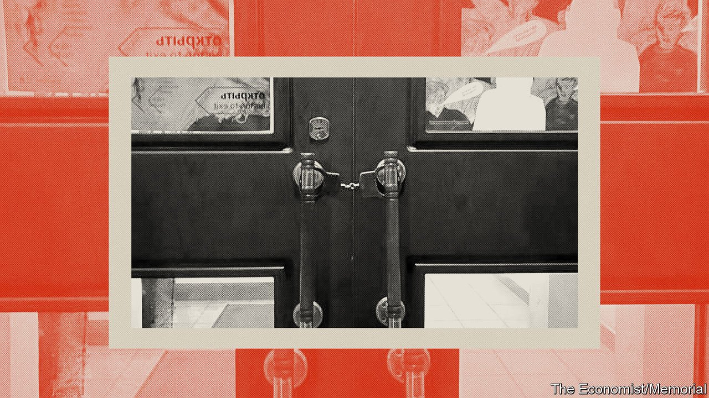
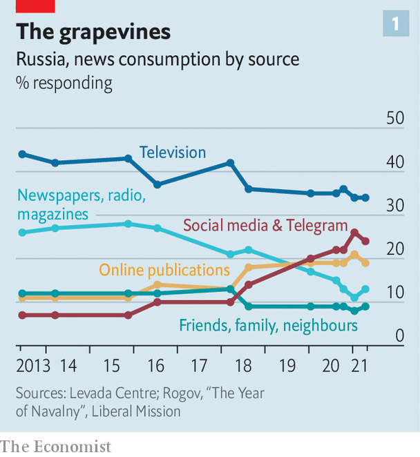
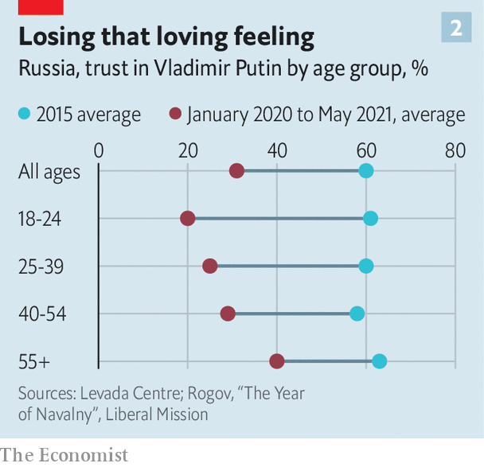
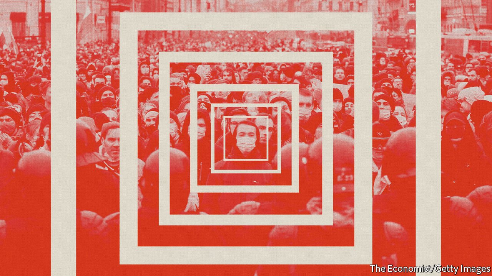

###### Manacled in Moscow

# Vladimir Putin has shifted from autocracy to dictatorship 

##### And Russians across the country are feeling the heat 

 

> Nov 13th 2021 

 On November 11th, after The Economist was published, , the human-rights group mentioned throughout this briefing, announced that Russian prosecutors have demanded it be shut down for violating the “foreign agents” law described in the article.

ON OCTOBER 14TH Twins Garden, in Moscow, was among the first Russian restaurants ever to be recognised with Michelin stars. In celebration it treated guests from the beau monde to magnums of Bollinger alongside its signature “sea urchins with citrus and shiso leaves” and innovative “3D-printed bean ‘squid’ with asparagus and black caviar”. From its rooftop terrace overlooking Pushkin Square guests could marvel at Moscow’s beautifully lit skyline. Below them pedestrians strolled along recently repaved streets lined with cafés and boutique shops, or rushed to catch the new production of “Tosca” at the Bolshoi. Delivery bikes sped back and forth attending to the needs of those staying at home—or stuck in their offices.

The diners might also have made out, less than a kilometre away, the building housing Memorial, Russia’s oldest human-rights organisation, which was at the time being stormed by masked thugs. Dozens of them, accompanied by state TV crews, crashed into a screening of “Mr Jones”, a film by Agnieszka Holland, a Polish director, about the famine Stalin inflicted on Ukraine in the early 1930s. The thugs jumped onto the stage and pumped their fists in the air, shouting “shame”, “fascists” and something about Goebbels. When the police arrived, they used a pair of handcuffs to lock the building’s doors closed, sealing the staff inside until the small hours of the morning.


In 1987, when Memorial was set up to document Stalinist repressions, the state was holding about 200 prisoners of conscience. Today, according to Memorial’s count, Russia has at least 410 political prisoners. On the day the Michelin stars were awarded, Vyacheslav Egorov, an activist involved in protests against a landfill site in a historic town near Moscow, was sentenced to 15 months in prison. A few days earlier, Sergei Zuev, the rector of the Moscow School of Social and Economic Sciences (known as Shaninka), one of the country’s leading independent universities, was taken to a prison cell from his hospital bed; the university faces closure. After being released and undergoing cardiac treatment he was jailed again on November 9th.

On October 27th Gleb Maryasov, a libertarian activist, was sent to a penal colony for ten months for blocking roads during a protest in January. On October 29th, the day on which the victims of Stalin’s repression are commemorated, four Crimean Tatars were sentenced to 12-17 years in jail. Hardly a day goes by without someone being fined, sent to jail, officially deemed “undesirable” or declared a “foreign agent”, as Memorial has been—a distinction which requires targeted organisations and individuals to preface every public utterance, in capital letters, with these exact words in Russian:


The increasing number of political prisoners—there are eight times as many as there were six years ago, according to Memorial—is not a return to Soviet form, as the high life which surrounds the repression bears witness. But the people of late-1930s Berlin would find the mixture of the two quite familiar.

Echoes of that era are also to be found in Russia’s official rhetoric of ressentiment and imperial nationalism. They can be recognised in media images of the male body beautiful, encouraging healthy living, and in laws against homosexual propaganda. They were voiced in a recent speech by Vladimir Putin, Russia’s president, extolling the country’s “spiritual values and historical traditions” and denouncing the decadence of Western liberalism. Mr Putin took the opportunity to praise Ivan Ilyin, a philosopher who in the 1920s embraced Italian fascism as a model for Russia.

Sitting pretty

For much of his rule, Mr Putin was more readily associated with kleptocracy, fakery and cynicism than with a coherent ideology which inserted the state deep into everyday life. During his first decade in power, the 2000s, economic growth—much of it to the benefit of his friends and former KGB colleagues, but significant amounts enjoyed more broadly—provided more or less all the support his regime needed. In his second decade, when growth faded and protests broke out in large cities, nationalist propaganda and anti-Americanism became more prevalent. The annexation of Crimea in 2014 and the war in Ukraine kept people entertained, excited and on-side. There was repression, but Russia’s ruling elite was more interested in wealth than violence. Literary-minded Russians could take comfort in lines from “Letters to a Roman Friend” a poem by Joseph Brodsky: “You are saying procurators are all looters, But I’d rather choose a looter than a slayer.”

Mr Putin’s regime is now rendering that distinction moot. As Alexei Navalny, an opposition leader poisoned in August 2020 and jailed this year, recently wrote from his prison cell: “An official taking a bribe and a policeman pulling a bag over the head of a prisoner tied to a chair are one and the same person. His law is the superiority of the strong over the weak. The superiority of the interests of a corporation over the rights of an individual. The willingness to commit crimes as an act of loyalty.”

Grigory Okhotin of OVD-Info, a media and human-rights organisation that monitors political repression and provides legal help to its victims, notes a shift in the government’s tactics. Once it wanted to contain, and by doing so deter, political threats. Now it wants to eliminate them. Political power has shifted from civilian technocrats to militarised and often uniformed “securocrats” happier with violence. The regime has moved from being a consensual autocracy supported by co-option and propaganda to a dictatorship resting on repression and fear.

This aspect of Mr Putin’s power has deep roots. In 2015 it claimed the life of Boris Nemtsov, a liberal opposition politician. Having warned of the lethal danger of Mr Putin’s corruption he was subjected to a hate campaign before being shot dead on a bridge next to the Kremlin. But since the summer of 2020 it has been applied more widely. According to a poll by the Levada Centre, also a “foreign agent”, the fear of repression, now shared by 52% of Russia’s population, and of state violence (58%), are at all-time historic peaks, trumping the fear of losing a job, falling into poverty or being struck by natural disaster.

Politics has been banned. Mr Navalny’s organisation has been crushed and declared “extremist”. His entire team has been forced out of the country; their remaining relatives are harassed and persecuted. The father of Ivan Zhdanov, one of Mr Navalny's right-hand men, was put on trial in October. On November 9th Liliya Chanysheva, a 39-year-old politician who ran one of Mr Navalny’s regional offices, was arrested on a retroactively applied charge of “extremism”. She could face ten years in jail.

Open Russia, a pro-democracy organisation funded by Mikhail Khodorkovsky, a former billionaire once jailed and since exiled, has been declared “undesirable” and forced to close. Its former boss, Andrei Pivovarov, is facing six years in jail for Facebook posts. Thousands are denied the right to stand for election because of real or imagined association with Mr Navalny—as are 9m people (8% of the electorate) with previous criminal records or dual citizenship, according to Golos, an election-monitoring outfit that is also a “foreign agent”.

One example is Violetta Grudina, who once worked for Mr Navalny in Murmansk, an Arctic port, and who is profiled in a film produced by The Economist and Hardcash Productions (see ). After Mr Navalny’s organisation was banned, she decided to stand as an independent candidate in local elections. Her office was vandalised, she was forced into a covid hospital, and then disqualified for being part of an “extremist organisation”.

The crackdown has not been as harsh as some before it. The regime has not used lethal force—at least not in its own name. Many have been allowed—indeed encouraged—to leave the country. This is not a liquidation, nor is it a tyranny built on a cult of personality. Rather it is something cobbled together to retain power in the face of falling popularity and eroded legitimacy. It is similar in kind, if not yet in resistance and violence, to that of Alexander Lukashenko in neighbouring Belarus. It does not thrive on mass mobilisation and hysteria. Its aim is to suppress crowds not excite them. It neither inspires nor requires enthusiasm in the masses.

Maybe this time

Just as well. Mr Putin’s access to the masses is not the easy matter it once was. He was brought to power by television, which then helped him consolidate his control. The public was dependent on the medium that he monopolised. Anything that was not televised did not exist, which was bad news for opposition figures. And that which did not exist could still, when necessary, be televised—as in the case of Ukrainian “fascists” in Crimea.

 


The rise of the smartphone changed all that. By 2018, 80% of the population was using the internet and 82% of 18- to 44-year-olds were watching YouTube. According to a recent report by Liberal Mission, a think-tank, the share of TV, radio and newspapers in overall media consumption has shrunk from 70% to 45% since the mid-2010s, while online sources’ share has grown from 18% to 45% (see chart 1).

In the same period, trust in Mr Putin has fallen from 60% to 30%. In the 2000s members of the younger generation were among Mr Putin’s most loyal supporters. That has now been reversed (see chart 2), and not just because of internet access. The young feel more disgust at corruption, which deprives them of prospects, and have a more positive view of Europe and America. They resent the state’s increasing intrusions into their lives and they value human rights. But the internet has undoubtedly helped cement those feelings and bring together those who feel that way.

 


One way of looking at the change is by comparing the three waves of protest in 2011-12, 2017 and 2019. The protests of 2011-12, the largest up to that time, were a response to elections seen as rigged and to the return of Mr Putin, who had previously switched from president to prime minister, to his previous office. They were political protests spurred by political events.

The next protests of comparable size, in 2017, were triggered by a YouTube video. An account of the corruption of Dmitry Medvedev, Russia’s prime minister at the time, put together by Mr Navalny, was seen by 4.5% of Russians within a couple of weeks, his supporters say, and its claims were heard by three times as many. Mr Medvedev’s approval rating fell by ten percentage points. Encouraged, Mr Navalny called on people to take to the streets, and they did.

In the Liberal Mission report, Kirill Rogov, a political analyst, argues that “The biggest threat to the regime is not the protest itself, but the reaction of society.” On that basis the 2019 protests were the watershed. Barred from standing himself, Mr Navalny nominated allies to run in Moscow’s local elections. When the Kremlin blocked them, people took to the streets and violence ensued. After the 2017 protests, 40% of the public had sided with the police and only 27% with the protesters. In 2019, 41% sympathised with the protesters and condemned the police violence. The Kremlin lost nearly half of its seats on the city council. The protesters had, for the first time, garnered real support.

That did not mean they were winning. Though Mr Navalny had support in Moscow and some other places, only 20% of Russians approved of him. But 80% now knew who he was. One of the key assets of any autocracy—the apparent absence of any alternative—had been lost. The Russian elite started to talk about succession. So Mr Putin changed the constitution to let himself stay in power indefinitely and reinforced that change with repression.

It has been largely a pre-emptive strategy. Many Russians believe Mr Navalny’s videos showing the extent of the regime’s corruption and think him brave, but few are committed to doing anything about the situation. That is how Mr Putin wants to keep it. The difference in the treatment of those arrested during the protests of 2019 and those arrested in protests at the time of Mr Navalny’s return in January is revealing. In 2019, the vast majority were quickly released with a fine, whereas in 2020 roughly half of the 11,000 arrested were held for up to two weeks. More than 130 criminal cases have been launched in the aftermath, according to OVD-Info.


Facial-recognition technology also allowed the police to make arrests weeks or even months after the main protests—a delayed response that adds to the anxieties of all who participated. Mr Okhotin of OVD-Info argues that such anxiety has become an important instrument of oppression in itself. So has the cynicism of jailing protesters during the pandemic for “violating epidemiological restrictions”, in a country where 80,000 people can be gathered into Moscow’s Luzhniki stadium to cheer Mr Putin. If Mr Navalny tried to inspire a sense of agency, the Kremlin wanted to plunge them back into a state of helplessness.

In 2019 Mr Putin signed a “sovereign internet” law which forced internet providers to install special equipment that allows the state to block, filter and slow down websites. Gregory Asmolov, an expert on the internet at King’s College London, says the goal is not to build a Chinese-style firewall but to influence people’s choices. If people don’t know what they are missing, they will not look for it.

The Kremlin has cracked down on “influencers” and independent media outlets that feed interest in politics, while herding web users towards local social-media networks—which happily share information with the security services—and video-hosting platforms that are easy to control. International services are harried with fines and hobbled with slow download and upload speeds, making video sharing almost impossible. Most Russian opposition figures believe that within two years YouTube will not be available in Russia.

Tomorrow belongs to me

For now the Kremlin seems to have succeeded in applying enough repression, and thus generating enough fear of worse to come, to accomplish its needs.But the screw continues to be turned. For one thing, the repression is not limited to achieving the Kremlin’s political aims; those close to Mr Putin are able to use this machinery for their own ends. Mr Zuev’s persecution, for example, appears to be to some extent collateral damage in a fight between a detained former vice-president of Sberbank, Russia’s largest state bank, and Arkady Rotenberg, one of Mr Putin’s closest business associates.

And Russia’s securocrats are not going to pack their bags and go home when they control a significant and growing chunk of public expenditure. More than 10% of the national budget is spent on internal security. There are a third more police and security staff than active-duty soldiers.

 


Mariya Omelicheva of the National War College in Washington, DC, points to another self-perpetuating dynamic: she calls it a “repression trap”. Expanding the role of the security services amplifies the Kremlin’s perception of threat at home and abroad, justifying more repression. As long as the regime relies on the demonisation of foreigners—and “foreign agents”—this trap looks set to keep tightening.

So repression worsens even as resistance is held at bay. Protesters know that the people understand the regime’s corruption. According to a Levada survey, 55% found the picture of Mr Putin’s ostentatious wealth and corruption that Mr Navalny posted to YouTube on his return in January convincing. But they also understand that this in itself will not change things, at least not quickly. Only 17% said that the video changed their opinion of Mr Putin for the worse. And increased comforts provide a palliative for some.

On the eve of the last large protest in April, in a candle-lit Moscow café, members of the liberal intelligentsia sat huddled around small tables, bracing themselves for arrest at a protest the following day. Tatiana Gnedovskaya, an art expert, sang for them. Her normal repertoire is Russian and romantic. On that evening, though, she ended her set instead with night-club songs from 1930s Germany. No one needed to ask why. “We, too, have a sense of dark times coming” she said later, “but we continue to live and enjoy our lives while we can.” ■

