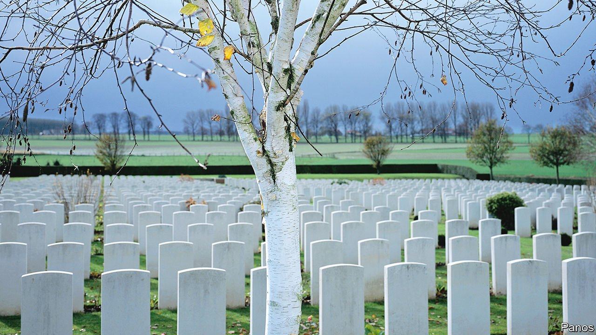

###### They shall not grow old

# Britain used to treat her dead soldiers with disdain. One man changed that 

##### How Fabian Ware transformed the aftermath of war 

 

> Nov 13th 2021 

WHAT MATTERED was the shadow of the sun on the stone. The letters on the gravestones of the Great War should be deep enough and the angle of their engraving sharp enough, the commission on war graves decided, that someone—a mother say, or a father—walking between the rows could read the name of their son at a distance of six feet. Stonemasons struggle to achieve this: a chisel likes its own lean and to go steeper is to struggle against stone. But the commission was adamant. The letters were to be in an identical font, cut at an angle of 60 degrees and to a depth of three-sixteenths of an inch.

The precision is that of a factory: this is mourning, mass-produced. It needed to be, because when the commission was formalised in 1917,there were so many graves. On the first day of the Somme 19,240 British soldiers died; by the war’s end the total was 900,000. More wars added more bodies. Today the Commonwealth War Graves Commission (CWGC), as it is now known, has 1,154,324 graves, from Arras (2,678 in just one cemetery) to Zanzibar (24) and even Timbuktu (two). It has graves in over 150 countries and every continent except Antarctica, corners of foreign fields that are legally forever England, since the CWGC has agreements giving it rights to its cemeteries “in perpetuity”.


When world leaders lay wreaths and stand for two minutes’ silence on Remembrance Sunday, therefore, they stand in places so orderly and so familiar that they feel less invented than inevitable. They were nothing of the kind. Before the first world war, Britain’s treatment of her dead was characterised by contempt. After Waterloo, Wellington’s men—“the scum of the earth” as he called them—were tipped back into the earth to rot. When tourists travelled to the scene, triumph turned to revulsion at the piles of bodies. At the start of the first world war Britain had no system for recording her dead—nor any plan to create one. General Haig called efforts to identify the dead “purely sentimental”.

Mass literacy and mass communication changed all that. News reports had started to chip away at official indifference: it was harder for generals to send brigades charging into the valley of death when war reporters sent back dispatches on the volley of cannon that met them, and the folly of the generals who sent them. It was easier to convince the British public that “dulce et decorum est pro patria mori” without letters from the front giving the details of deaths that were neither dulce nor decorous, and that ended with, in the words of Roland Leighton, “a little pile of sodden grey rags that cover half a skull” and “hideous putrescence”. (The fiancé of Vera Brittain, an early feminist who served with the Voluntary Aid Detachment, Leighton died soon after, aged 20, shot through the stomach on a moonlit night.)

But the efforts of one man were crucial. Fabian Ware, a former journalist, was too old to fight, and went to the front as commander of a Red Cross mobile ambulance unit instead. He quickly realised that there was no system for recording the slaughter. Soldiers had been trying, with pencils and wooden crosses, but official indifference defeated them. Ware set to work.

Walk through a war cemetery on Remembrance Sunday, and Ware’s legacy is around you. By May 1915 his unit had registered 4,300 graves and the commission had gained some official recognition. By 1916 he had sketched a design for the now-iconic double dog-tag: one for the body, one “for the purpose of evidence of death”. By 1917 the empire’s artists were involved. Rudyard Kipling oversaw the wording on the graves. MacDonald Gill produced the font and Edwin Lutyens the design. All should be the same shape—and they should not be crosses, for among the dead were “Jews, Mussulmens, Hindus and men of other creeds” who deserved “equality of honour”. (Religious symbols could be individually engraved afterwards).

This was death standardised and, to an extent, homogenised. In 1917 the commission ruled that graves should be in serried ranks to “carry on the military idea”, to give the impression of soldiers on parade and to ensure equality in death. Its 1,300 staff worldwide go to some lengths to keep the troops in trim. In India, in the rainy season grass is mown twice a week to maintain a military cut. Many of the graves are in Britain, as those who died of their wounds after the war still received a war burial. Walk through London’s Victorian cemeteries and you will spot them, amid the ivy and angels and decay, by the grass of a shorter cut and stones of a brighter white.

The CWGC aims for perpetuity. But time fights back. Moss grows, ivy creeps, rain erodes. The headstones were intended to be eternal: instead, Ozymandias-like, their soft Portland stone turned out to be an object lesson in obsolescence. By the second world war it was already eroding, says Caroline Walker, great-niece and biographer of MacDonald Gill. The CWGC does its best. Enzymes are now deployed to clean moss without eroding the stone further.

To the end, they remain

Stonemasons are sent to re-engrave the irrevocably damaged. Each begins by ruling lines on the grave with a metal ruler and sharp 9H pencil. It is like being back at school, says Alastair Goodall, a CWGC stonemason, when, to practise writing with ink, “you’d rule lines and repeat letters over and over again”. And so in Belgium and Britain and beyond, lines are ruled out, as by a schoolboy, and the names and ages of dead soldiers, many little older than schoolboys themselves, are chiselled deeper into stone. ■

