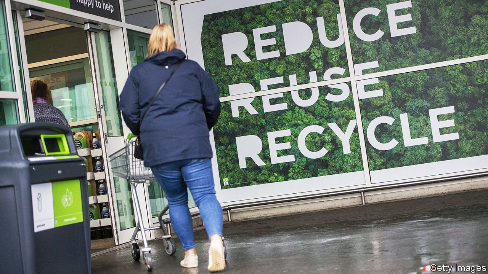
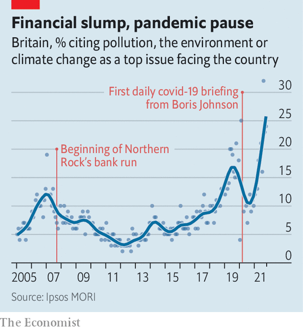

###### Thinking about the environment

# Britons want to prevent climate change, but favour expensive solutions 

##### One in the eye for economists 

 

> Nov 13th 2021 

ONE SIDE-EFFECT of hosting an international climate conference is an outbreak of navel-gazing. As the UN extravaganza in Glasgow nears its end, many opinion polls and studies have appeared, which provide a superbly detailed view of how Britons think about climate change. They reveal a country committed to tackling global warming, but unfortunately drawn to the priciest ways of doing it.

Perhaps sensing that they ought to set a good example for their international guests, Britons have swung firmly behind the view that anthropogenic climate change is both real and alarming. One pollster, Ipsos MORI, finds that 81% believe that an environmental disaster looms unless habits change quickly. Old people’s opinions have changed most dramatically. A series of polls for the Department for Business, Energy and Industrial Strategy reveal that 80% of over-64s are now concerned about climate change, up from 56% in 2012.


Britons have a lot on their minds these days, what with Brexit, covid-19 and inflation. That does not seem to matter. Whereas the financial crisis of 2007-08 was followed by a years-long recession in concern about climate change, the coronavirus pandemic suppressed interest only briefly (see chart). Lorraine Whitmarsh of the University of Bath suggested a decade ago that people have a “finite pool of worry” and that economic concerns had displaced environmental ones. She now thinks that climate change has become a core concern that cannot be pushed out of the pool.

 


What to do about it, though? Unsurprisingly, Britons are keen on climate mitigation policies in the abstract and less keen when they are presented with the probable costs of such policies. But if they must pay, they would rather do so, by a slight margin, through general taxation. Onward, a think-tank, reported on November 8th that 50% of people were prepared to pay higher taxes in order to reduce carbon emissions, whereas 46% would pay higher prices for goods. Low-earners were especially opposed to higher prices.

Politicians amplify this view. Robert Halfon, the Conservative MP for Harlow, has for a decade campaigned successfully against any rise in fuel duty. That probably contributed to the fact that greenhouse-gas emissions from transport fell by just 2% between 2010 and 2019, even as emissions from all sources dropped by 26%. Mr Halfon is not a climate-change denier (“I believe in all of it,” he says). And he supports subsidies for electric vehicles. He merely opposes attempts to reduce demand by raising prices.

Britons are keener still on banning things. Another poll, in August, found that people would prefer policies that restrict the number of flights they can take and the quantity of meat they can eat to policies that increase the price of flying and the price of meat. Sir John Curtice, a psephologist at the University of Strathclyde, and others found that 44% support a ban on powerful vacuum cleaners. The proportion rose to 64% following an online discussion of the issue.

Economists usually favour market-based interventions such as carbon taxes, and disdain measures such as electric-car subsidies because of their inefficiency (some of the money goes to people who would have bought electric cars anyway). But ordinary Britons plainly disagree. Will Tanner of Onward suggests that is because they believe the cost of tackling global warming should be borne by society as a whole, and general taxation strikes them as a good way of achieving that. Blanket bans probably strike a nation inordinately fond of queuing as equitable, too.

This enthusiasm for inefficient ways of reducing greenhouse-gas emissions implies that Britain will end up spending far more than it needs to. That is frustrating. But the polls also suggest that Britons are in one sense ahead of their leaders. Adaptation to climate change has for years been the poor relation of mitigation. It is discussed less and often thought of as something that poorer countries need to do. Speaking at a session on adaptation in Glasgow on November 8th, Anne-Marie Trevelyan, Britain’s trade secretary, touted a fund to assist Asian countries but said nothing about her own.

People seem to have noticed this, and are not happy. In late 2020 Ipsos MORI polled 30 rich and middle-income countries for the energy firm EDF. It found that just 30% of Britons believe that their government has taken measures to reduce the effects of climate change at home, such as building dams—the second-lowest proportion of any country after Italy. Politicians might call that judgment unfair. It would be better if they tried to change people’s minds through their actions.■

For the latest from COP26 see our . For more coverage of climate change, register for , our fortnightly newsletter, or visit our 

