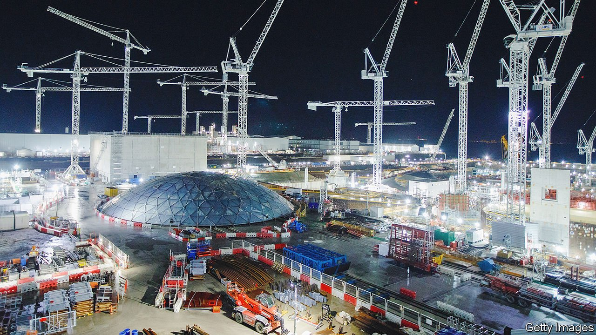

###### Nuclear power

# Can smaller reactors make nuclear power economic? 

##### Rolls-Royce—and Britain’s government—hope so 

 

> Nov 11th 2021 

BRITAIN IS keen on nuclear power—in theory, at least. In 2010 the government gave permission for eight new reactors to be built in England and Wales, as part of its efforts to decarbonise electricity generation. Things have proved harder in practice. A decade later only one—at Hinkley Point on the Somerset coast (pictured)—is being built. It is late and over budget. Construction only began at all because in 2013 ministers committed consumers to paying EDF, the French firm building the plant, a fixed price far above the going rate for its electricity for the first 35 years.

Rolls-Royce, a big engineering firm, thinks it can do better. On November 8th it said it had raised £195m ($263m) from private investors including Exelon Energy, an American firm, and BNF Resources UK, a company backed by the Perrodo family, a French oil dynasty. The money will be used to develop and design a new generation of up to 16 smaller nuclear reactors that Rolls-Royce says will be both cheaper and quicker to build than existing ones, and which it hopes may evolve into a new business line. That will be particularly welcome because its aerospace business suffered badly during the covid-19 pandemic, leading it to cut up to 9,000 jobs.


The private investment was enough to persuade the government to chip in another £210m. Ministers hope that a new round of nuclear power plants will help Britain meet its carbon-cutting goals by providing a steady source of low-carbon power to go with the intermittent electricity generated by wind-farms and solar panels. Rolls-Royce reckons that the first ones could come online by the early 2030s.

Such “small modular reactors” (SMRs) are not a new idea. Countries from China and Russia to America, Canada and France are pursuing the concept. As the name suggests, they are designed to be smaller than most modern nuclear stations. The two reactors at Hinkley Point C, when they are finished, will supply 3.2 gigawatts (GW) of electricity. In summer that would be enough to cover around a tenth of Britain’s electricity demand. Rolls-Royce’s reactors, which are large by SMR standards, will supply 0.47GW each.

Smaller means cheaper. The latest estimate for Hinkley Point C is £23bn. Such a hefty price tag ensures that only the biggest, best-capitalised firms can build nuclear plants. Even then governments must often sweeten the deal. In 2017 the National Audit Office, a spending watchdog, said that EDF’s fixed-price contract might amount to a subsidy of £30bn over the 35 years of the contract. By contrast Rolls-Royce reckons its first few SMRs might cost around £2.2bn apiece. That would put them within reach of smaller firms.

The “modular” part, in turn, refers to how the reactors are constructed. Rather than building a reactor on-site, says Andrew Storer, who runs the Nuclear Advanced Manufacturing Research Centre at the universities of Sheffield and Manchester, the idea is to make as much of the reactor as possible off-site, in factories, before shipping the parts for final assembly.

Rolls-Royce thinks that should make construction faster. It reckons the build time for an SMR could be shaved to three or four years, shortening the time between forking out capital and beginning to earn a return. It also hopes that a combination of factory manufacture and a large production run will allow its engineers to take advantage of economies of scale and learn how to streamline production, just as makers of standardised goods from aircraft to fridges do. It reckons that the cost of later SMRs could fall to around £1.8bn.

 


It all looks good on paper. Rolls-Royce says there is interest from Poland, the Czech Republic and Turkey. Privately, though, even some of those associated with the project concede that history counsels caution. The nuclear industry has promised cheap reactors many times before; so far it has failed to provide them. The price of wind and solar energy, meanwhile, continues to fall.

Ministers, however, may feel they have little choice but to hope that this time really will be different. Britain’s nuclear plants produced 16.5% of its electricity last year. Yet they are mostly old and decrepit: all but one is due to shut by 2030. The country has installed fleets of wind turbines, but unusually calm weather this year has cut output and forced it to rely more heavily on polluting coal and gas-fired power stations, even as the price of natural gas has soared. Electricity bills are rising; carbon emissions from electricity generation, which had been falling for years, have crept back up (see chart).

Nuclear energy, despite its drawbacks, is low-carbon and more dependable than the wind. Its price is little affected by fluctuations in the cost of uranium. Ministers, Rolls-Royce and consumers will hope that a new twist on the idea takes off. ■

