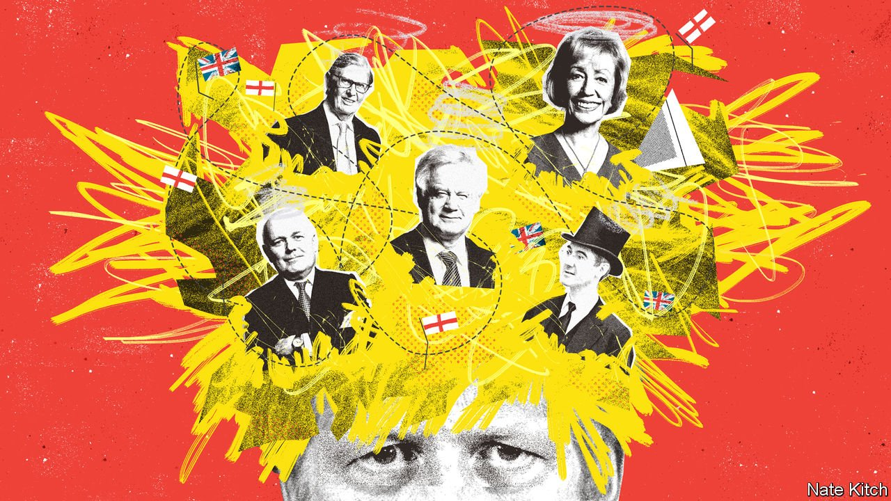

###### Bagehot

# How Boris Johnson’s failure to tackle sleaze among MPs could prove costly 

##### The lessons of the latest parliamentary debacle in Britain 

 

> Nov 10th 2021 

SOME POLITICAL dramas flare up briefly; others redraw the political landscape. The debacle in the House of Commons on November 3rd and 4th, when Boris Johnson tried to tear up the system of parliamentary oversight to prevent the suspension of Owen Paterson, a friend and MP, only to reverse course, looks like the second type. As furious Conservative MPs complained about being treated as cannon fodder, it strained their faith in the prime minister’s judgment and undermined the whips’ authority. It also gave fresh juice to other inquiries into Tory conduct, including Mr Johnson’s recent holiday at a Spanish villa, payment for seats in the House of Lords and the extra-parliamentary legal career of Sir Geoffrey Cox, a former attorney-general who earned £900,000 ($1.2m) in the past year. A YouGov poll after the fateful vote on November 3rd found that a Tory lead of 6% had narrowed to 1%.

Marxist theoreticians argue that, as Hegel put it, beyond a certain point “merely quantitative differences…pass into qualitative changes”. Mr Paterson has stepped down, but for the prime minister the affair may mark the moment when his accumulating errors and U-turns, from getting friends to pay for expensive wallpaper in his residence to changing tack repeatedly on lockdowns, becomes a qualitative shift in public opinion.


Explanations for such a catastrophic misstep range from generous (the prime minister merely wanted to protect a friend and ally) to cynical (he sought to neuter the standards commission before it pronounced on his own actions). But one is particularly compelling: that he was unduly influenced by a clique of ageing Brexiteers. Behind the Paterson debacle stands a group of brothers-in-arms who served shoulder to shoulder in the anti-European trenches for decades. The hard core, Sir Iain Duncan Smith, Sir Bill Cash, David Davis and Sir Bernard Jenkin, were critics of the Maastricht Treaty in the 1990s, “Vote No” warriors under David Cameron, stalwarts of the pro-Brexit European Research Group, self-styled “Spartans” under Theresa May—and champions of Mr Johnson as prime minister.

Dame Andrea Leadsom, who put forward the Paterson amendment, and Jacob Rees-Mogg, who did most to push it through, were too young for the Maastricht wars. But they were there in spirit (the infant Rees-Mogg was educated in Euroscepticism by Sir Bill). Lord (Charles) Moore, a former editor of the Daily Telegraph, also played a pivotal role. He wrote columns in support of Mr Paterson, his friend for 45 years, and organised a dinner at the Garrick Club on November 2nd, at which Mr Johnson was fed pheasant and claret, and brought round to their point of view.

The clique’s victory in the Brexit vote of 2016 has injected a toxic mix of triumphalism and paranoia into the heart of Conservatism. Its members see themselves as possessing a unique connection with the British people, and a rare strategic genius. They think they can achieve anything, as long as they exert sufficient pressure and plot sufficiently thickly. But they also regard themselves as beset by a hostile establishment that seeks to frustrate their will. Lord Moore’s articles are textbook examples of the style. He has argued that the two-year investigation into Mr Paterson “smacks of political revenge”, and that the parliamentary standards committee selectively targeted pro-Brexit MPs while going easy on Remainers. He urged MPs to reject the committee’s sentence as a way of “reasserting the right of voters, not bureaucrats, to decide who should make [the] law and ensure that it works”.

Successful political parties rely on their elders’ accumulated wisdom to stop them making unforced errors. Even Margaret Thatcher, a radical to her fingertips, paid close attention to William Whitelaw, a moderate grandee—thus her immortal dictum that “every prime minister needs a Willie”. But the Brexit wars have removed a generation of “Willies” from the parliamentary party, notably Sir Nicholas Soames, Sir Alan Duncan, Kenneth Clarke, Patrick McLoughlin and Dominic Grieve. Politics has been left in the hands of ageing zealots in the Commons and lightweight technocrats in Downing Street, such as Dan Rosenfield, Mr Johnson’s chief of staff. The zealots appeal to Mr Johnson’s worst trait, a tendency to believe that he is above accountability; the technocrats lack the strength to rein their master in.

Younger MPs were particularly furious about the Paterson mess, not because they are anti-Brexit saboteurs (most were fervently in favour of leaving the EU) but because they resent being treated so cavalierly by people who wouldn’t recognise them in the corridors of Westminster, let alone say hello. The brewing row over extra-parliamentary income sharpens their resentment. To the ageing baby-boomers within the Brexit clique, £100,000 a year may sound like a reasonable second income; to the 2019 intake representing working-class “red wall” constituencies in the Midlands and north of England, it is serious money.

Mr Johnson now needs to break with the Brexit clique. He should stop listening to the likes of Sir Iain and Mr Davis, who are neither wise nor even particularly intelligent. Gargoyles like Mr Rees-Mogg should be cleared out of front-line politics. In their place, the prime minister should assemble a government of all the Tory talents. The brightest and best of the rising generation should be put on the fast track to high office.

They’re not out to get you

Above all, he needs to break decisively with the triumphalist-paranoid mindset. Neither he nor anyone else has the right to force through controversial legislation in the name of some mystical connection with “the people”. Not everyone who resists his actions is plotting to bring Britain back into the EU. The British establishment, by and large, recognises that Brexit is a fait accompli and the great task of the coming decades is to make the best of it. Mr Johnson can still repair the damage of the past week, but only if he takes it as a spur to party renewal. ■

