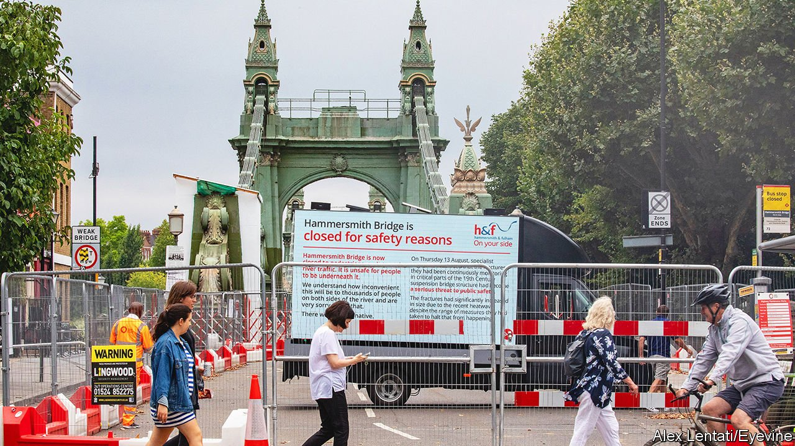

###### Infrastructure in Britain

# London’s bridges are falling down 

##### It is unclear whom to blame—and that is the reason for the problem 

 

> Nov 11th 2021 

IN THE SPRING of 2019 micro-fractures were found in the cast-iron pedestals of Hammersmith Bridge in west London—one of more than 40 Thames river crossings in the capital. It has been closed to cars and buses ever since. That has knock-on effects on the neighbouring Chiswick and Putney bridges, as the 20,000-odd vehicles that used to cross Hammersmith Bridge each day seek other routes.

Cockneys have long joked that north and south London are separate cities, and increasingly they are. Last year Vauxhall and London bridges were closed to car traffic in order to allow repairs. Tower Bridge has closed twice in the past year because its drawbridge was jammed open. Battersea, Kew, Lambeth and Twickenham bridges are expected to need expensive repairs within a decade.


Many of the bridges are old: Hammersmith’s opened in 1887. But they would be in better nick if they had been properly maintained. A report published on November 4th by the London Assembly’s transport committee put the blame on the lack of any single authority responsible for keeping London’s bridges functioning. Dozens of agencies, boroughs and departments share responsibility for their upkeep. As each tries to hand off the burden to others, a maintenance backlog of £241m ($326m) has built up.

Hammersmith and Fulham, the borough north of Hammersmith Bridge, has been responsible for its maintenance since 1985. Even before covid-19 gutted its reserves, it would have struggled to find the £140m or more needed to repair the bridge sufficiently to reopen it to cars and buses (an alternative plan to build a temporary truss and repair the bridge off-site might lower the cost—and be quicker). Nor does it feel much compulsion to do so. Its residents use the bridge less than people living in Richmond upon Thames to the south, says Sarah Olney, the local MP.

The national Department of Transport and Transport for London (TfL) have agreed to split the cost of repairs with the borough in equal parts. But TfL also has a huge budget shortfall, caused by a slump in the use of public transport. The Conservative government in Westminster is more focused on building up infrastructure in northern England, where many of its new voters live, than on repairing a crumbling bridge in an affluent part of London. It might not help that Ms Olney is a Liberal Democrat. In 2019 her predecessor, Zac Goldsmith, a Conservative, claimed that he could get the bridge open if he was re-elected—though that boast was never tested.

A solution is possible. Some of London’s transport authorities already work together informally to ensure that maintenance work does not gum up traffic entirely. The London Assembly’s transport committee recommends formalising that co-operation, and giving the resulting group a budget to take over the repair of bridges. TfL seems open to the idea. But even if this solution is adopted, it could be too late for Hammersmith Bridge.

Build it up with iron bars

Locals fear that the government-led task force meant to be co-ordinating repairs is waiting out the frustration, and that the bridge will never reopen to heavy vehicles. Some have already changed their travel habits. Fabrice Guillon, who owns a café down the street from Hammersmith Bridge, used to drive in every day from Kensington. He has switched to biking. Others have added 15 minutes to their commute, as they walk instead of taking the bus over the bridge to the closest Tube stop, in Hammersmith and Fulham. Older, frailer people must drive over another bridge. Efforts have been made to bring in pedicabs to help. But these too, have been held up by buck-passing and red tape.■

