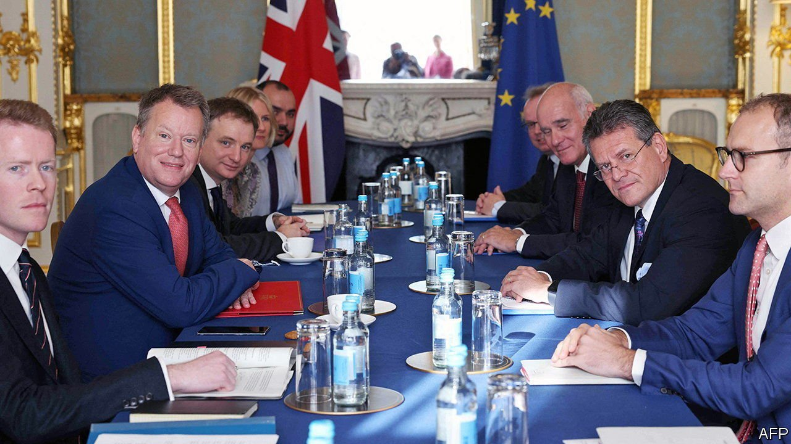

###### Groundhog day

# The Northern Ireland protocol is under threat. Again 

##### Triggering Article 16 would mean testy trade talks—and a risk of no deal 

 

> Nov 13th 2021 

NEGOTIATIONS ON THE Northern Ireland protocol are deadlocked. To avert a hard north-south border with Ireland, it keeps the province (though not Great Britain) in the EU’s single market for goods. But protecting the single market means customs controls on goods crossing the Irish Sea. The European Commission has offered to simplify these controls a great deal, but Britain insists on a total rewrite of the protocol to remove most checks and the authority of the European Court of Justice (ECJ)—demands that the commission has no authority even to discuss.

Diplomats now expect the British government to trigger Article 16 of the protocol within weeks. This permits unilateral “safeguard” measures if the protocol creates “serious economic, societal or environmental difficulties” or diversion of trade. The government says this condition is clearly met, entitling it to invoke Article 16 and take corrective steps. It is seeking fresh legal advice to justify the move.


The EU is preparing to respond to what officials have termed the nuclear option. The impact depends on what happens next. The EU can take “rebalancing” measures, but if Boris Johnson’s government merely extends grace periods for importing chilled foods or plants to Northern Ireland, it may result in little more than lengthy court proceedings. However, if Britain overrides the provisions on customs and the single market, and writes out the ECJ, the EU would respond more forcefully to what it would deem a disproportionate and illegal breach of the treaty.

Simon Coveney, the Irish foreign minister, has suggested that the EU would react by terminating the entire Brexit trade deal. Catherine Barnard, a Cambridge academic who is deputy director of UK in a Changing Europe, a think-tank, says this can be done without offering any reason, but with 12 months’ notice. Many in Brussels claim that formal moves to terminate the deal would be certain to follow the invocation of Article 16—though such warnings are aimed, in part, at discouraging Mr Johnson from pursuing the nuclear option.

This would all take some months. Meanwhile the British government may hope to show that the checks supposedly required to stop leakage into the single market are otiose. Mij Rahman of the Eurasia Group, a consultancy, says this prospect makes many in the EU keen to retaliate more quickly. Possibilities include tariffs on fish and many food exports, as well as on whisky. Britain is not in an easy position to retaliate as it has not yet imposed checks on goods imported from the EU.

Fears of an immediate trade war may be exaggerated. More likely is the opening of tricky negotiations that could last for much of 2022. The protocol would remain formally in place, if not fully applied. The result would be continuing uncertainty for businesses on both sides of the Irish border. Although polls find a majority in the province want the protocol to be maintained if it can be improved, the recent rancour has polarised opinion: most unionists are now against keeping it in any form.

The biggest risk is that, under the threat of terminating the trade deal, Mr Johnson may revert to his atavistic preference for no deal. His team is fostering the delusion that he was forced to accept the protocol by pro-European MPs who tied his hands in the Brexit talks, and by the ineptitude of his predecessor, Theresa May. This skates over the fact that Mr Johnson himself chose to create the border in the Irish Sea, which Mrs May once said no British prime minister could ever accept. He then railroaded the Brexit deal through with the huge majority he won at the end of 2019.

The revived spectre of no deal would be bad for Britain’s fragile economy. But with his popularity dipping amid a sleaze scandal, Mr Johnson may find fighting with the EU politically attractive, even if it casts doubt on his claim to have got Brexit done. Labour’s leader, Sir Keir Starmer, will find it hard to work out a way to respond to such a scenario. And experience has shown that when it comes to Brexit, politics trumps economics—on all sides.■

For more coverage of matters relating to Brexit, visit our 

