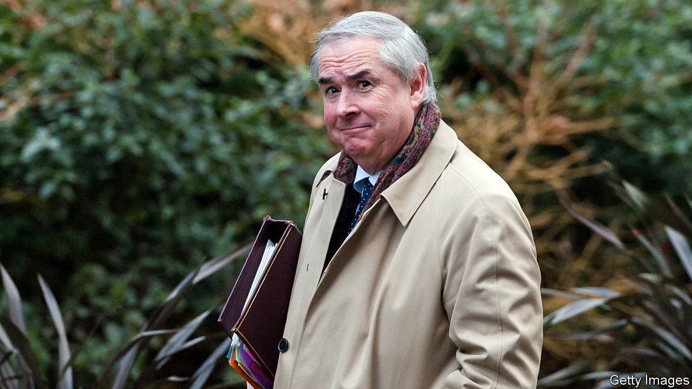

###### A spiralling scandal

# Voters do not want MPs to profit from their job 

##### Under the current rules, they can. Cue controversy 

 

> Nov 11th 2021 

EVERY NOW and again Parliament is embroiled in a scandal over pay. The latest is unusual. By using his position as an MP to advance the interests of extra-parliamentary paymasters, Owen Paterson, a patrician Tory, broke the rules. That is agreed by most, even among those who argue the investigation was mishandled. Yet by drawing attention to the fact that MPs may have second jobs, his case threatens to pull the whole system down.

The problem is that the rules are out of step with public opinion. Parliamentarians are allowed to profit from their position, including by acting as consultants to firms looking for political advice, so long as they declare the income received and do not lobby, as Mr Paterson did. A fifth of MPs have a second job (defined as one which pays regular wages) and two-fifths declare income from some form of extra-parliamentary work. According to a poll by YouGov, 63% of Britons believe no such work should be allowed—let alone jobs that trade on insider knowledge.


Chief among the MPs now in the spotlight is Sir Geoffrey Cox, a former attorney-general, who has been reported to the Committee on Standards in Public Life (CSPL), a watchdog, for defending the British Virgin Islands in a corruption inquiry, apparently from his Westminster office. Daniel Kawczynski, a Conservative MP, has attracted attention because of his work for a mining firm while acting as trade envoy to Mongolia. Sir Iain Duncan Smith, a former Tory leader, has a job at a firm making alcohol-free hand sanitiser—and chaired a task force that recommended clarifying the covid-19 rules on hand sanitiser.

A study published in 2015 found that voters were more sympathetic to work that paid less, of which there is plenty. In the register of members’ financial interests, it is revealed that Douglas Ross, leader of the Scottish Conservatives, received £1,356 ($1,820) for serving as an assistant referee at a Europa League football match between Shakhtar Donetsk and Benfica. Dean Russell, a Tory MP, was paid £750 by Gareth Bacon, a colleague, for a painting. Three MPs earned £960 performing on stage in a “parliamentary rock band” called MP4.

With exceptions—such as Rosena Allin-Khan, a Labour shadow minister who works shifts as a doctor, and Sir Geoffrey Clifton-Brown, a Tory MP and farmer—few MPs have jobs entirely unrelated to politics. Other than fees for media appearances, the most common sources of income involve selling access in ways big and small. Formerly, Labour MPs received trade-union sponsorships and Tories company directorships. But the former dried up in the 1990s, meaning it is Tories who are now more likely to top up their salaries.

Today these activities are outnumbered by a more mundane way of selling insights: filling in surveys. In the most recent register, some 110 MPs declared that they did so, with both parties well represented. These are run by pollsters and commissioned by firms, charities and even other bits of the public sector, and pay MPs to respond. YouGov once described them as a way to find out “what Westminster thinks”. In reality, they are a way to find out what no-mark MPs think; few big names participate. In the recent register, Philip Davies, a Tory backbencher, reports that he spent 12 hours form-filling for a total of £1,525.

Research finds that MPs in safe seats are most likely to take up part-time work. They may soon have fewer options. The CSPL is due to suggest changes to the rules, and the speaker of the House of Commons is expected to back them. One senior Tory MP predicts a tighter definition of what constitutes lobbying, and a ban on jobs where that is the principal purpose. MPs would still have to agree to the changes, but, as he notes, “it is a difficult one to tell your constituents you voted against.” ■

