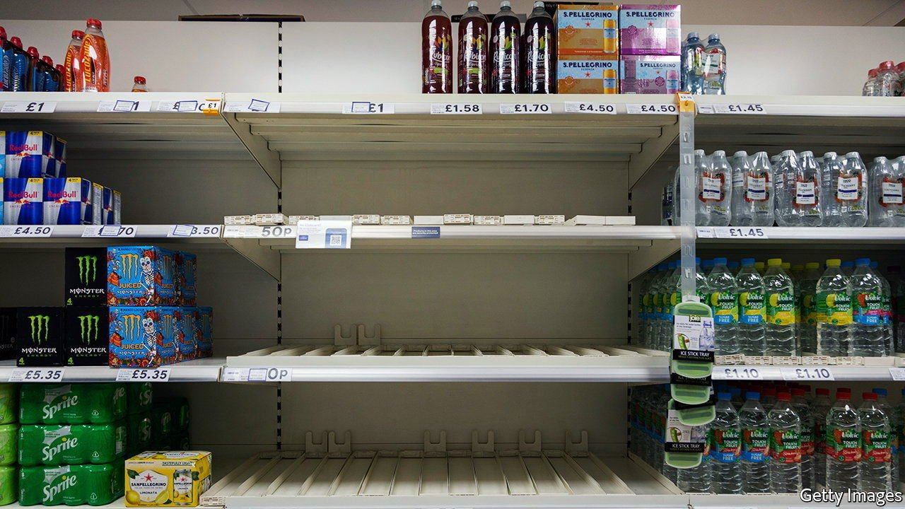
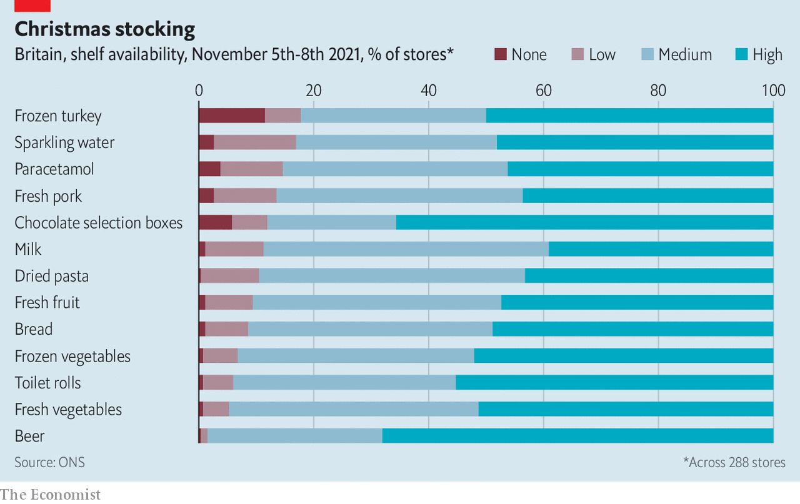

###### Supply chains

# Which products are scarce on Britain’s shelves? 

##### New data published by the Office for National Statistics show patchy problems 

 

> Nov 13th 2021 

Spooked by supply-chain disruptions, the Office for National Statistics has started to monitor supermarket and grocery shops. A survey of 288 stores suggests only patchy problems. Just 5% of sites looked low on fresh vegetables, and 6% on toilet roll. But 12% lacked chocolate selection boxes, 17% sparkling water and 18% frozen turkey.

 


When lorry-drivers are scarce, heavy, low-margin products like bottled water are not a priority. For other products, Christmas stockpiling could be a factor. Sales of frozen poultry in October were up 27% compared with a year ago, according to Kantar, a data firm, and those of Christmas puddings were up by a third. Scattered shortages of paracetamol are probably also related to the season: sales of cough medicine have doubled.

