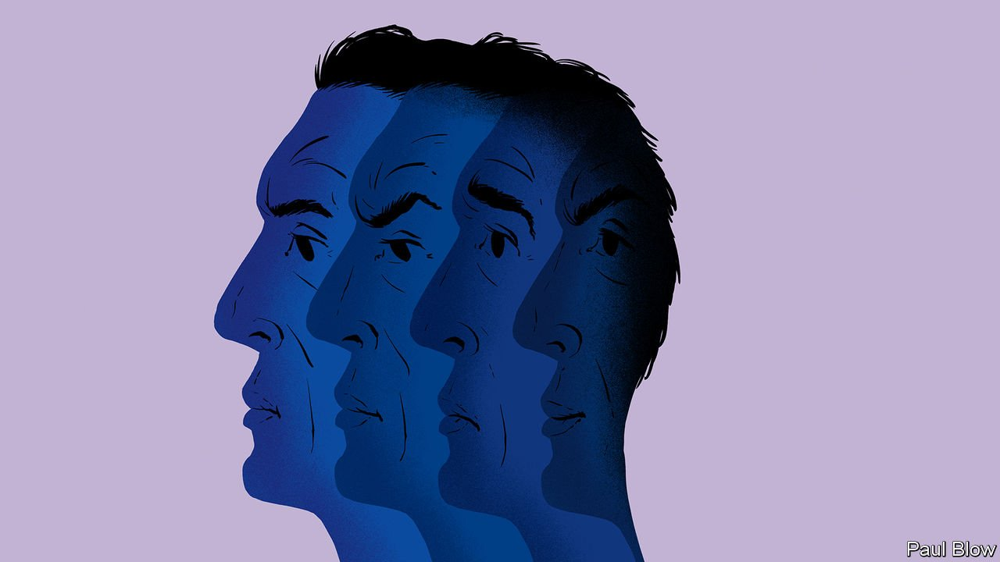

###### Bartleby

# Chief executives are weirder than ever 

##### An impossible job has become even tougher 

 

> Nov 13th 2021 

CELEBRITY BOSSES used to have nicknames that made a virtue of short fuses and brutality. “Chainsaw Al” and “Neutron Jack” sounded more like wrestlers than men in suits. That kind of moniker would jar today. Inclusivity and empathy are what matter: think “Listening Tim” and “Simpatico Satya”. But just because chief executives seem more normal does not mean that they actually are. The demands of the job require an ever-stranger set of characteristics.

In some ways the path to the top of the corporate pyramid is unchanged. It requires people to compete with each other over an extended period. It demands evidence of financial and operational success. It uses the prospect of money—lots of it—as a lever to incentivise ambitious people. And it selects for familiar traits: hard work, impatience, self-confidence and extroversion. If you would rather stay in and watch “The Great British Bake Off” than wine and dine clients, the role is not for you.


A recent study by Steve Kaplan of the University of Chicago and Morten Sorensen of the Tuck School of Business looks at assessments conducted by ghSMART, a consulting firm, of more than 2,600 candidates for different leadership positions. Candidates for CEO jobs emerge as a recognisable type. Across a range of characteristics they have more extreme ratings on average: they shine in what the academics term “general ability”.

They also differ from other executives in the particulars. Where aspiring chief financial officers are more analytical and focus on the detail, would-be CEOs score higher on charisma, on getting things done and on strategic thinking. These traits also seem to be predictive. By tracking the subsequent careers of candidates, the academics find that people who were applying for a different position but had “CEO-like” characteristics were more likely eventually to wind up in the top job.

Yet firms today are after more than a type-A personality. Mr Kaplan and Mr Sorensen note that CEO candidates with better interpersonal skills are more likely to be hired. Another new piece of research, from academics at Imperial College London, Cornell University and Harvard University, analyses the lengthy job descriptions that companies draw up when they work with headhunters to recruit a new leader. Cognitive skills, operational nous and financial knowledge are prerequisites for success. But over the past two decades these descriptions have placed more and more emphasis on social skills—the ability of bosses to co-ordinate and communicate with multiple people.

Why are these softer skills prized? The answer, according to Stephen Hansen of Imperial College, lies partly in the rise of knowledge workers. Firms increasingly depend on developers, data scientists and IT managers who are used to operating independently. Chief executives are not going to tell these kinds of workers what to do; their job is to make sure that people understand the firm’s goals and toil together effectively. Sure enough, the paper shows that demand for these skills goes up in larger and more information-intensive firms. Social skills matter more when bosses need to persuade as much as instruct.

The wider environment also rewards softer skills. Polling by Edelman, a public-relations firm, suggests that majorities of customers and employees make choices on what to buy and where to work based on their beliefs. Chief executives must mollify politicians, respond to activists and dampen social-media firestorms. It helps if the boss comes across as a relatable member of society, not a volcano-dwelling villain.

It is not yet time to call time on old-fashioned narcissism. Another study, by a quartet of researchers at Stanford Graduate School of Business, surveyed 182 directors about the personalities of their chief executives. The answers suggest as many as 18% of bosses are considered narcissists by their own board members, a prevalence rate perhaps three times that of the general American population. The researchers also find that firms with narcissistic CEOs tend to have higher scores for their environmental, social and governance policies. What better way for an egomaniac to come across as empathetic than to save the planet?

The demands on chief executives make for an increasingly strange mixture. Be more talented than others in the firm, but don't tell them what to do. Crush the competition while exuding empathy. Listen charismatically. Be likeably aggressive. CEOs have always been abnormal. The trick now is not to show it.


