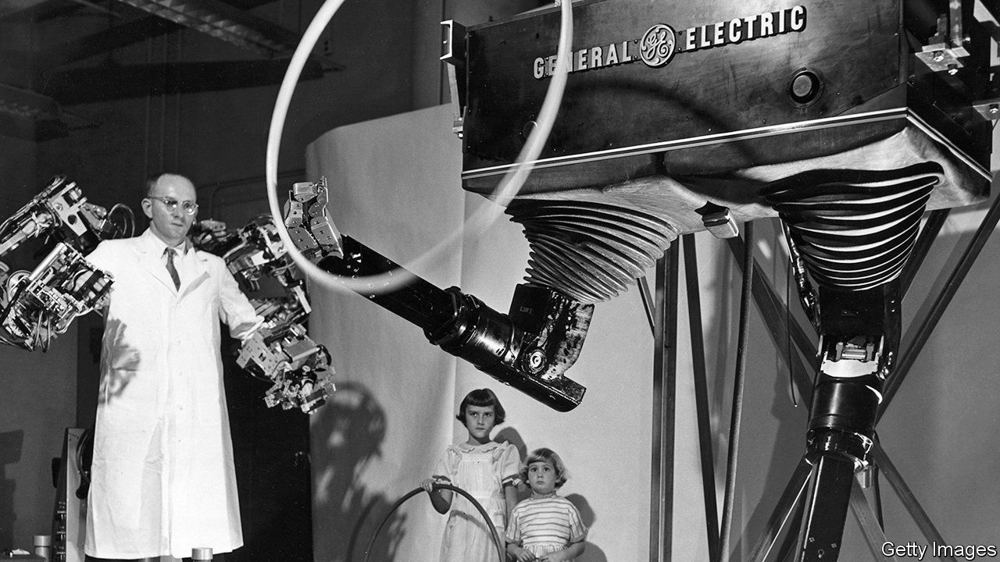
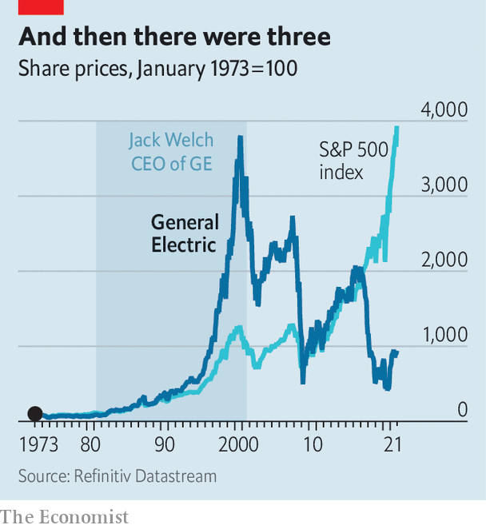

###### Not so general

# General Electric breaks up 

##### An iconic conglomerate calls time on itself 

 

> Nov 13th 2021 

PERHAPS THE most remarkable characteristic of General Electric (GE) over its 129-year history has been how thoroughly it reflected the dominant characteristics of big American business. Most of its history was a chronicle of boisterous expansion, then globalisation—followed by painful restructuring away from the now-unloved conglomerate model. On November 9th Lawrence Culp, its chief executive, announced that GE would split its remaining operations into three public companies.

Each of these entities will be large, essential and very modern. One will make jet engines, which GE reckons already power two-thirds of all commercial flights. Its power business will provide the systems and turbines generating one-third of the world’s electricity. The health-care division will continue to be the backbone of modern hospitals. Yet it speaks to GE’s remarkable role that this is a modest reach given its past sprawl. From the late-19th to the late-20th century its products lit dark streets; provided the toasters, fans, refrigerators, and televisions (along with the stations beamed to them), which transformed homes; delivered the locomotives that hauled trains; and then built a huge business financing all that and more.


The ambition to be everything was enabled by the perception that it could manage anything. The 21st century punctured that perception. Jack Welch, an acquisitive chief executive reputed to be a managerial genius, retired in 2001 after receiving a mind-boggling $417m severance package. Ever-better results during his tenure beguiled investors and sent the share price soaring. But problems soon arose. The structure Welch left behind was in effect bailed out during the financial crisis. Losses at GE Capital, the sprawling financial unit he fostered, were blamed, though the company’s industrial core turned out to have plenty of problems, too.

 


Recent years have been spent spitting out one notable business after another. The timing of the break-up announcement was determined by the sale of a large aircraft-financing unit. The transaction reduced debt by enough to provide the three soon-to-be independent companies with an investment-grade credit rating. Mr Culp, the firm’s boss since 2018, speaks of the “illusory benefits of synergy” to be traded for the certain benefits of focus. “A sharper purpose attracts and motivates people,” he says.

Having boasted of its management nous, it now seems that poor management is what did it for a unified GE. The contest to replace Welch was widely seen as pitting the best global executives against one another, with the losers hired to run other big firms. But his successors struggled. Jeffrey Immelt, Welch’s hand-picked replacement, retired under a cloud in 2017. John Flannery, once seen as a wizard behind the rise of the health-care division, took over but was fired after little more than a year. Mr Culp was brought in from outside, a step last taken in the 19th century.

During much of Welch’s tenure and its immediate aftermath GE was the most valuable company in the world, reaching a peak market value nearly five times its current $121bn. It is tempting to conclude that GE’s failure illustrates the demise of the conglomerate. That is refuted by the diversification of today’s most valuable companies: tech firms that have branched out into driverless cars, cloud computing and so on. Rather, GE’s story reflects how even the most valuable American companies may be flawed—and if flaws emerge, may be thoroughly transformed.■


