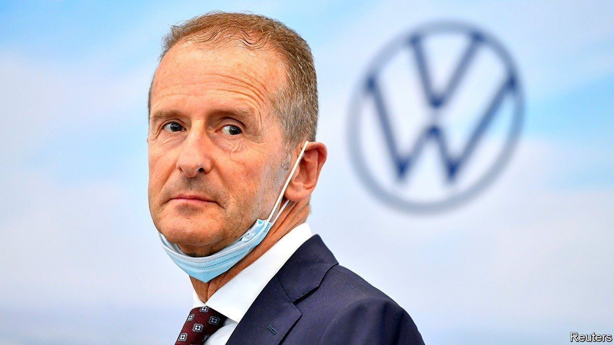

###### Golf’s course

# Herbert Diess’s job is once again on the line 

##### Volkswagen workers are flexing their muscles 

 

> Nov 13th 2021 

WHEN BERND OSTERLOH, the mighty boss of Volkwagen’s council that represents workers, announced his resignation in April many investors breathed a sigh of relief. Frequent, acrimonious clashes between him and Herbert Diess, the group’s no-less-mighty chief executive, had become a distraction from the big changes required to push VW into the electric age. The culmination was Mr Osterloh’s attempt to topple Mr Diess.

Yet only six months after the departure of his near nemesis Mr Diess is again locking horns with labour representatives. This time observers say the brash Bavarian may have gone too far. After all, Volkswagen’s workers have enormous clout. Their representatives occupy half the seats on the group’s 20-member supervisory board. They can count on the loyalty of the two board representatives of Lower Saxony, the western German state that owns a fifth of VW. The Volkswagen law from 1960 that limits voting rights of any shareholder to 20% gives Lower Saxony a de facto veto on any big decision.


How did the relationship hit bottom so quickly? The biggest bone of contention is the extent of changes required to enable VW to rival Tesla as a leading maker of electric cars. In an email that was leaked to the works council, Mr Diess suggested cutting 30,000 jobs, which would mostly affect the bloated bureaucracy at VW’s headquarters in Wolfsburg. Yet job losses are likely to be an unavoidable part of the electric-vehicle age, because EVS take less time to assemble than cars with internal combustion engines. Amid the ensuing outcry, Mr Diess toned down his plans for job cuts.

But the damage is done. A four-member mediation committee is discussing Mr Diess’s future even though his contract was extended to 2025 only in July. Most agree he is the right man to steer change at VW, but say he lacks diplomacy. Various names of possible successors are circulating. Tesla, of course, faces no such headwinds. Its boss, Elon Musk, has used social media to warn workers against unionisation. The American firm, which is building a gigafactory not far from VW’s headquarters, presumably views Germany’s system of powerful worker representation on boards as a cautionary tale.


