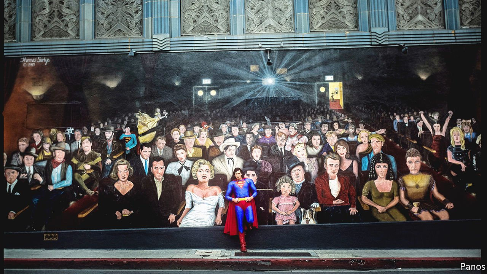

###### The movie business

# How Hollywood’s biggest stars are losing their clout 

##### Streaming has changed the economics of talent 

 

> Nov 8th 2021 

HOLLYWOOD LABOUR disputes have a certain theatrical flair. When Scarlett Johansson sued Disney in July, claiming she had been underpaid for her role in “Black Widow”, the studio launched an Oscar-worthy broadside against the actress’s “callous disregard for the horrific and prolonged global effects of the covid-19 pandemic”. In September film crews marched to demand better conditions, brandishing placards designed by America’s finest propmakers. And when WarnerMedia decided to release “” on its streaming service on the same day it hit cinemas on October 21st, the movie’s director, Denis Villeneuve, huffed magnificently that “to watch ‘Dune’ on a television…is to drive a speedboat in your bathtub.”

The streaming revolution has sent money gushing into Hollywood as studios vie to attract subscribers. Netflix boasts that its content slate in the fourth quarter will be its strongest yet, with new titles such as “Don’t Look Up”, starring Leonardo DiCaprio, and the final season of “Money Heist”, a Spanish bank-robbing saga. On November 12th Disney will announce its latest commissioning blitz, with new shows expected to include “Star Wars” and . In total, streaming firms’ content spending could reach $50bn this year, according to Bloomberg.


Yet despite the largesse it is a turbulent time in Tinseltown, as everyone from A-list stars to the crews who style their hair goes to war with the film studios. Some of the disputes have arisen from the pandemic, which has . But the tension has a deeper cause. As streaming disrupts the TV and movie business, the way talent is compensated is changing. Most workers are better off, but megastars’ power is fading.

Start with the pandemic. As cinemas closed, studios scrambled to find screens for their movies. Some, like MGM’s latest James Bond flick, were delayed by more than a year. Others were sent to streaming platforms—sometimes without the agreement of actors or directors. Those whose pay was linked to box-office revenues were compensated, either behind the scenes (as WarnerMedia did in the case of “Dune”) or after very public spats (as with Disney and Ms Johansson).

Even before covid, streaming was changing the balance of power between studios and creatives. First, there is more work to be done. “There's an overwhelming demand and need for talent, driven by the streaming platforms and the amount of money that they're spending,” says Patrick Whitesell, boss of Endeavour, whose WME talent agency counted Charlie Chaplin among its clients. Three years ago there were six main bidders for new movie projects, as Netflix vied with five major Hollywood studios. Now, with the arrival of Amazon, Apple and others, there are nearer a dozen. Streamers pay 10-50% more than the rest, estimates another agent.

Below-the-line workers, such as cameramen and sound engineers, are also busier. Competition among studios has created a “sellers’ market”, says Spencer MacDonald of Bectu, a union in Britain, where Netflix makes more shows than anywhere outside North America. In the United States the number of jobs in acting, filming and editing will grow by a third in the ten years to 2030, four times America’s total job-growth rate, estimates the Bureau of Labour Statistics.

The streamers’ hunger for variety means their seasons have half as many episodes as broadcast shows, and are less frequently renewed. That means “people are having to hustle for work more often,” says one script supervisor. A fatal accident on the set of “Rust”, a movie starring Alec Baldwin, has stirred a debate about the frantic pace of production. But the streamers’ short, well-paid seasons allow more time for CV-burnishing side-projects, and the work is more creatively rewarding. IATSE, a union which represents 60,000 below-the-line workers in America, has reached an agreement with studios for better pay and conditions; its members will begin voting on the deal on November 12th.

More controversial is the streamers’ payment model, which is creating new winners and losers. Creative stars used to get an upfront fee and a “back-end” deal that promised a share of the project’s future earnings. For streamers, a show’s value is harder to calculate, lying in its ability to recruit and retain subscribers rather than draw punters to the box office. Studios also want the freedom to send their content straight to streaming without wrangling with a star like Ms Johansson, whose pay is linked to box-office takings. The upshot is that studios are following Netflix’s lead in “buying out” talent with big upfront fees, followed by minimal if any bonuses if a project does well.

That suits most creatives just fine. “Buy-outs have been very good for talent,” says Mr Whitesell. “You’re negotiating what success would be…for that piece of content, and then you’re getting it guaranteed to you.” Plus, instead of waiting up to ten years for your money, “you're getting it the day the show drops”. America’s 50,000 actors made an average of just $22 per hour last year, when they weren’t parking cars and pumping gas, so most are happy to take the money up front and let the studio bear the risk. Another agent confides that some famous clients prefer the streamers’ secrecy around ratings to the public dissection of box-office flops.

For the top actors and writers, however, the new system is proving costly. “People are being underpaid for success and overpaid for failure,” says John Berlinski, a lawyer at Kasowitz Benson Torres who represents A-listers. The old contracts were like a “lottery ticket”, he says. Create a hit show that ran for six or seven seasons and you might earn $100m on the back end; make a phenomenon like “Seinfeld” and you could clear $1bn.

A few star showrunners such as Shonda Rhimes, a producer of repeat TV hits currently at Netflix, can still swing nine-figure deals. But creators of successful shows are more likely to end up with bonuses of a couple of million dollars a year. And though actors are receiving what sound like huge payments for streamers’ movies—Dwayne Johnson is reportedly getting $50m from Amazon for “Red One”, for example—in the past they could make double that from a back-end deal.

Some creative types grouse that the newcomers simply don’t understand showbusiness. With its “phone-company mentality”, AT&amp;T, a cable giant that acquired WarnerMedia in 2018, turned Hollywood’s most storied studio into “one of the last stops you’d make”, complains one agent. Disney’s new boss, Bob Chapek, came up through the company’s theme-park division. The Silicon Valley streamers are more comfortable with spreadsheets than stardust.

But their unwillingness to venerate A-listers also has an economic rationale. The star system, in which actors like Archibald Leach were transformed into idols like Cary Grant, was created by studios to de-risk the financially perilous business of movie-making. A blockbuster, which today might cost $200m to shoot plus the same in marketing, has one fleeting chance to break even at the box office. The gamble is less risky if a star guarantees an audience.

Today, studios are de-risking their movies not with stars but with intellectual property. Disney, which dominates the box office, relies on franchises such as Marvel, whose success does not turn on which actors are squeezed into the spandex leotards. Amazon’s priciest project so far is a $465m “Lord of the Rings” spin-off with no megastar attached. Netflix’s biggest acquisition is the back-catalogue of Roald Dahl, a children’s author, which it bought in September for around $700m.

What’s more, streaming’s approach to generating hits is different. Whereas winning at the box office required betting big on a few mammoth projects, Netflix’s method is “more like a random walk where ‘hits’ are first discovered by their users, then amplified by…algorithms,” notes MoffettNathanson, a firm of analysts. Netflix served up 824 new episodes in the third quarter of this year, more than four times as many as Amazon Prime or Disney+. Its biggest success, “Squid Game”, has a cast that is largely unknown outside South Korea. “Competition is not limited to who has the best content; it is also framed around who has the best tech” for discovering it, says MoffettNathanson. In the new Hollywood, stars are neither made nor born: they are algorithmically generated.■

For more expert analysis of the biggest stories in economics, business and markets, , our weekly newsletter.

