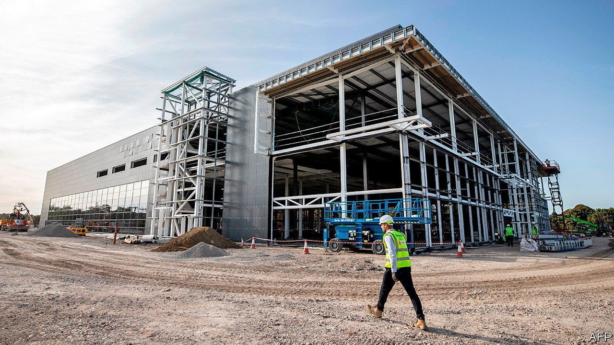
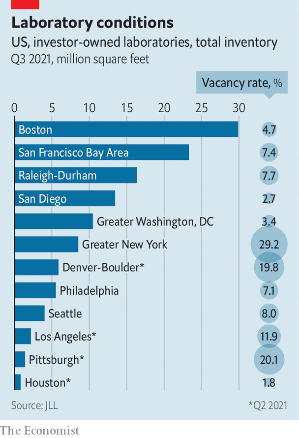

###### Seeking new premises

# Science and technology lifts the gloom for property investors 

##### Lab landlords are seeking new premises 

 

> Nov 13th 2021 

OXFORD NANOPORE’S MinION is a tiny but powerful device. When a hotel worker in Sydney tested positive for covid-19 in March last year, the portable DNA sequencer traced the infection to a flight attendant for an American airline, avoiding a general lockdown. The success of biotech firms—another celebrity is BioNTech, of Covid-19 vaccine fame—is sucking capital into life sciences. When such companies expand, they do so not with offices or shops but by means of white-walled, shiny-surfaced scientific laboratories.

Commercial-property investors have long banked on offices, retail and industrial buildings. Less conventional assets like mobile-phone towers were the preserve of specialists. Now the big guns of real estate are competing over them too. Thus laboratory space has become commercial real-estate’s hottest property, along with other facilities that power the digital economy. Data centres and infrastructure that connect smartphones are booming.


The investors’ motivation is clear. The pandemic convulsed commercial-property prices globally. American retailers closed nearly 15,000 shops in 2020. By mid-October, with people attached to remote work, offices were only a third full. The risk profile of some conventional property assets has deteriorated sharply.

In contrast, demand for assets like labs and data centres has never been stronger—a trend visible before the coronavirus began to spread. As rent collections for shops and restaurants plummeted last year, data traffic from virtual meetings and online shopping exploded. Companies that use the underlying data centres and mobile towers are demanding more of them. These digital-economy winners look as safe as houses.

 


The shift is reflected in the changing make-up of America’s ten largest real-estate investment trusts (REITS). A decade ago the most valuable such vehicle was Simon Property Group, the country’s biggest mall owner. Today it is American Tower, a fast-expanding owner of tens of thousands of phone masts around the world. Five of the top ten REITS currently manage either data centres or mobile towers.

The loudest buzz currently surrounds life-sciences and lab space. Investors are flooding the health-care sector with capital. Drug makers, medical-equipment manufacturers and other life-sciences firms have raised a record $103bn in venture capital so far this year, up from $63bn in 2019, according to JLL, a property consultancy. A generous slice of capital is going into property. JLL estimates that up to $87bn is now being directed towards life-sciences real estate worldwide. That is equivalent to a third of all global spending on commercial property in the second quarter of this year.

Landmark deals are cropping up frequently. In October GIC, Singapore’s sovereign-wealth fund, purchased a 40% stake in Oxford Science Park from Magdalen College, part of Oxford University; the deal valued the park at ten times its worth just five years ago. Blackstone, a private-equity firm, recently doubled its ownership of life-sciences floorspace in Britain, investing over $1bn in two new sites. Shares of life-science REITS are booming.

By now, lab space is growing hard to come by. In Boston, where much of it in America is held, less than 5% of labs were available in the third quarter.In the Golden Triangle, as the area between London, Oxford and Cambridge is known, premises have run out. The Harwell life-sciences campus near Oxford will add 1.5m square feet over the next seven years to meet demand—equivalent to three-quarters of all the office space London’s financial district will add this year. Chris Walters, director at JLL, estimates unmet demand for lab space in and around Cambridge at 1m square feet—equivalent to nearly a quarter of retail space on London’s Oxford Street.

Where markets are tight, participants will seek to expand supply. In the case of sci-tech property that is harder than it sounds. Constructing new phone towers means navigating strict planning laws and NIMBYS. New data centres need land with access to cheap electricity and high-speed internet. Life-sciences firms like to cluster around top universities and academic medical centres that provide the chemists, microbiologists and other experts that populate their labs. One fix is finding secondary locations. Cities like Los Angeles, which is fairly near the San Francisco Bay Area, and Pittsburgh, home to Carnegie Mellon, a university known for prowess in artificial intelligence, are attracting startups awash with capital. In Britain, life-sciences hubs are springing up in the north, where pharmaceutical giants like AstraZeneca and GSK have manufacturing sites.

Another remedy is converting existing offices and industrial space. Boston Properties, one of America’s largest office REITS, says it can convert 5m square feet of conventional sites and buildings into laboratories. It is no easy process, for labs are complex spaces governed by biosafety rules. They need four times the amount of air that offices do. Waiting lists in London for “wet” labs, facilities in which dangerous chemicals and other hazardous substances can be handled, are lengthening.But property investors are game to try. In New York conversions could almost double the city’s lab space for rent, according to Newmark, a real-estate advisory firm.

Even empty shops are being repurposed. Savills, a British property firm, reckons London has at least 1.8m square feet of retail property that could be refashioned into laboratories.Shops’ high ceilings mean plenty of room for high-performance ventilation, and service lifts for moving dangerous materials. It will doubtless take years for supply to catch up with demand. But as the locus of work and commerce moves, real-estate investors are shifting with it.■


