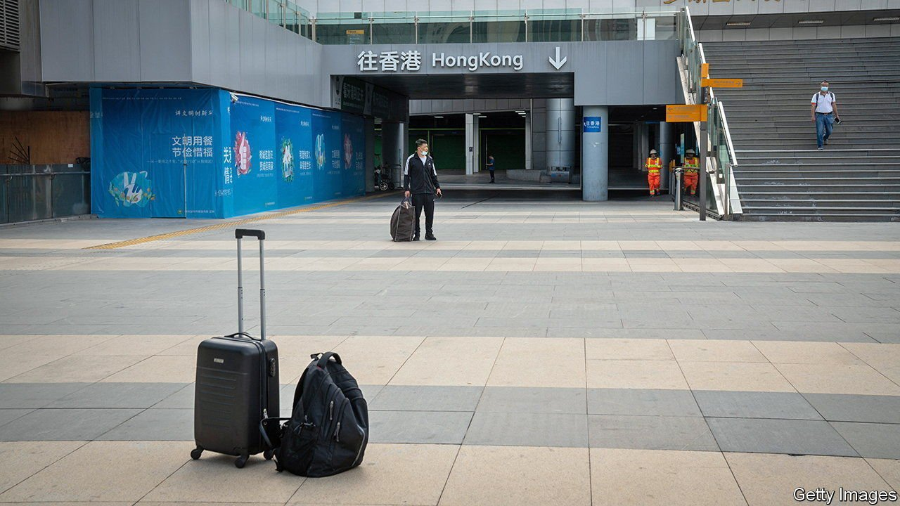
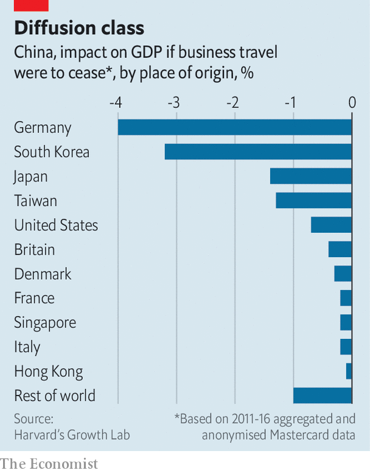

###### China and the pandemic

# The non-zero costs of zero-covid 

##### In business, China is becoming a world unto itself 

 

> Nov 13th 2021 

THE TRADE war between America and China paradoxically brought some of the countries’ citizens closer together. Ben Kostrzewa, a trade lawyer for Hogan Lovells, moved from Washington, DC, to Hong Kong to help his corporate clients navigate duties, sanctions and export controls. He used to travel two or three times a month to the mainland. If he timed it right, he could pass through the border checks in 20 minutes. “I got to know those border agents very well”, he says.

The pandemic has changed all that. In the first half of 2019, China’s busy agents recorded over 344m border crossings between the mainland and the rest of the world (including Hong Kong). In the first half of this year, that number was down by over 80%, according to official statistics. Mr Kostrzewa has not visited in almost 22 months. “It’s funny to be talking about this in the past tense,” he says.


Talks, in a future conditional tense, between Hong Kong and the mainland have so far failed to ease travel between the city and the rest of China. But officials now say a pilot scheme might soon allow small numbers of vaccinated people to travel to the mainland without quarantine. If the scheme works, some of Mr Kostrzewa’s favourite checkpoints in Shenzhen could reopen by June, according to the South China Morning Post, although travel would be subject to quotas.

For the rest of the world, visiting China will remain an ordeal. It is like arranging a “state visit”, says one banker who used to make the trip 30 times a year. The documentary requirements can be onerous and inconsistent. One delegation of senior businesspeople, hoping to visit Shanghai, were asked for their primary-school transcripts. After the bureaucratic bother, the boredom of quarantine awaits: a minimum of 14 days, typically in a hotel not of one’s choosing. One well-connected married couple were at least given the option of separate rooms. They took them without any hesitation.

The benefits of China’s zero-covid strategy can be measured in lives saved and infections averted. The economic cost of the country’s self-isolation is harder to quantify. The travel restrictions are making life harder for the international “facilitators” that make cross-border business tick, argues one investor in Shanghai. Remote communication can maintain existing relationships, but some things are better done face-to-face. The investor used to get to know his managers over dinners, drinks and cigars. “If you spend three hours a night together, by the end of that week, you know the guy.” No one has the stamina to replicate that on Zoom.

 


Some know-how is also tacit, embodied in people or teams. To transmit this know-how it is necessary to move the minds that carry it. Increasing spending on business travel by 10% raises productivity by 0.2-0.5% in the visited sector, according to a study of American travellers by Mariacristina Piva of the Università Cattolica del Sacro Cuore and her co-authors. Another study by Michele Coscia of the IT university of Copenhagen, as well as Frank Neffke and Ricardo Hausmann of Harvard’s Growth Lab, made use of aggregated, anonymised Mastercard data to map this movement of minds. They estimate that China’s economy would be 13% smaller if it had not benefited from the know-how diffused by international business travel. The biggest contributions were made by visitors from Germany and South Korea (see chart).

Foreign direct investment in China has so far remained strong, thanks to the economy’s early recovery from the pandemic. And few multinationals are leaving. Some foreign firms may even localise activities done outside China to keep doing business there. Companies are “battening down the hatches”, according to the European Union Chamber of Commerce in Shanghai, bringing more of their supply chain onshore, because of geopolitical tensions, covid restrictions and new laws that limit data-sharing across borders. “Companies might be forced to have two different systems running: one for China, and one for the rest of the world,” says Bettina Schön, the chamber’s vice-president. “This will be horribly expensive.” It is not that the world is leaving China; more that China is becoming a world unto itself.■


