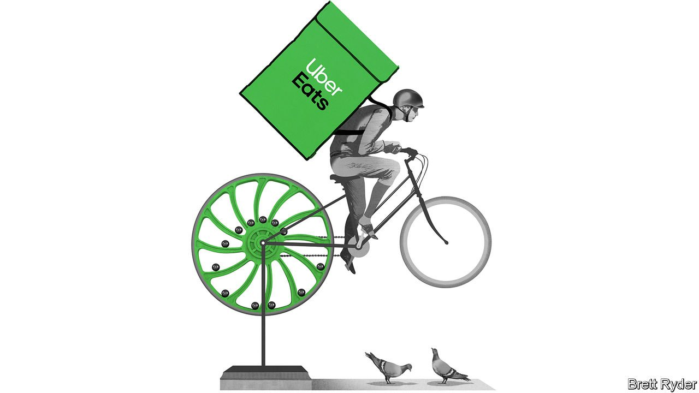

###### The flywheel delusion

# Uber, DoorDash and similar firms can’t defy the laws of capitalism after all 

##### The mania over ride-sharing and delivery companies has at times been absurd 

 

> Nov 9th 2021 

IN THE REAL world a flywheel is a mechanical contraption that stores rotational energy. In  it has come to mean something else: a perpetual-motion business that not only runs forever but is self-reinforcing. Thanks to powerful network effects, , a digital platform becomes more attractive as it draws in more users, which makes it even more attractive and so on. The end state is a venture that has gathered enough energy to self-levitate and throw off tons of cash.

The payout on one of the most richly funded bets of the past decade or so revolves around whether ride-sharing and delivery firms—which once were part of something known as the “sharing economy” but are better described as the “flywheel economy”—can actually ever live up to their heady promise. The outcome will matter to more than just venture capitalists who backed their growth. Whether these flywheels do gather unstoppable momentum is also of interest to regulators worried about technology’s propensity for winner-takes-all business models, not to mention paid-by-the-gig workers caught in its cogs.


Consider the results of Uber and DoorDash, the largest Western ride-sharing and delivery apps respectively. Optimists will have seen plenty to cheer them. On November 4th Uber proclaimed it was at last profitable, albeit only on the flattering metric of “adjusted EBITDA”.Strong third-quarter figures from DoorDash, which were released on November 9th, fuelled an already heady rally in its shares (the firm also announced the acquisition of Wolt, a Finnish food-delivery company, for $8bn).

But look deeper and evidence is mounting that business flywheels are not defying the laws of capitalism. The money that went into building them recalls the railway mania among other past speculative investment crazes. The nine firms that have gone public so far—Uber and its American rival Lyft;; and six delivery firms, from DoorDash and Delivery Hero, which is based in Berlin, to China’s Meituan and India’s Zomato—collectively raised more than $100bn. In most cases, the capital was intended to jumpstart those network effects and make market dominance a self-fulfilling prophecy. Seemingly bottomless pits of investors’ cash went to subsidising rides and deliveries to juice demand. This reached absurd points: a pizzeria could make money by ordering its own food for a discounted price on DoorDash (which then paid back the regular amount). To justify such profligacy, interested parties pointed to the huge “total addressable market”, another . Bill Gurley of Benchmark, an early investor in Uber, argued in 2014 that the firm could vie for as much as $1.3trn in consumer spending if one saw it as an alternative to car ownership.

Measured against such visions, the flywheel economy has proven a dud. To be sure, the nine listed flywheel firms are still growing nicely—at 103% on average in their latest reporting period compared to the same period the previous year. This explains why they are collectively worth nearly $500bn. But self-levitating they are not. Nor are they profitable. Sales for the group amounted to $75bn over the past year and the operating loss to nearly $11.5bn.

As the firms have discovered, their businesses are less perpetual motion machines than real-world flywheels that inevitably lose energy to friction, says Jonathan Knee of Columbia Business School and the author of a book entitled “The Platform Delusion”. The network effects in fact have proved much weaker than expected. Many users switch between Uber and Lyft. Drivers also flit between them, or to delivery apps, depending on which model offers the best pay. This bargaining power from both sides means the system does not become self-reinforcing after all.

Technology, too, has turned out to be less beneficial than expected. Data collected by the firms help optimise their operations, but are not the decisive factor some had hoped for. . In London they have forced Uber to pay drivers minimum wages and pensions. In San Francisco they capped the fees DoorDash can charge restaurants for delivering their meals.

Uber’s tortuous path to stemming losses should temper investor optimism. It eked out a profit of $8m on revenues of $4.85bn. That excludes expenses that are unlikely to disappear, such as stock-based compensation. The company has crawled out of its sea of red ink mostly by slashing costs, shedding technology assets such as its autonomous-car unit, charging higher prices and increasing its “take rate”, the share of the fares it keeps. As a result, an Uber is now no cheaper—and often more expensive—than conventional cabs, plenty of which can be hailed via apps these days.

What is more, the company, which has a market capitalisation of $85bn, is now more of a delivery service than a ride-hailing app: Uber Eats generates more than half of sales. DoorDash’s own punchy valuation, of $65bn, rests on revenue that has grown more than fourfold since the last quarter of 2019, albeit during a time when people dined at home more often. But it also bakes in success in new markets that it has recently entered, including groceries and pet food.

Circular economy

Real business flywheels do exist. Software makers have managed to lock users in and thus generate gross margins typically above 70%. Venture capitalists are hoping against all hope to find new ones. They are already pouring money into the next generation of flywheel contenders: instant-delivery startups, which offer gratification in 30 minutes or less. Coupon-collecting consumers in cities such as New York now get at least a week’s worth of groceries for nothing from such services as Buyk, Fridge No More and Gopuff. Eventually, these firms’ champions promise, their economics will be far better than those of an Uber or a DoorDash. In the flywheel economy hope and hype spring eternal, at least as long as interest rates remain low and capital is essentially free.■

For more expert analysis of the biggest stories in economics, business and markets, , our weekly newsletter.

