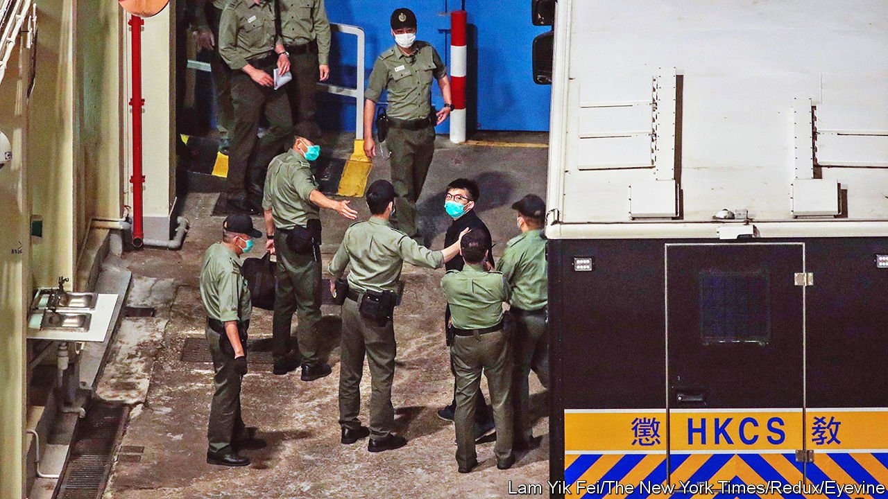

###### New kids on the cell block

# Behind bars, Hong Kong’s democrats remain popular 

##### The city’s jails are filling up with dissidents 

 

> Nov 11th 2021 

SOME NEW inmates in Hong Kong’s prisons have reading wishlists that reflect interests beyond such common behind-bars topics as self-improvement and how to exercise in small spaces. Their requests include dystopian novels about totalitarianism, such as George Orwell’s “1984” and “Brave New World” by Aldous Huxley, or books about struggles against authoritarian rule, including Vaclav Havel’s “The Power of the Powerless” and “How To Feed A Dictator” by Witold Szablowski.

Such bookworms belong to a new breed of prisoner: the dissident. Before the pro-democracy demonstrations that roiled Hong Kong for much of 2019, few people were incarcerated for taking part in political protests. But the authorities have got tougher. More than 10,000 people have been arrested in connection with the unrest. Court proceedings have begun against a quarter of them. The government is building a megacourt to process a backlog of cases, including some involving a national-security law that was imposed in Hong Kong last year. Hundreds of people are now serving prison sentences or being held on remand for alleged offences related to the protests. Many Hong Kongers know someone in jail who has been accused of such crimes.


Conditions are better than in the mainland’s jails, where political prisoners are allowed little, if any, contact with the outside world and are often treated brutally. In Hong Kong, volunteers collect books and organise letter-writing campaigns for detainees. Online guides provide advice to correspondents about what not to write: avoid slogans from the protests and any references to violence or sexually explicit material. Instead, write about trivial news, tell jokes, describe movie plots and draw sketches, suggests one manual. A bookseller recently ran an eight-part workshop. Participants wrote letters to inmates and read prison literature by Nelson Mandela, Havel and activists from Hong Kong. Joshua Wong (pictured, entering prison), one of the best-known faces of the pro-democracy movement, has written that he is grateful for “every word and every sentence” mailed to him.

Sympathy for political detainees is widespread in Hong Kong. During a heatwave in May, a petition for the provision of cold water and more showers to those incarcerated garnered over 140,000 signatures. A cottage industry has emerged to help them in other ways. Some Hong Kongers transcribe popular YouTube videos for inmates, who cannot access the internet. Other pen-pals copy and paste posts from LIHKG, an online forum that attracts democracy enthusiasts, in order to create a physical newspaper for inmates. “As an avid user of LIHKG, these forum-post printouts are my Bible,” says a detainee quoted by a prisoner-rights group.

Well-known pro-democracy inmates pass the time by exercising, writing letters, helping fellow inmates with their appeals and publishing articles in local newspapers. Chow Hang Tung, a jailed barrister and human-rights activist, accepted her boyfriend’s proposal of marriage, which was sent to her by letter. It was later published in Ming Pao, one of Hong Kong’s leading newspapers. These young Hong Kongers are “learning to seek freedom in an environment where they have lost their freedom”, writes Chan Kin-man, an academic who served 16 months in jail for his role in the Umbrella Movement of 2014.

Imprisoned activists are scattered throughout the city’s jails to prevent them from communicating with each other. But officials still worry about their influence. In September an elite squad was used to quell a protest by 18 prisoners angered at the treatment of other inmates, including Tiffany Yuen, a district councillor who is on remand under the national-security law. They had been accused of acquiring a prohibited number of chocolates and hair clips. Bizarrely, officials feared they might give them to other inmates to win support for Ms Yuen. “This is how groups begin, like terrorist groups recruiting followers,” said Woo Ying-ming, the head of Hong Kong’s prisons. Even behind bars, officials keep Ms Yuen’s type under close watch. ■

