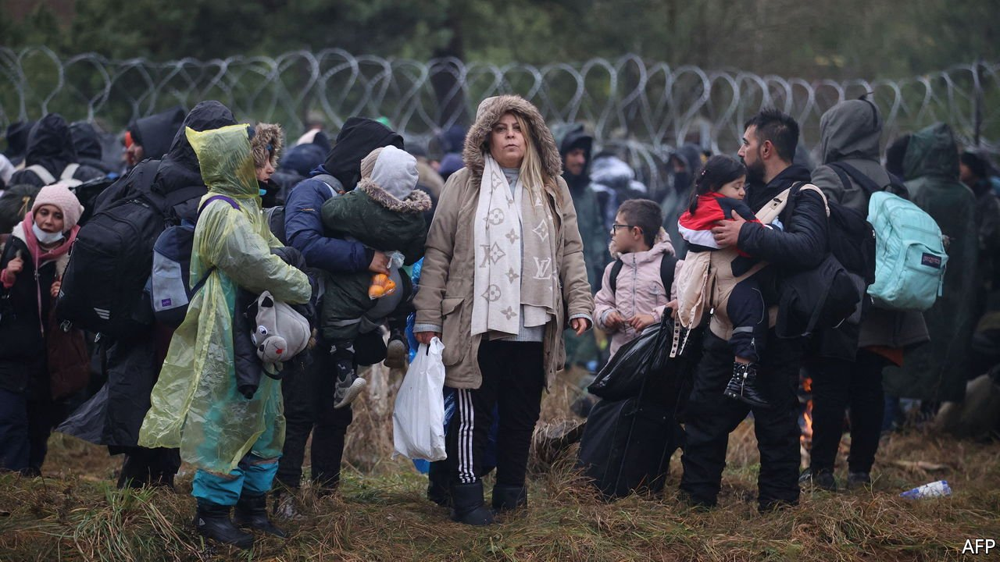
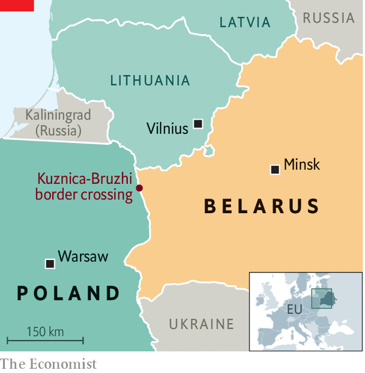

###### Caught at the wire

# A scheme to use migrants to split the EU is likely to backfire 

##### Belarus is shipping Iraqis to the Polish border and trapping them there 

 

> Nov 13th 2021 

ALEXANDER LUKASHENKO, master tactician? The president of Belarus has brought thousands of migrants from the Middle East to the EU’s doorstep on the eve of winter, daring the bloc to abandon its humanitarian instincts as the world looks on. Mr Lukashenko seems to have intended to reignite the internal division and political upheaval that followed the influx of migrants to Europe in 2015. He has instead forged a consensus in favour of the swift punishment of his regime.

The scenes that have unfolded at the Polish-Belarusian border since November 8th were his concoction. Belarusian travel agents in Iraq offer flights, a visa and the sham promise of an easy path to a new life in Europe in exchange for thousands of dollars. Arrivals in Minsk are whisked through the woods to a spot on the border where, far from swiftly crossing into Poland and embarking on the supposed opportunity to move around the Schengen free-travel zone, migrants end up squeezed between the EU’s razor-wire fences and Belarusian men with guns, unable to go forward or back. As The Economist went to press on November 11th, some 2,000 were trapped near the current main point of concern, the Kuznica crossing (see map). There have been a number of attempts to breach the border there. An estimated 20,000 migrants are thought to be elsewhere in Belarus, with more still continuing to fly in via Istanbul and other Middle Eastern cities on Belavia, the Belarusian state carrier.


Mr Lukashenko’s foreign policy has increasingly resembled that of a mafia boss since his theft of elections last year. He has sent goons after dissidents who fled abroad. He is angry at the countries sheltering them, chiefly Poland and Lithuania, and at the entire EU for the sanctions it has imposed on his regime. The ambition of those sanctions was scaled back thanks to lobbying by affected industries, from Austrian banks to Lithuanian railways. Now the political will to deter Mr Lukashenko has hardened. The EU is hinting at fresh sanctions, including on Belavia, possibly as soon as next week. The hitherto hesitant Irish government, whose firms lease planes to the airline, has come on board.

 


That does not mean that keeping migrants off the route to Belarus will be easy. The EU wants to install officials at airports across the Middle East to prod Iraqi passengers with awkward questions before they embark. But that will take time. Angela Merkel, Germany’s outgoing chancellor, has asked Russia’s president, Vladimir Putin, to talk Mr Lukashenko out of his plotting. Her chances of success seem slim.

Poland sees deterrence as the best way to stem the influx, and so is determined not to admit any of the migrants gathering at its gates. Its populist government has waved away offers of help from Frontex, the EU’s border agency. A camp has sprung up on the Belarusian side, and a lengthy battle of wills is likely. Meanwhile, the migrants are in danger. A freezing winter approaches. And Mr Lukashenko is willing to make people suffer, if the television footage causes problems in Europe. ■

