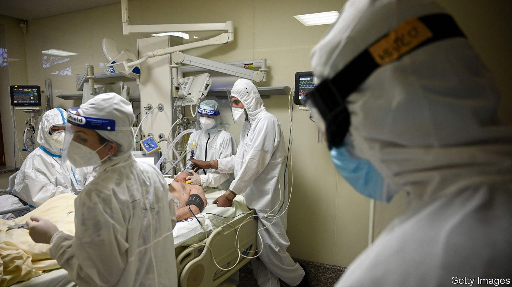

###### The arc of susceptibility

# Eastern European countries are being hit by a wave of covid deaths 

##### But only where vaccination rates are poor 

 

> Nov 12th 2021 

ON NOVEMBER 6TH teams of medics dressed in full protective gear packed equipment into a Romanian military transport plane before pushing beds with two severely ill covid-19 patients up the ramp and inside. As the propellers began to whirr, the back door slowly closed and the plane lumbered up the runway heading for Denmark. “There is no secret,” says Raed Arafat, who is co-ordinating Romania’s fight against covid: the country’s hospitals are “overflowing”. About 90 patients have been evacuated to Denmark, Germany, Hungary and elsewhere. Teams of doctors are also flying in from all over Europe to help their beleaguered colleagues.

Across Europe the numbers of people infected with the highly contagious Delta variant are rising, and many governments are contemplating or imposing new restrictions. But this wave is affecting some countries far more than others. From the Balkans to the Baltics an arc of susceptibility has emerged, encompassing a swathe of countries with low vaccination rates.


In the past few weeks the death rate from covid-19 has hit record highs in Bulgaria, Latvia and Romania. In the week to November 8th there were 22.8 confirmed deaths in Bulgaria for every million people. In Romania the figure was 21.8 and in Latvia 18.8. Yet for the EU as a whole it was only 3.0. The number of cases is at last dropping in those three badly-hit countries, but it is now soaring in Croatia, Estonia, Lithuania, Slovenia and Ukraine.

All of the countries being clobbered are at the low end of the scale when it comes to vaccination. Only 23% of Bulgarians and 34% of Romanians have been double-jabbed. In Latvia the proportion is 57%, but it was much lower a month ago, when the current wave took hold. In the EU as a whole, 66% are double-vaccinated.

Low vaccination rates are not the result of a lack of vaccines. The countries of the arc have ample supply, but also loud anti-vaxxers. Distrust of government and medical staff is high. A Eurobarometer survey conducted earlier this year found that only 22% of Bulgarians and Croats, 26% of Latvians and 31% of Romanians tend to trust their governments. When asked if they trusted medical staff, 34% of Bulgarians said they did not, along with 32% of Croats, 31% of Latvians and 40% of Romanians.

It is ironic that relatively low levels of infection in the summer seem to have contributed to the scale of current outbreaks. Those with doubts about the vaccine saw little urgency in getting it, which left them vulnerable when the Delta variant hit. Of those now in hospital, says Dr Arafat, 92% are unvaccinated. The true share could be higher, as unknown numbers have bought fake vaccination certificates. He angrily denounces anti-vax disinformation, which is often propagated by rogue doctors, Orthodox priests and far-right nationalists, with the help of “Dr Facebook”.

Inga Springe, a journalist with Re:Baltica, a news website, says that in Latvia prominent doctors have given ambiguous signals about vaccinations and some politicians are promoting themselves via anti-vax sites. Bulgaria goes to the polls on November 14th for the third time this year, and politicians there may fear alienating anti-vax voters.

According to Oana Popescu, director of GlobalFocus, a Romanian think-tank, Romanians’ lack of enthusiasm for getting vaccinated is a direct result of what they perceive to be decades of neglect by the authorities. “When the government suddenly seems to care for you for the first time in 30 years, of course you become suspicious!” she explains. Alas, it is not just Romanians who feel that way. ■

Dig deeper

All our stories relating to the pandemic can be found on our . You can also find trackers showing ,  and the virus’s spread across .

