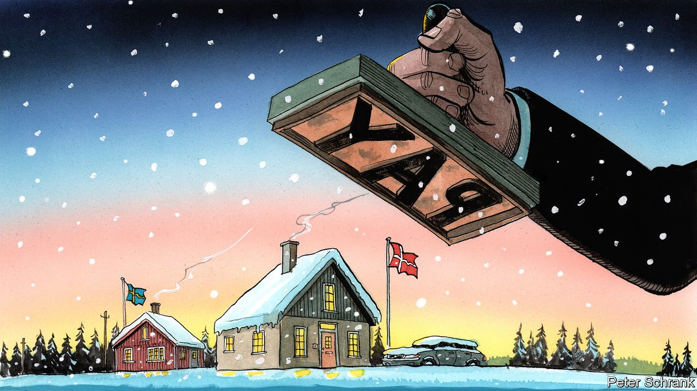

###### Charlemagne

# Minimum wage, maximum rage 

##### A fight about worker pay pits a Scandinavian duo against the rest of the EU 

 

> Nov 13th 2021 

EVERYONE WANTS to be a little bit Danish. Hygge, a sense of Nordic contentment attained via baking, candles and good company, became the philosophy du jour during lockdown. Danish dramas win garlands, while its comedies contain jokes so enjoyably dark that viewers may worry about finding themselves on a Europol watch list. Even Danish semen has become a booming export, thanks to the country’s combination of liberal rules for donors and reputation as a small nation of tall hunks.

But it is the Danish labour system that attracts the most plaudits. Leftists drool over a model that sees burger flippers in McDonald’s paid the equivalent of $22 per hour. Those on the right marvel that the country has no statutory minimum wage. Instead, employers and stakeholders sit down together and hammer out collective agreements that cover most workers. It is the same in neighbouring Sweden. Employees benefit from wages and benefits that are among the most generous on the continent; employers can hire or fire with ease during boom or bust. Denmark and its Scandi neighbours manage to be both a worker’s paradise and a capitalist’s dream.


Telling Scandinavians how to run a labour market is akin to teaching the French how to bake baguettes. Yet this is the position in which the Nordic countries have found themselves. Ursula von der Leyen, the president of the European Commission, wants all workers to be covered by a minimum wage, whether through national law (as in most of the club) or through collective agreements (as in Scandinavia). Proposals that will see the topic of minimum wages dragged into EU law are being negotiated among MEPs and national governments.

At first glance, Denmark and Sweden have little to worry about. A common minimum wage is not on the table. Indeed, that would be impossible for a club that includes Luxembourg, whose minimum wage is €2,202 per month ($2,550) and Bulgaria, where it is €332. According to the EU’s own treaties, only national governments can set a minimum wage. Indeed, the commission came to praise the Scandinavian system, not to bury it. It would rather everyone looked a bit more like Sweden or Denmark, with collective agreements galore.

Instead, the commission wants to shape how national governments guarantee decent wages, rather than to set their level. Under its proposals, countries would still be in charge of the details. Those with statutory minimum wages would be forced to ensure these are adequate when measured against average incomes. For those without a minimum wage, a group which includes Italy, Austria, Cyprus and Finland as well as the Scandinavian duo, the commission wants at least 70% of workers to be covered by collective agreements—a hurdle that the Scandinavians already meet.

Yet the Scandinavian duo are still fretting, and with some cause. All legislation comes with unintended consequences, particularly at the European level, where the European Court of Justice is a player as much as a referee. In Sweden about 60% of collective agreements do not include a minimum wage, points out German Bender, an analyst from Arena Idé, a Swedish think-tank. With EU law now encompassing minimum-wage rules, legal challenges would become possible. And peculiar things can happen. A case in the 1960s involving an unpaid electricity bill worth a few lira ended up establishing the primacy of EU law, which means EU rules trump national ones if the two clash. The so-called “no bailout” clause in the EU’s treaties did little to stop a series of bail-outs. A single judgment might upend the Nordic labour model.

When proposals start rolling, they are tricky to stop. Employment legislation gets agreed by a qualified majority of governments, so vetoes do not apply. Usually, though, the EU avoids topics that are sacred to national governments. Pleas that legislating—rather than issuing suggestions—on minimum wages violates the Scandinavian principle of no government interference in wage-setting fell on deaf ears. Denmark and Sweden “yellow-carded” the proposal for a directive on minimum wages, a formal protest, but to no avail. In the EU’s ministerial council, where national governments haggle over a position, the lawyers say it is perfectly legal. The French government, which will shepherd negotiations on the topic from January, is keen to get it done sharpish.

Beyond the bare minimum

New rules on minimum wages are only the beginning of a wider push on workers’ rights at the EU level. Laws to make pay transparent have been put forward by the commission. Proposals on how countries must treat “platform workers”—such as Deliveroo riders and Uber drivers—are in the works. For some it is a welcome shift in EU policy. During the austerity years governments were to be lean and mean. Angela Merkel was fond of noting that the EU was 7% of the world’s population, a quarter of its economy, but about half of all its welfare spending. Today, the tune has changed. Generous welfare states and high worker protections were once held to be the cause of the EU’s woes; now they are the solution.

For the Scandinavians, this shift is cause for concern. Their system is not broken, yet the EU insists on fixing it. There is little scope for dodging the legislation. Denmark has an opt-out on the euro, as well as on European laws on justice and home affairs. Sweden is in theory obliged to join the euro eventually, but uses a loophole to cling on to its krona. Such derogations are a thing of the past, however, and of no help in the present case. Europe is no longer à la carte. Systems that work well, such as those of Denmark and Sweden, may have to change in order to help systems that work less well, such as those of Cyprus or Italy. “United in diversity” is the EU’s slogan. But unity increasingly trumps diversity as the EU delves ever further into the lives of its citizens. Everyone wants to be a bit like Denmark. But Denmark may soon start to resemble everywhere else.■

