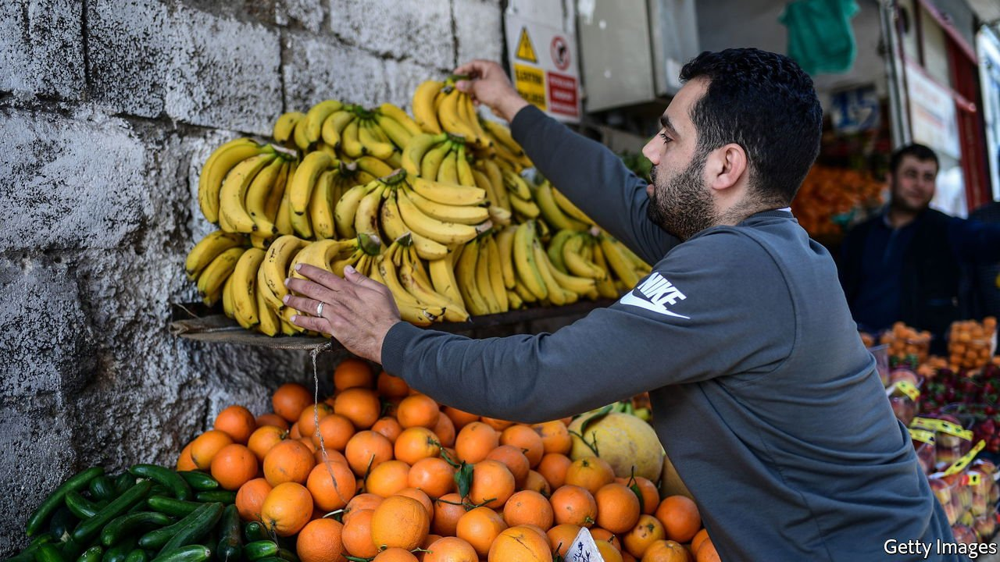

###### Going bananas

# Turkey’s government sees no humour in soft fruit 

##### Refugees who ate bananas in a provocative fashion are to be deported 

 

> Nov 11th 2021 

TURKEY HAS deported Syrian refugees before. Some were sent back to their war-scorched homeland for failing to register with the authorities or for minor crimes. Some say they were tricked or forced into signing voluntary return forms. But none thought they would be thrown out for eating bananas. Until now.

In October the government said it would deport seven Syrians for sharing “provocative” videos on social media, which showed the young refugees staring into their phones and munching yellow fruit. This was in response to an interview with a Turkish man who had blamed Syrians for driving up rents and complained that they could afford bananas, which he could not.


The banana-eaters seemed to be mocking prejudice against refugees. But officials accused them of mocking the needy. And that was not the end of it. Turkish police arrested a Syrian journalist who had made light of the uproar in a video that showed him nervously buying bananas from a grocer, then hiding them under his sweater. (He was released on November 8th.)

Some 3.7m Syrians have made Turkey their home over the past decade. The Turkish welcome, once generous, has become grudging. As the lira plummets and inflation tests 20%, the refugees are becoming a target of frustration. With its poll numbers shrinking President Recep Tayyip Erdogan’s government appears keen to prove that it can act tough. Even over soft fruit.

