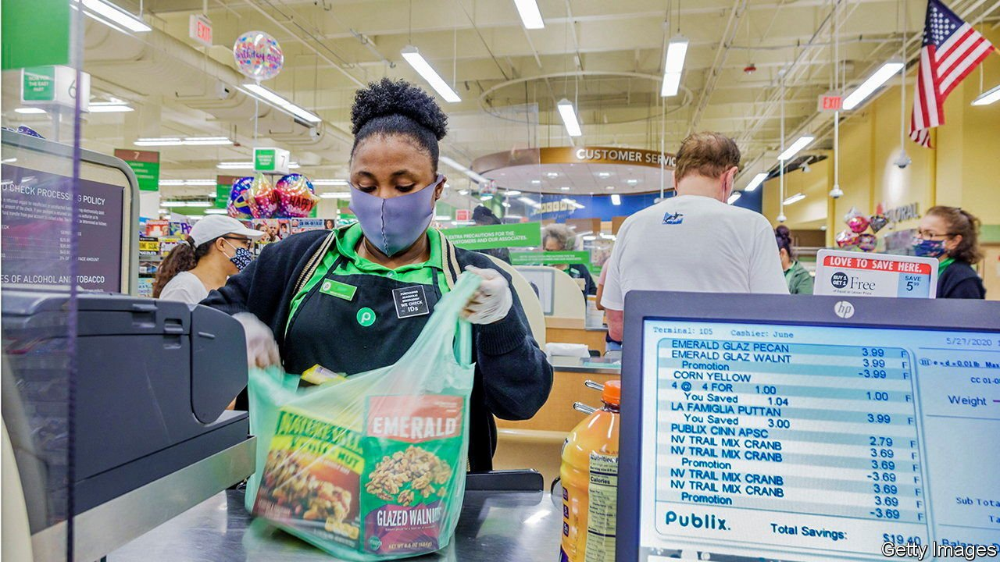
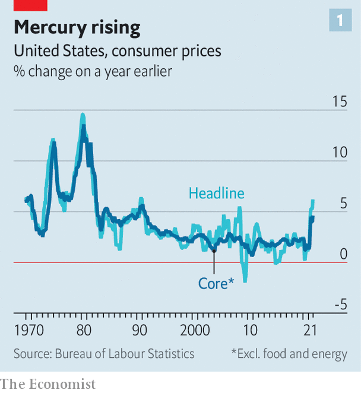
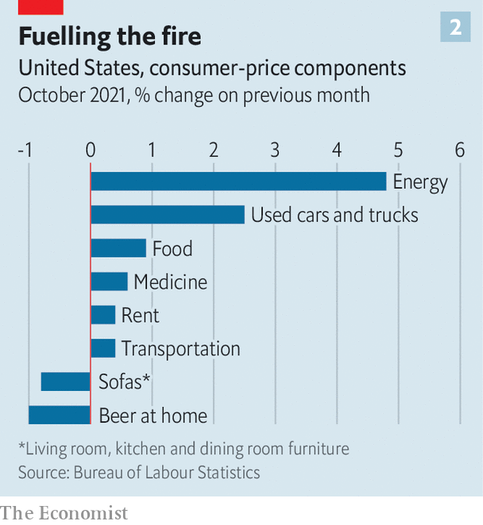

###### Inflation in America

# A three-decade high in inflation sows concerns about America’s recovery 

##### How a broad pickup in prices puts pressure on the Fed to raise rates 

 

> Nov 10th 2021 

IF AN AVERAGE American decided that last month was high time to buy a new sofa and then spent his evenings drinking beer on it, he would have been lucky. Both the furniture and the brew cost a little less than a few weeks earlier. Unfortunately, that same American may have been painfully aware that just about everything else—his , the  for his car, his food and even that new leafy plant next to the sofa—cost a fair bit more. The best level for i, economists joke, is when people do not notice it. In America it is becoming very noticeable. In October the consumer-price index rose by 6.2% compared with a year earlier, the highest rate in more than three decades (see chart 1).

As inflation has accelerated economists and officials have debated whether it is a transitory phenomenon—reflecting overstretched supply chains—or a more . It is far more than an academic debate. If inflation is short-lived, the right move for the Federal Reserve would be to look through it, aware that jacking up interest rates may do more harm than good. If, however, inflation is stubbornly high, the central bank is duty-bound to tame it. The big jump in prices in October tilts the debate in favour of “Team Persistent”, as some have taken to calling it, and puts pressure on the Fed.


To be sure, a big chunk of America’s headline inflation is still attributable to the lumpy post-pandemic recovery (see chart 2). Gasoline costs, for instance, are 50% higher than a year ago, tracking the surge in oil prices. Used cars are 26% dearer than a year ago, with a  leading to slower production of new cars and more demand for . And prices are rising globally, from Australia to Britain.

 


Nevertheless, optimism that supply kinks would be ironed out by now has vanished. Inflation is even hotter in America than in other countries because of the strength of the rebound there, with stimulus payments fuelling demand. Price pressures are getting broader. A gauge of core inflation, stripping out volatile food and energy prices, rose by 4.6% year-on-year in October, more than twice its trend rate of the previous quarter-century.  suggest that elevated inflation will continue well into 2022. With wages also rising at their fastest in years, concerns are mounting about a feedback loop, in which higher salaries beget higher inflation.

 


In truth there ought to be little chance of a wage-price spiral in America. A sharp narrowing in the fiscal deficit will constrain growth in the coming quarters. And, crucially, investors still expect the Fed to take decisive tightening action if necessary, which is why longer-term bond yields have not moved much. Last week the Fed announced that it would start , the first step to unwinding its ultra-loose policies implemented at the height of the pandemic. Several prominent banks have moved forward their forecasts for rate increases. Goldman Sachs, for example, had previously expected the Fed to wait until 2023; now it expects two increases next year, starting in July. But the uncertainty around all these expectations is much greater than in normal times. The Fed itself has consistently underestimated inflationary trends over the past year, so its shift to tightening may end up being uncomfortably abrupt.

Politically, this is treacherous territory for President Joe Biden. His week had got off to a great start with the passage of America’s biggest  in decades, giving him something to crow about. On November 10th, shortly after the inflation data were published, he instead chose to adopt a defensive posture. “Inflation hurts Americans’ pocketbooks, and reversing this trend is a top priority for me,” he said. His administration is trying to clear some of the backlogs at ports, which would help retailers stock their shelves more quickly, perhaps easing some of the pressures. Mr Biden also noted that the price of natural gas, a big contributor to inflation in October, has dipped in recent days.

Yet inflation is, ultimately, out of Mr Biden’s hands. The government can only do so much to paper over . Knowledge that the Fed may feel compelled to raise rates before too long will offer Mr Biden little consolation. Historically, growth cycles tend to come to an end when the central bank tightens policy, so today’s price pressures may augur economic disappointment a little farther down the road. Mr Biden, a teetotaller, cannot even soothe his sorrows with a modestly cheaper bottle of lager. ■


