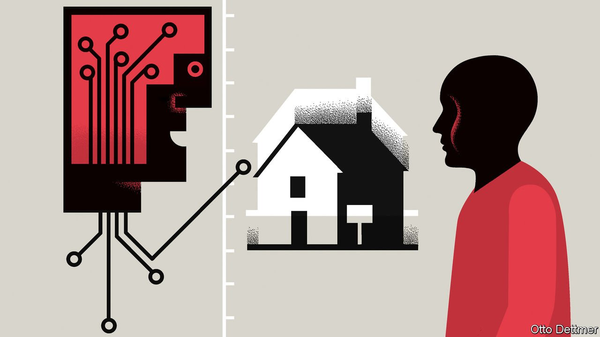

###### Free exchange

# A whodunnit on Zillow 

##### Lessons for America’s housing market 

 

> Nov 13th 2021 

THE TIMING was apt. On November 2nd, just two days after Americans celebrated their scariest annual holiday, news of a suspicious death shocked the stockmarket. Zillow, a giant property and technology firm, said it would shut down its huge instant-buying, or i-buying, business, which uses big data and algorithms to make offers on homes in dozens of cities in America and then swiftly sells them on. The firm expects to lose in excess of $500m in the second half of 2021 after it overpaid for thousands of homes. It will lay off a quarter of its 8,000 employees. It seemed like a business that should be in rude health. By and large it has been a fantastic time to buy a home almost anywhere in America—if you can only snag one: house prices have climbed between 16% and 25% during the past 18 months. So why is Zillow’s i-buying business in the morgue? And whodunnit?

Finding the right suspect matters for reasons bigger than the fate of Zillow itself. The i-buying business is one of many examples of firms using a platform to collect big data, analyse it using advanced techniques and empower their algorithms to enable a market to work more smoothly. This trend has pushed down transaction costs in many asset markets, from stocks and bonds to camera equipment and clothing. The fate of Zillow’s i-buying business might indicate that using technology to buy and sell something as idiosyncratic as a house is a flip too far.


Consider the most serious suspect first: the housing market. It has been in an unusual state of flux. At first the covid-19 pandemic caused a freeze in all property transactions. Then prices went berserk, rising at record levels year on year in April. Undoubtedly, volatile prices do no favours to algorithms trained on historical data. Still, in theory rising prices should help i-buyers by making it harder to sell a house for less than was paid for it. The reverse, falling prices, could be a more likely culprit but as yet the data are mixed. A house-price index compiled by the National Association of Realtors (NAR) finds that values peaked in June 2021, at 19% above pre-pandemic levels, and have since dropped by 2.8 percentage points. Another by S&amp;P CoreLogic Case-Shiller suggests prices are still galloping ahead. Both are published with a lag (the NAR runs to the end of September, Case-Shiller to the end of August), which means the evidence is inconclusive.

The next suspect is the mathematical models. A handful of firms offer i-buying services, the first and biggest of which is Opendoor, founded in 2014. They charge a fee for the services they provide: buying and selling homes immediately, with zero fuss. The quick in-and-out makes them more like marketmakers than property investors, who buy to hold. To succeed, i-buying firms need two critical pieces of information: the current value of a home and a forecast of the price at sale time, typically two to three months in the future. To figure these out they need troves of data, ranging from the precise location of a home, to how many rooms it has, to whether it has a pool or not. They compare these with the closest comparable homes that have sold recently and look at recent trends to make a forecast. That enables them to make an “instant” offer to a homeowner. In the past the algorithms appear to have worked pretty well. Mike DelPrete, of the University of Colorado, found they offered homeowners about 1.4% below market value—not a bad outcome for a quick, hassle-free sale.

Zillow’s boss, Rich Barton, said the big problem was with the firm’s forecasts. He claimed it had found itself unable to predict prices three-to-six months into the future. In particular Zillow seems to have projected much rosier conditions than materialised. In Phoenix, where house-price appreciation has been particularly rapid but seems to be slowing, Zillow is listing homes for an average of 6.2% less than it paid for them.

This problem is exacerbated by the fickle economics of adverse selection. Even if the algorithms of i-buying firms are excellent at pricing homes at a fair value on average, they only need to be a little off for the risk to skew to the downside. Homeowners will probably not sell their home for much less than they think it is worth, but they will happily settle for a higher-than-expected price. Mr Barton revealed in a shareholder letter on November 3rd that “higher-than anticipated conversion rates” were part of the problem. One former Zillow employee has claimed that the company wanted around 50% of homeowners who sought an offer to take it, but as many as 74% of offers made in recent months were taken up. Zillow bought almost 10,000 homes in the third quarter, more than double the amount from the prior three-month period, which itself was more than double the amount in the first quarter. The suspicion is that Zillow’s algorithm was making overly generous offers, and homeowners were rushing to take advantage.

This may have been a Zillow problem, not an i-buyer one, however. Some of Zillow’s competitors seemed to realise before Zillow that the market was losing steam. OpenDoor and Offerpad, an i-buyer founded in 2015, both began making more conservative offers relative to their models’ valuation around July as price appreciation began to cool. When they reported their earnings on November 10th neither Opendoor nor Offerpad exhibited anything like the problems suffered by Zillow.

Inside job

Perhaps the fatal blow was, in fact, self-inflicted. Zillow expanded its i-buying business aggressively. Opendoor expanded gradually. It offered i-buying services in only six markets after three years, taking its time to refine its algorithms. It is now operational in 44 markets. Zillow added almost as many markets in half as much time. A former Zillow employee told Business Insider that management had been hellbent on catching up with Opendoor, the front-runner. In order to compete, the employee alleged, the company pushed to offer generous deals to potential clients. It called this “Project Ketchup”. Now it has its own fake blood on its hands. ■

