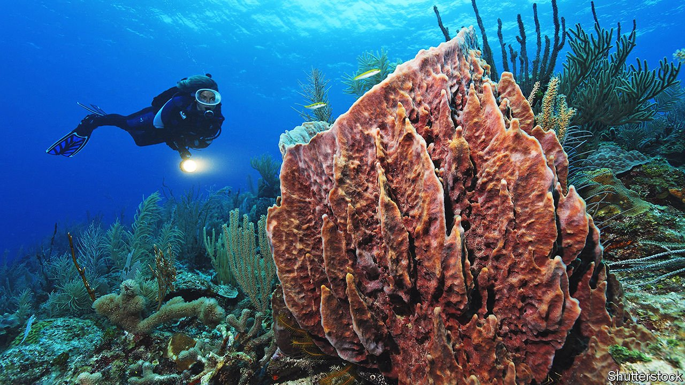

###### Reef relief

# Belize shows the growing potential of debt-for-nature swaps 

##### It is exchanging one sort of riches for another 

 

> Nov 13th 2021 

IF ECONOMIES WERE measured by their natural capital, as well as the physical and human sort, Belize would be a richer country than it is. What the tiny Caribbean state lacks in cold, hard cash, it makes up for in warm, tropical biodiversity. The Belize Barrier Reef, the second largest expanse of coral in the world, is packed with turtles, manatees and other threatened species. Holidaymakers flock to its coast to dive, snorkel or simply gaze at its waters from the comfort of a hammock. Or at least they did before the pandemic. Last year tourism dried up, growth contracted sharply and public debt jumped from just under 100% of GDP in 2019 to over 125%.

That forced Belize, not for the first time, into a debt restructuring—one in which it is seeking to exchange one sort of riches for another. As part of the deal, concluded on November 5th, Belize bought back its only international bond, a $553m liability misnamed the “superbond”, at 55 cents on the dollar. It funded that with $364m of fresh money, arranged by The Nature Conservancy (TNC), an NGO, which is insured by the International Development Finance Corp, an American agency. The transaction is backed by the proceeds of a “blue bond” arranged by Credit Suisse, a bank. The payback is due over 19 years with a coupon that begins below that of the superbond but rises above it over time.


It is called a blue bond because Belize has pledged to invest a large chunk of the savings into looking after the ocean. That includes funding a $23m endowment to support future marine-conservation projects and promising to protect 30% of its waters by 2026.

It might be argued that Belize should do this anyway to support tourism, which accounts for 40% of economic activity. But at a time when governments and investors are looking at novel ways of funding environmental clean-ups, Belize was able to use its natural patrimony to gain leverage over bondholders. Whether it will be enough to stop it defaulting again in the future is another matter.

Debt-for-nature swaps are nothing new. Lenders have been offering highly indebted countries concessions in return for environmental commitments for decades. But these transactions have historically involved debt owed to rich countries, not commercial bondholders. As Lee Buchheit, a lawyer who specialises in sovereign-debt restructurings, points out, they were “negligible in size”. In total, the value of debt-for-climate and nature-swap agreements between 1985 and 2015 came to just $2.6bn, according to the United Nations Development Programme. Of the 39 debtor nations that benefited from the swaps, only 12 negotiated debts of over $30m. “It was really an exercise in public relations,” Mr Buchheit says.

A lot has changed since then. Governments are now under immense pressure to make ambitious commitments on climate change and biodiversity. And investors are eager to show they can make money as well as being committed to environmental, social and governance goals.

Other poor countries are trying to move in the same direction. At the COP26 climate summit in Glasgow Ecuador’s president Guillermo Lasso proposed enlarging the country’s Galapagos nature reserve through a debt-for-nature swap. And TNC is in talks with other poor countries interested in doing something similar. Once a blueprint is in place, agreement gets simpler. The last restructuring of the same sort that it took part in, which involved $21.6m of debt owed by the Seychelles to the Paris Club of creditors, took four years to thrash out. Negotiations in Belize lasted a year and a half.

Yet no amount of creative dealmaking can distract from the grim truth: many emerging markets still suffer from crushing debts. The pandemic has pushed half of the world’s poorest countries into debt distress or heightened the vulnerability to it. And debt-for-nature swaps only help at the margin. Last week’s restructuring reduced Belize’s external debt by $250m, or 12% of GDP. The success is for coral reefs more than debt relief. ■


