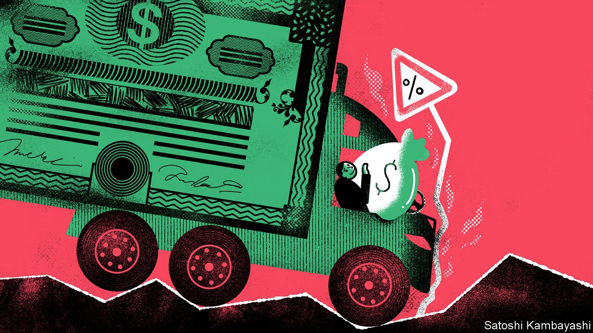

###### Buttonwood

# Cash is a low-yielding asset but has other virtues 

##### The immediacy of cash is a plus when other investments rely on evermore distant earnings 

 

> Nov 13th 2021 

EVER HAD the feeling that there is a party somewhere that you’re not invited to? It is the same feeling investors have when they have capital sitting in three-month bills or on deposit at a bank. Cash is a safe asset, but a wasting one. The real returns on risky assets have been much greater. True, cash affords options—to buy cheaply when others are selling. But episodes of distressed selling have been fleeting, largely thanks to central banks, which have been liberal in supplying cash in emergencies. Why then should investors incur the opportunity cost of holding it?

In its favour, cash is at least now offering a small return, or the prospect of one. Overnight interest rates have risen, notably in Latin America and Eastern Europe. The Bank of England may raise its benchmark interest rate before the year is out. The Federal Reserve may follow at some time next year. But the rate of return in short-term money markets is still below the rate of inflation and is forecast to stay that way. For those seeking returns, holding cash remains a loss-making prospect in real terms.


The true appeal of cash as a portfolio asset lies somewhere else. More and more capital is tied up in investments where much of the payoff lies in the distant future. You see this in the huge market capitalisations of a handful of tech companies in America and in the money flooding into private-equity and venture-capital funds. Investors have to wait ever longer to get their money back. In the meantime their portfolios are vulnerable to a sharp rise in interest rates. A simple way to mitigate this risk is to hold more cash.

The concept of “duration” is a useful one in this regard. Duration is a measure of a bond’s lifespan. It is related to, but subtly different from, the maturity of a bond. Duration takes into account that some of what is due to bondholders—the annual interest, or “coupon”—is paid out sooner than the principal, which is handed over when the bond matures. The longer you have to wait for coupon and principal payments, the longer the duration. It is also a gauge of how much the price of a bond changes as interest rates shift. The greater a bond’s duration, the more sensitive it is to a rise in interest rates.

You can also think of equity investment in duration terms. Take the familiar price-earnings ratio, or PE, the price paid by investors for a given level of stockmarket earnings. The idea is that if a stock has a PE of ten, based on recent earnings, it would take ten years to earn back the outlay of an investor who buys the stock today, assuming earnings stay constant. If the PE is 20, it would take 20 years. The PE is thus a crude measure of the stock’s duration. On this basis, American stocks in aggregate have rarely had a longer duration. The cyclically adjusted price-earnings ratio, a valuation measure popularised by Robert Shiller of Yale University, is now close to 40. It was higher only at the giddy height of the dotcom boom in 1999-2000.

The rationale for longer-duration assets is a familiar one. Real long-term interest rates are about as low as they have ever been. As a consequence investment returns even in the distant future, once discounted, have a high value today. It is not just stocks. Property is valued at a steep price relative to the stream of future rents. Investors are piling into private-equity and venture-capital funds that won’t pay out for a decade or more. Everyone, it seems, is long duration. But with longer duration comes a greater risk that unexpectedly aggressive interest-rate rises will lead to a collapse in asset values.

A typical investment portfolio of stocks, bonds and property is vulnerable to this risk. There are not too many good ways to hedge it. Buying insurance in the options market against a stockmarket crash is expensive and fiddly.

This is where cash comes in. Cash is by definition a short-duration asset. Were interest rates to go up sharply, cash holders would get the benefit quickly even as other assets suffer. So as the duration of your portfolio rises, it makes sense to raise your cash holdings too. By precisely how much will depend, as ever, on your risk appetite. Just as you are advised to sell down your stocks to the level where a night’s rest is assured, you might also build up your cash holdings to the sleeping point.

Of course, such a strategy comes with an opportunity cost. As long as asset markets continue to boom, cash will be a drag on your portfolio. So be it. Missing out on some returns is the price you pay for mitigating duration risk.


