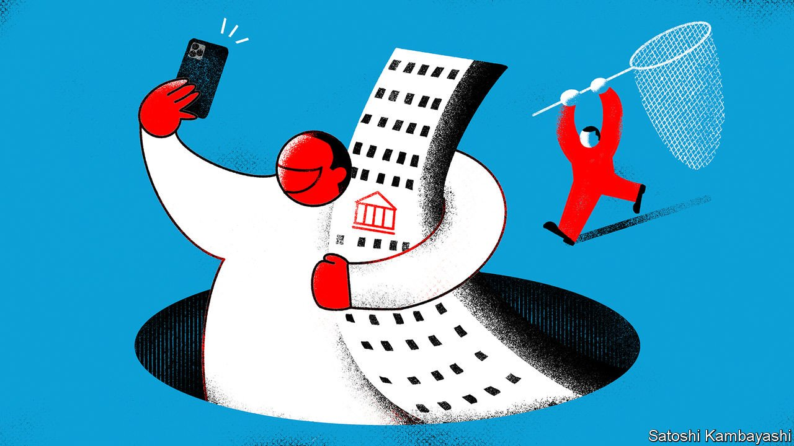
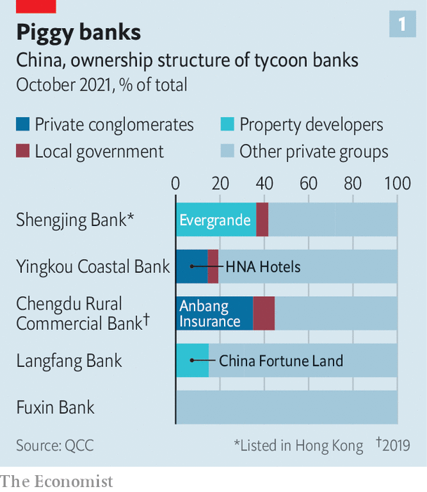
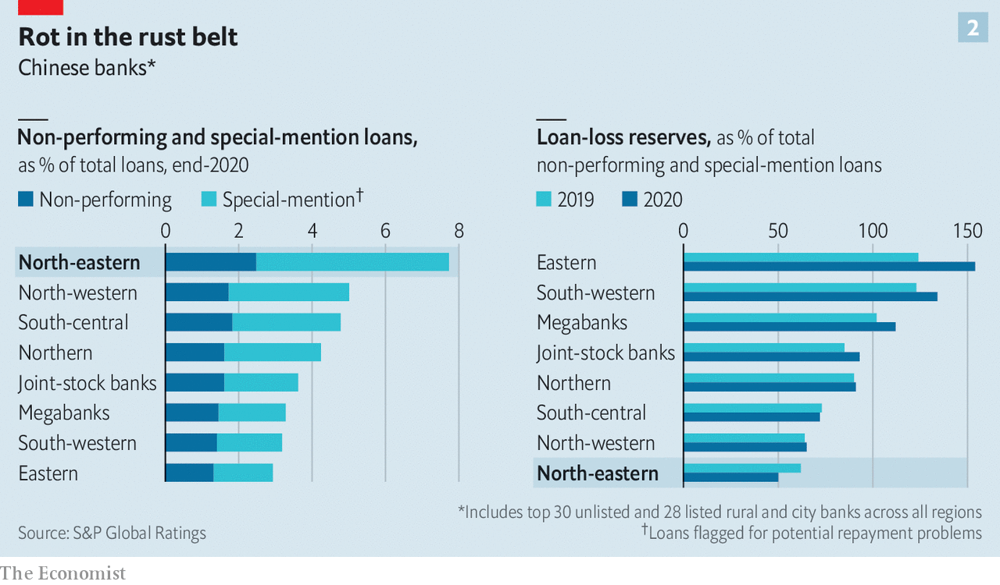

###### Attack on the tycoons

# China attempts to clean up its sleaziest regional banks 

##### It’s not just Evergrande. The rot in China’s banking system goes deeper 

 

> Nov 8th 2021 

IT’S BEEN A bad year to be a big cheese in China. Billionaire entrepreneurs have been hounded. Over-extravagant entertainers have disappeared from the internet. Now a new type of tycoon is feeling the heat. The latest regulatory crackdown on what the government considers private-sector misbehaviour extends to businessmen with excessively cosy ties to banks. The fear is that insider dealing, preferential access to credit and lax corporate governance pose threats to stability, particularly in the regional and local underbelly of China’s financial system.

The most prominent red flag is Evergrande, a debt-ridden property firm close to collapse that until recently had a 36% stake in Shengjing Bank, a local lender based in the north-eastern province of Liaoning. The authorities are said to be investigating whether Evergrande, which is run by a billionaire, Hui Ka Yan, took control of Shengjing, with about 1trn yuan ($156bn) in assets, using illicit means, as well as conducting some 100bn yuan in related-party transactions.


Another notorious case involves HNA Group, an acquisitive conglomerate which took over Yingkou Coastal Bank in Liaoning in 2014 (see chart 1). HNA put new leaders into the bank and transformed it into a mill for shadow-banking products that provided it and related groups with copious amounts of credit. Its assets tripled in 2016, making it the fastest-growing bank in China that year—before it almost collapsed. Since February HNA has been in bankruptcy administration. Chen Feng, its co-founder and chairman, was arrested in September, as was its CEO.

 


The malaise goes far deeper, posing a potential threat to economic stability in some Chinese provinces, particularly rust-belt ones like Liaoning. The 134 metropolitan and 1,400-odd rural commercial banks in China make up about 32% of its commercial-banking sector, with some 90trn yuan, or $14trn, in total assets. That is almost the size of Britain’s entire banking system. They exist in the shadow of China’s six big national-level banks and 12 joint-stock banks, which are predominantly state-owned and have the most visibility. Unlike the bigger banks, during most of the past decade many of those in the lower tiers have sold ownership stakes to large private investors, to the point of being under the influence of them. In recent years some have become cesspools of bad debts, insider dealing and failures of risk management, which are often attributed to misaligned ownership incentives.

This has aroused the concern of regulators. The central government is expediting a reform to push out what it calls “problem shareholders” from banks. On October 15th the China Banking and Insurance Regulatory Commission introduced rules that extended supervision of those that it considered to be banks’ controlling shareholders. According to China Daily, a government mouthpiece, that extended to anyone holding a 10% stake or more in a city or local bank, or those holding the largest equity stake in a bank or insurance company, with ownership of no less than 5%. The aim is to weed out over-cosy corporate interests.

If corporate shareholders are indeed the problem, the authorities will have their hands full. The Economist calculates that of 107 city commercial banks that disclosed financial information for 2020, 72 with about 20.2trn yuan in total assets had large corporate shareholders, many of which were property developers and manufacturers. Twenty-two of this group were controlled outright by corporations and tycoons, or had been until they were recently forced to restructure. But even those with more than one large shareholder have attracted the attention of regulators. The authorities are likely to be scrutinising the way investors compete with each other for preferential treatment.

The level of corporate ownership at rural commercial banks extends even further—to the point that it has shocked some researchers. Wang Chunyang of Peking University surveyed 1,295 rural banks and found that 1,122, or about 87% of them, had private companies as their largest shareholders. By our calculations, that level of private ownership implies that up to 39.4trn yuan in rural-banking assets could be controlled or influenced by private interests. For these banks, identifying problems early is a challenge. Smaller lenders are more likely to hide their bad debts, says Ruan Tianyue of National University of Singapore, creating a regulatory blind spot.

Private ownership of banks, by itself, is not the cause of the problem. Some privately held banks, such as the newly created Zhongbang Bank, have performed well. For their part, many small, government-controlled lenders have demonstrated abysmal risk controls. But in banks lacking in corporate governance, the risk is that the owners use their clout to extract loans on preferential terms, undermining prudent risk management and increasing the level of bad debts.

That could have economic consequences. Some experts liken the state of China’s small banks to that of the more than 1,000 savings-and-loan institutions that collapsed in America in the mid-1980s due to deregulation and lax lending controls. They say bad-debt problems among city and rural banks could hurt regional economic growth.

Another problem is more political in nature. As evidence grows of tycoons’ murky relationships with banks, the more it plays into the narrative of President Xi Jinping that socialist command-and-control policies do a better job than private capital in allocating economic resources.

Signs of misbehaviour appear to be mushrooming. Besides Evergrande, which has been forced to sell some of its shares in Shengjing, Hong Kong-listed Bank of Gansu required a bail-out last year after it lent to and invested heavily in the debt securities of one of its shareholders, which eventually defaulted. Bank of Jinzhou, a north-eastern lender, required an emergency restructuring after its largest shareholder, to which it had extended many loans, could no longer pay back creditors. Anbang Insurance, the unwieldy conglomerate best known outside China for buying the Waldorf Hotel in 2014, controlled Chengdu Rural Commercial Bank until 2020. Xiao Jianhua, a tycoon who was kidnapped by Chinese agents from a Hong Kong hotel in 2017, controlled two lenders, Baoshang Bank and Bank of Harbin, both of which required expensive state bail-outs.

These problems are unlikely to abate as China’s economy decelerates and more companies default. In September shares in Fuxin Bank were put up for sale in an online auction meant to help raise capital for the struggling lender after a property developer with shares in the company could no longer repay its debts. Bank of Langfang faces a potential increase in bad debts after its second-largest shareholder, China Fortune Land, a developer, defaulted on a 5.3bn yuan bond earlier this year.

Regulators take several approaches towards weeding out miscreant owners—of varying severity. One is to push out problematic shareholders. In mid-2020 the banking regulator published a list of 38 “illegal shareholders” that it had forced to divest. Another is detention. Mr Xiao, for instance, is thought to be currently held in Shanghai, where he is assisting in the unwinding of his business operations. A third is the death sentence. Cai Guohua, former chairman of Hengfeng Bank, which required a bail-out in 2020, was handed a suspended death sentence for, among other things, taking illegal loans.

Authorities have no intention of forcing all private shareholders out of the banks, but they are moving to ensure that the largest shareholders come from the state, says Lian Ping of Bank of Communications, a large Chinese bank. This will mean an upheaval across the industry, given how prevalent large, private shareholders have become in recent years. Such regulatory actions will take time and will need to avoid undermining depositor confidence at banks.

 


In some regions, such as the north-east, the government has sought to restructure handfuls of banks at a time, possibly worried about a regional concentration of debt woes. S&amp;P Global, a ratings agency, says that nearly 8% of the loan books of the most prominent city and rural lenders in the north-east were non-performing or of questionable status in 2020. The figure was just 3% for the loan books of similar banks in eastern China (see chart 2).

The north-east has one of the highest rates of private ownership in the country. In Liaoning province, for example, eight of its 15 city commercial banks are privately controlled. That produced a drive for consolidation. After the HNA debacle, Yingkou Coastal Bank became the central pillar of an effort to merge banks in Liaoning. At first regulators went so far as to attempt to bring together 12 of Liaoning’s banks. But later this ambition was downsized to two, including Yingkou.

For all the regulatory overdrive, the neatest solution continues to evade Chinese regulators: allowing banks to fail and exit the market. Not since the collapse of Hainan Development Bank in 1998 has a lender been allowed to fail. And that was a convoluted bankruptcy that still drags on to this day. Rural banks would be fertile ground for such tests. ■

For more expert analysis of the biggest stories in economics, business and markets, , our weekly newsletter.

