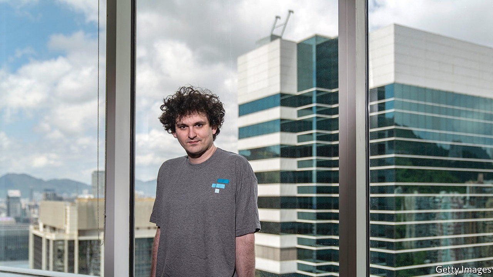

###### The bitcom boom

# Will the craze for crypto startups ever produce the next tech giant? 

##### As big investors weigh in, valuations are reaching the stratosphere 

 

> Nov 13th 2021 

THE HONG KONG office of FTX, a cryptocurrency exchange, is a place where basic needs come second to business. Food and booze lie around desks fitted with six screens each. Sam Bankman-Fried, its boss, says he sleeps four hours a night on a bean bag next to his desk—if he’s lucky. He sees little difference between breakfast and dinner, apart from “which restaurants are open for delivery”.

His restlessness mirrors that of crypto markets, which never sleep. But it also reflects the speed at which the two-year-old firm is growing. Last month FTX announced a $420m funding round that valued it at $25bn, just three months after investors gave it a price tag of $18bn. The deal featured the crème de la crème of the investment universe, including BlackRock, the world’s largest money manager, OTPP, a $170bn Canadian pension fund, and Temasek, a sovereign fund from Singapore.


FTX’s funding feast is symptomatic of investors’ growing appetite for crypto startups, especially those that are creating the tools to build a blockchain-based future. In the first nine months of 2021 they raised $15bn in venture capital (VC), five times their tally for the whole of 2020. In the third quarter 12 crypto unicorns—startups valued at $1bn or more—were born, a record. The heady times remind some venture capitalists of the dotcom era. But they’re not sure whether they are partying like it’s 1994—or 1999.

 


One trigger for the capital flows is the rising demand for digital monies from retail speculators. That is influencing VCs to back crypto wallets and exchanges. Investors are also betting that, as regulation becomes clearer, institutions will take it more seriously, stirring demand for crypto tax advisers, analytics firms and asset custodians, says Matt Burton of QED, a VC firm. Red-hot indicators such as the bitcoin price, which flirted with a record $69,000 this week, are turbocharging excitement.

The industry’s boundaries are expanding, too. Blockchain startups are promoting new forms of financial services (decentralised finance), digital ownership (non-fungible tokens, or NFTs) or incentive models (as in gaming, where users can earn crypto as they play). NFT ventures have raised $2bn so far this year, up from $31m in 2020. Four-fifths of VC deals have been early-stage rounds.

Most intriguing is the entry of new investors. Successful crypto firms are reinvesting cash into younger ones. The most prolific is Coinbase Ventures, the investment arm of America’s largest crypto exchange, which sealed 24 deals in the past quarter. On November 5th FTX and other firms launched a $100m gaming fund.

Deep-pocketed investors from mainstream finance are also pitching in. They include well-known venture funds, such as Andreessen Horowitz, an early backer of Facebook and Skype. SoftBank, a trigger-happy Japanese group, made six crypto deals in the past quarter. They also feature some hedge funds and asset managers. Such investors helped complete 15 rounds of more than $100m in the last three months. Together these accounted for two-thirds of total VC money spent.

Shan Aggarwal, who runs Coinbase Ventures, says the craze recalls the dotcom boom of the 1990s, when investors rushed to back the firms that would form the foundations of the web economy. In one respect the current era is even more impressive: while the internet bubble was mostly nurtured in Silicon Valley, the “bitcom” boom spans Asia ($1.4bn raised this quarter) and Europe ($1.1bn) in addition to America ($3bn). Crypto unicorns are cantering ahead in Africa and Latin America, too.

Whether it will produce successes like today’s tech giants is still an open question, though. It’s early days. The bounty garnered by crypto firms in 2021 amounts to 16% of the sum raised by fintech firms and 3% of that raised by startups at large. Big deals have buoyed the average size of investment rounds to $21m, triple the level of 2020, but the median, at $4m, is small.

Some valuations look silly: in September Sorare, a fantasy-football game played on the blockchain, closed a $680m round that valued it at $4.2bn, or 22 times sales—more than Facebook’s multiple when it did its initial public offering. All of which suggests that some investors will make out like bandits, while others will get their fingers burned. For good or ill, more sleepless nights beckon. ■

