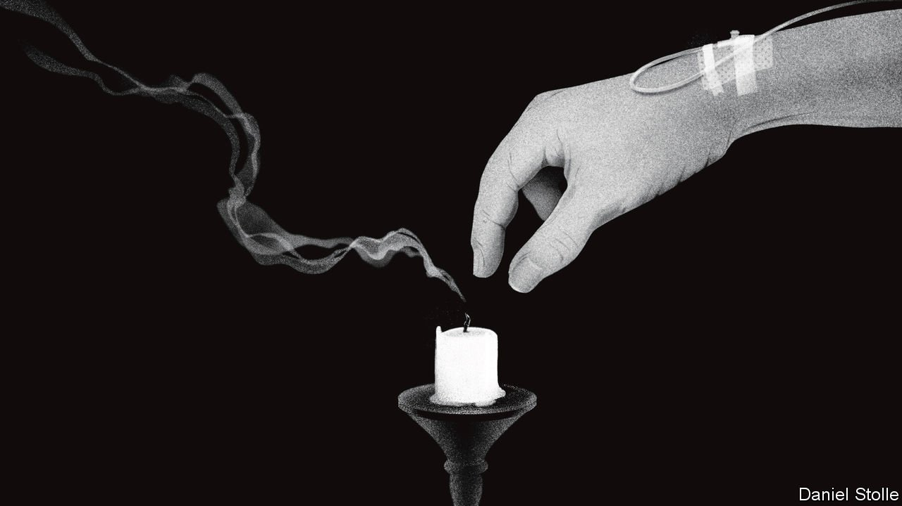
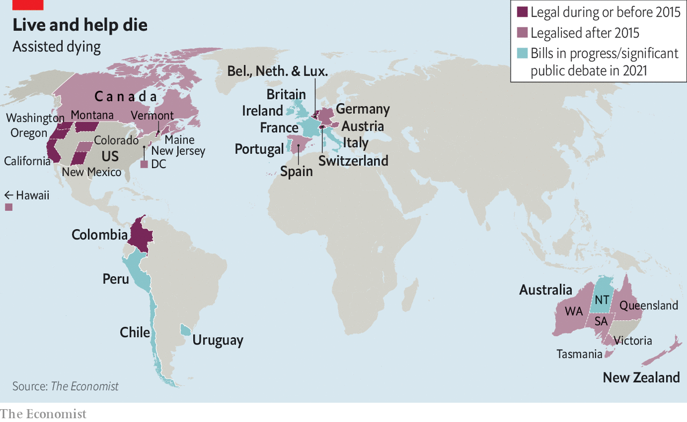
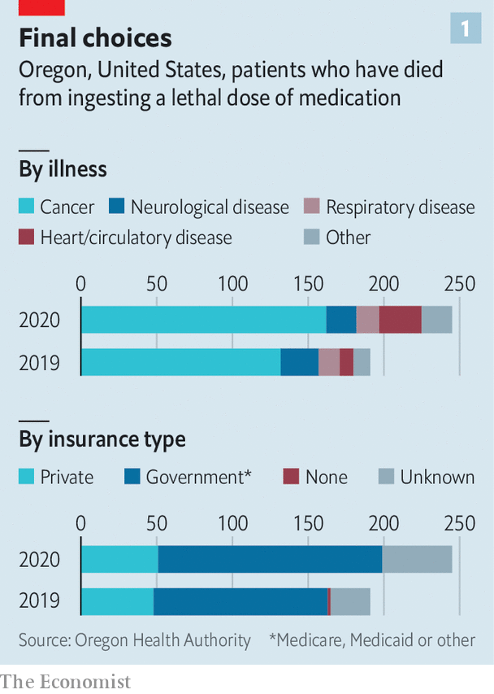
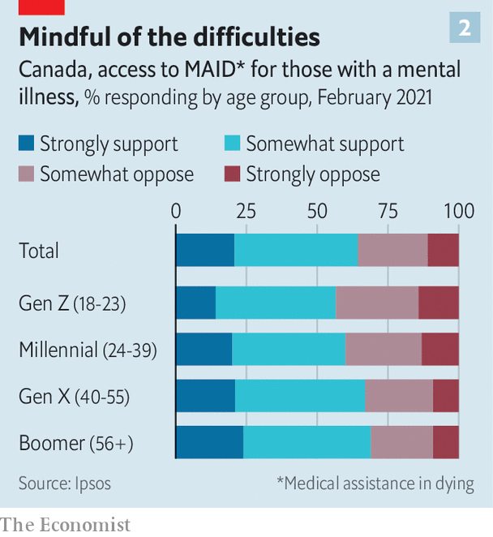
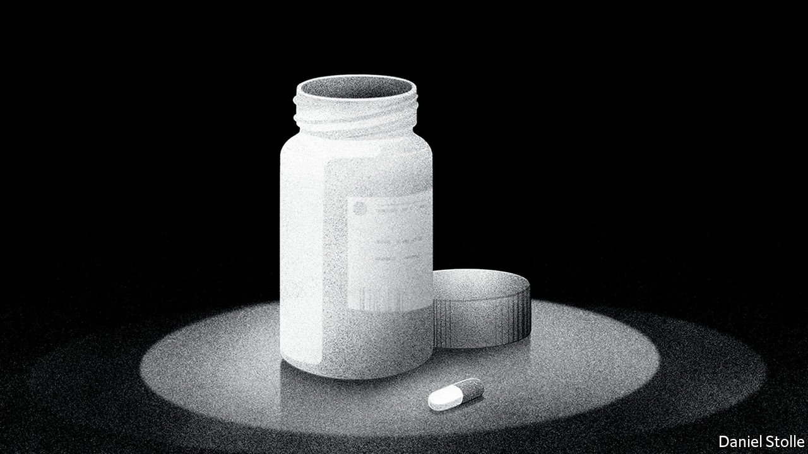

###### Death on demand

# In the West, assisted dying is rapidly becoming legal and accepted 

##### It is raising hard questions and changing how people think about death 

 

> Nov 13th 2021 

SHORTLY BEFORE Ángel Hernández handed his wife the glass of barbiturates that would kill her, he asked her once again if she wanted to die. “The sooner the better,” she replied. Ravaged as María José Carrasco’s body was by multiple sclerosis, she struggled to swallow the poison. In the end she forced it down through a straw.

Ms Carrasco’s death in 2019 provoked a media storm in Spain. In Madrid the investigating judge initially referred the case to a court that specialises in violence against women. The prosecutor pushed for Mr Hernández, then 70, to serve six months in prison. But on June 25th Spain enacted a law allowing those with a “serious or incurable illness” or a “chronic or incapacitating” condition to seek help to end their own lives. Twelve days later, Mr Hernández was acquitted.


In much of the West public opinion has long favoured assisted dying. In 2002 60% of Spaniards supported voluntary euthanasia, a share which had risen to 71% by 2019. Writ large, secularisation and increasingly liberal values have solidified support. But so has personal experience, particularly that of baby-boomers who, having witnessed their parents’ suffering, are fighting for the right to deaths of their own choosing.

Change has been rapid. Assisted dying is now legal or decriminalised in at least a dozen countries, with legislation or court challenges pending in many others (see map). On November 5th Portugal’s parliament approved a revised bill which would allow those with “grave, incurable and irreversible” conditions to receive help to end their lives (the constitutional court had in March blocked an earlier version as being too imprecise). Other largely Catholic countries such as Chile, Ireland, Italy and Uruguay are also moving towards enshrining a right to die. In Belgium, Colombia and the Netherlands governments have broadened assisted-dying laws to include terminally ill children.

 


After years of struggle, activists and politicians have found ways through or around reluctant legislators. The right to die has been ticked through American ballot boxes, squeezed through Australian legislatures, and gavelled through Canadian and European courts. Proponents are using public consultations and petitions to demonstrate public support. And growing evidence from countries with assisted-dying laws has assuaged fears it will become easy to “kill granny”. The changes are snowballing as advocates in one country learn from their counterparts elsewhere.

Assisted dying is still rare. Most cases are cancer-related, and the number of deaths is tiny. But they are nonetheless changing how people think about dying. In some countries assisted dying has been extended to those with mental disorders and dementia, and even to old people who feel tired of life. A clandestine network of baby-boomers who share methods to kill themselves has sprung up on the internet. Even some proponents are beginning to worry about a slippery slope.

Thirty years ago assisted dying was illegal everywhere bar Switzerland. But in 1997 the American state of Oregon approved the Death with Dignity Act, initiating a spate of liberalisation. In Oregon two doctors must agree that a patient is of sound mind and has less than six months to live before he or she can receive the lethal drugs. These must be administered by the patient (known as physician-assisted dying) rather than injected by a doctor (voluntary euthanasia). Around 2,000 people have died under the law (roughly 250 of them last year, see chart 1), with no wrongful deaths reported. Versions of the law are now on the books of ten states, home to a fifth of Americans, as well as in Washington, DC.

 


Oregon’s rules are being copied internationally, with some modifications. New Zealand’s Oregon-style law came into effect on November 7th. In Australia, the state of Victoria passed a similar law in 2017, and since then all but one of Australia’s six states have followed suit. In Britain, an Oregon-style bill passed its second reading in the House of Lords in October. But to become law it would also need the support of the House of Commons and the government, which looks unlikely. Three-quarters of Britons support a right to die, but only 35% of MPs do.

Some campaigners are circumventing cautious representatives by going through the courts. In February Peru’s constitutional court ruled that the Ministry of Health’s refusal to help a woman with degenerative polio end her life violated her rights to “dignity” and “autonomy”. Several countries, such as Austria, are beginning to flesh out a ruling by the European Court of Human Rights in 2011 that people have the right to decide the time and manner of their deaths. After Germany’s highest court declared in 2020 that a ban on repeatedly helping others die was unconstitutional, Dignitas Germany, a non-profit organisation, began to help people kill themselves.

Even after a legislature or court opens the door to assisted dying, those pursuing the option can face high hurdles. With 68 safeguards, Victoria’s law excludes some of the people it was intended to help. Doctors are forbidden to bring up assisted dying with their patients, so many do not know it is an option. Colombia decriminalised voluntary euthanasia in 1997, but is only now regulating the practice. As a result, many Colombian doctors refuse to get involved for fear of prosecution. Approval is rare and can be withdrawn.

Despite such strictures, the expansion of the right to die is not without controversy. In Canada, the Supreme Court ruled in 2015 that a ban on medical assistance in dying (MAID) violated the national Charter of Rights. Now MAID is available to all Canadians who suffer from chronic physical illness or disability. Uniquely, the law allows patients to determine what constitutes “unbearable” suffering. In 2020 only 6% of written requests for MAID were refused.

Some advocates for the disabled argue that the amended law devalues the lives of those with disabilities. It’s “literally unthinkable” that MAID would be doled out instead on the basis of race, sex or any other protected characteristic, says David Shannon, a quadriplegic lawyer who campaigns against assisted dying. But others argue that the foundations of the disability movement lie in creating the freedom to make one’s own choices.

 


Opponents also fear that Canada may end up helping people die before it has helped them live. Disabled people who do not get enough support may choose to die because society has failed them, critics argue. They worry this may prove particularly true for people whose lives have been filled with abuse, racism and poverty, though data from America show that those who choose assisted death are overwhelmingly middle-class, white and educated.

From 2023, Canada will extend MAID to those who suffer solely from mental illness, on the ground that to do otherwise would discriminate. Many Canadians find this troubling (see chart 2). They worry that doctors may indulge the suicidal urges that are a symptom of many psychiatric disorders: one in ten schizophrenics kill themselves, some studies reckon. Others question whether a patient could have tried every possible treatment when the medical and social understanding of mental illness is so rudimentary and mental-health services are so often inadequate. Most people underestimate how serious an intractable psychiatric condition can be, says Mona Gupta, a Québécoise psychiatrist and bioethicist. They see depictions of mental illness in popular culture but have never met anyone severely affected.

The only way out

John Scully, who has lived with severe depression and PTSD for decades, agrees. At home at night in Toronto, Mr Scully, who is 80, is haunted by the horrors he witnessed as a war correspondent: the dead torn apart by vultures, the AK47 scoped to shoot him. He also experiences physical pain. “There is no cure,” he says. Nineteen shock therapies, countless medications and six stints as a psychiatric patient have failed to bring him relief. The “only help available”, he believes, is assisted dying. He sees it as a far more dignified choice than suicide, which he has attempted twice, and he thinks it would be less painful for his family.

Like other bioethicists, Dr Gupta thinks mental disorders should be seen in the same light as other conditions that create chronic pain. For doctors, she says, the assessment process would be much the same: distinguishing between an impulsive death-wish and a considered one, and determining if a patient is mentally competent. Such cases are rare. In 2020 in the Netherlands, only 88 people with mental illnesses—12% of all those who made requests—had their requests for help approved by a euthanasia clinic. Many are heartened by simply having the option.

Canada is making the same mistakes as the Netherlands, reckons Theo Boer, a Dutch ethicist who once supported his country’s euthanasia laws. Since Dutch doctors pushed to legalise assisted dying 20 years ago, he believes that voluntary euthanasia has gone from being a “last resort to prevent a terrible death to a last resort to prevent a terrible life”. Voluntary euthanasia is a shortcut to death, like a C-section is a shortcut to birth, he argues. In the Netherlands as a whole, one death in 25 is assisted, he notes, but in some cities that figure can be as high as one in seven.

The choice to die is often murkiest for those with dementia. In 2016 a Dutch woman with severe Alzheimer’s awoke during her euthanasia and, as she struggled, her family had to hold her down. Before dementia overcame her, she had made a written request for euthanasia, and the doctor prioritised that choice. In 2020, after the doctor was cleared of wrongdoing, the Supreme Court clarified that doctors cannot be prosecuted for carrying out euthanasia on patients with advanced dementia, even if they no longer express an explicit wish to die. The Netherlands averages around two such cases a year.

Bert Keizer, a geriatrician who has carried out some of the Netherlands’ most controversial euthanasia cases, is deeply uneasy about the new guidelines. Euthanasia usually happens with the agreement of the patient, doctors and the family. But in cases of dementia, he muses, “the one who it’s all about’‘ is “removed from the event”. Implicit in the court’s ruling is a judgment that the person one was has more value than the person one has become. A patient who wanted to live could be denied that choice.

What lies ahead

Swiss law, by contrast, mandates that those seeking to kill themselves be mentally competent. This can create a different fear. Alex Pandolfo has early-onset dementia. He has decided to die in Switzerland, yet he has postponed the day of his death once. If he waits too long, he will doom himself to the future he does not want.

Some proponents of assisted dying are pressing to expand eligibility, to include those who feel they have lived a “completed life”. In 2020 the liberal D66 party in the Netherlands proposed a law to make suicide pills available to people over 75 who felt they were done living. Critics point to research from the University of Humanistic Studies in Utrecht, which shows that death wishes in older people are subject to change, and in some cases are caused by loneliness and isolation. Few truly want to die, and those who do often meet other criteria for euthanasia, a commission found in 2016. Supporters say it is important to offer the choice, even though few will take it in the end. Just 3% of the members of Dignitas, which campaigns for assisted dying, end up getting help to end their lives.

 


Some who are tired of life, or unwilling to endure its decay, do choose to press ahead. At 76, Dawn Voice-Cooper, who suffered from debilitating but not life-threatening ailments, saw her future and did not want to live it: the pain of having her ears syringed; the indignity of swimming with a colostomy bag; the diminishing freedom to move as her arthritic joints stiffened. Life was exhausting and would only become more so. “I don’t want to die but I can’t live like this,” she said. In October she travelled from her home in Britain to an industrial estate on the edge of a Swiss forest. After listening to Nick Drake’s “Day is Done”, she died, with her friend Mr Pandolfo (and a tabloid reporter) by her side.

“Many people are not waiting for laws to pass,” warns Katie Engelhart, author of “The Inevitable”, a book about the right-to-die movement. It reveals a secret world where people, fed up with restraints imposed by laws or doctors, order lethal substances over the internet. Their reasons are often existential rather than physical: a loss of purpose, fear of being a burden or of losing their dignity. People who seek death through legal channels have similar reasons. In Oregon the most common concerns among people who qualify to die owing to terminal illness include loss of enjoyment (94%), loss of autonomy (93%) and loss of dignity (72%).

Some shrug this off, arguing that “assisted dying is not suicide.” But Ms Engelhart believes that such deaths are inevitably linked to the strictures around assisted dying. In New South Wales, Australia, for example, one in five people over the age of 40 who kill themselves have a terminal or debilitating illness. Yet many lonely suicides are not planned and considered, so a black market in suicide can bring terrible risks. Earlier this year a 28-year-old Dutch woman died after taking a substance from an affiliate of Last Will Cooperative, a right-to-die organisation, it seems impulsively. Several members of the group, including its leader, have since been arrested. Prosecutors suspect the group is involved in dozens of deaths.

In the West, assisted dying is helping to change the culture of death. People are talking about it more, and even scripting it, says Naomi Richards, a British anthropologist. Death is becoming an event to be scheduled, controlled, reached via a byway past ageing or suffering. In an Instagram age, it is possible to imagine a “good death” being idealised and curated. Ellen Wiebe, a Canadian doctor, says she has helped people die “on a beach, in a forest and in the middle of a party”. Such deaths may seem particularly appealing when, for generations, dying has been medicalised and hidden, and during a pandemic in which so many have died alone in hospital.

For those left behind, an assisted death can feel like a blessing or a curse. Some, such as Tom Mortier, who has taken his mother’s case to the European Court of Human Rights, feel angry and resentful that a relative was taken too soon. But most find solace. Heather Cooke’s son, Aaron Ball, chose to die last year, at 42, while suffering from metastatic colon cancer. Ms Cooke suffers the agony of a mother who has lost her only child, but she is also comforted that he died in peace, at home, surrounded by his family. Medically assisted dying was a “gift” for us, she says. “But I understand why people fear it.” ■

