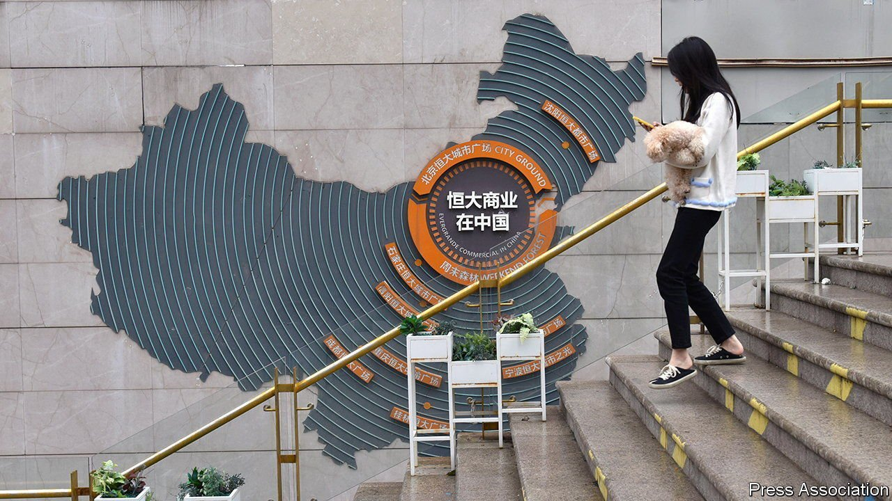
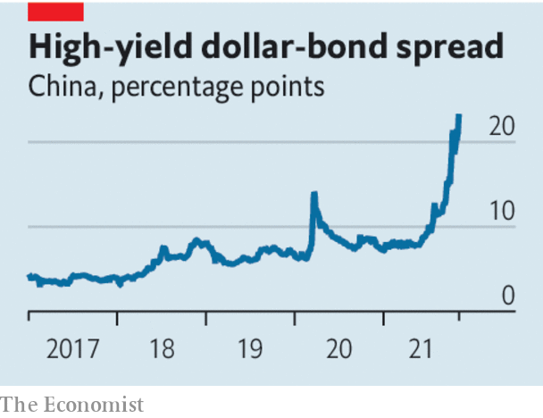

###### China’s other debt problem

# Evergrande is not the only looming danger in China’s financial system 

##### Crony capitalism has flourished among the country’s small and mid-tier banks 

 

> Nov 13th 2021 

SCARES ABOUT toxic debt are an ever-present feature of China’s economy. The latest involves Evergrande, a troubled developer that threatens to cripple the property sector. The firm also has tentacles that reach into the darkest corners of the Chinese financial system, wrapping around banks and shadow lenders. Yet even as Evergrande catches the eye, another risk is emerging: crony capitalism at smaller banks.

A government crackdown on leverage in property has pushed Evergrande to the brink of collapse. Other large developers are weighed down by $5trn of debts. Speculation is swirling that one of them, Kaisa, is also struggling to make payments (it has asked investors for “time and patience”). The turmoil may intensify as more debts come due. According to Nomura, a Japanese bank, the property industry must repay $20bn of offshore bonds in the first quarter of 2022, twice the level of this quarter.


Foreign investors have been quick to grasp the risks. The yield on Chinese junk dollar-bonds has reached a crippling 24%, shutting most issuers out of the market. Some homebuyers are holding off purchases, worried about handing over deposits to weak firms. Building has stalled at many of Evergrande’s 1,000 or more projects.

 


It is unclear who is exposed to losses, and to what extent. Many developers use shell companies, masking their debts, while stockmarket regulators have allowed them to keep investors in the dark. On November 8th the Federal Reserve warned that China’s property troubles threaten the global economy.

Losses on property loans will hurt the banking system, although by how much remains to be seen. But as we explain this week, lenders also face another danger. Crony capitalism has flourished among the country’s small and mid-tier banks. Because the biggest state-owned lenders prefer to make loans to other state firms, private companies and entrepreneurs have bought stakes in banks in the hope of getting preferential access to credit.

Although the banks involved are often small they add up to a giant problem. The Economist calculates that up to 20% of the commercial-banking system may have close links with tycoons or private businesses. There have already been blow-ups. In 2019 the collapse of a small lender caused a spike in interbank borrowing rates; several more failures have followed. Evergrande was until recently the owner of a captive bank in north-east China and is said to be under investigation for some 100bn yuan ($15.7bn) in related-party deals.

For Xi Jinping, China’s leader, state control is the answer to both the property and banking threats. To keep building sites ticking over, local governments are taking control of some unfinished projects. At smaller banks many corporate shareholders are being forced out and replaced by local-government asset managers.

This reveals the limitations of Mr Xi’s economic philosophy. The expanding reach of state control may prevent a full-blown panic, because it shows that almost all banks are underwritten by the government. But it fails to acknowledge an important truth about the economy.

Many of the distortions that plague China’s markets were created by rigid state control. In plenty of private firms, insider dealing with lenders has been a way to cope with a state-dominated banking system that discriminates against them. Mr Xi may succeed in averting a sudden bad-debt crisis by reasserting state authority. But his reluctance to be bound by rules, treat state and private firms equally, and offer predictability to investors will ensure that the financial system is doomed to suffer yet more dangerous distortions in the future. ■

