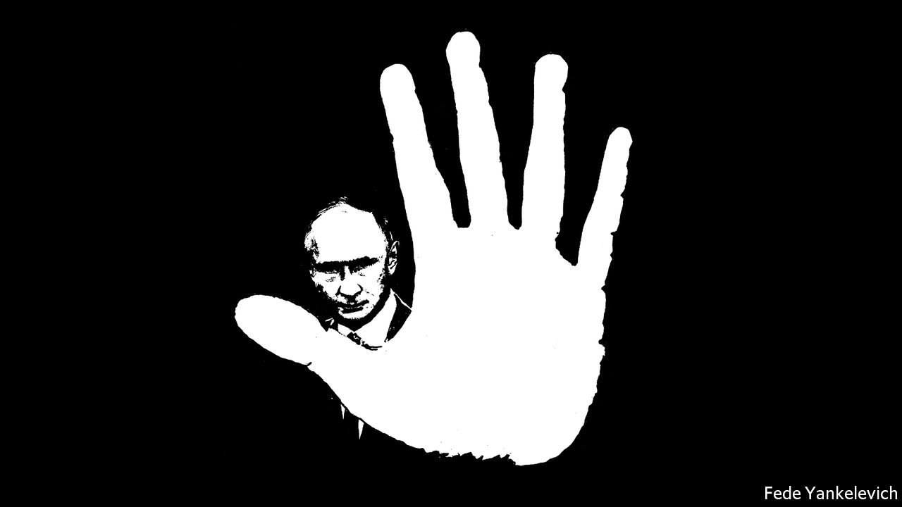

###### Vladimir Putin

# Russia’s new era of repression 

##### It will lead to confrontation with the West 

 

> Nov 13th 2021 

 On November 11th, after The Economist was published, , the human-rights group mentioned in this editorial, announced that Russian prosecutors have demanded it be shut down.

ANDREI SAKHAROV, a Soviet dissident and physicist, used to argue that repression at home invariably becomes instability abroad. His own life was evidence of it. His internal exile was lifted in 1986 by Mikhail Gorbachev, the Soviet Union’s last leader, who as the architect of glasnost released political prisoners and tolerated free speech. It was no accident that Mr Gorbachev’s rejection of repression coincided with the end of the cold war.

Today Sakharov’s thesis is being demonstrated once again—in reverse. According to Memorial, a human-rights group, Russia has more than twice as many political prisoners than at the end of the Soviet era. , which Sakharov helped set up to document Soviet abuses, has itself been branded a “foreign agent” and attacked by state-sponsored thugs.


At the same time, Russia’s relations with the West have also entered a dark period. In order to justify repression at home, President Vladimir Putin is telling his people that Western policy is designed to obliterate the Russian way of life. Mr Putin now builds in cold-war confrontation to his dealings with the West. Its leaders need to prepare for what comes next.

The latest phase of repression began in 2020 with the poisoning of Alexei Navalny, Russia’s most famous political prisoner, and winner last month of the European Parliament’s Sakharov prize for freedom of thought. Mr Navalny survived the attack, only to be incarcerated and abused in Penal Colony No 2, one of the country’s harshest jails.

Since then, Mr Navalny’s organisation has been outlawed and much of his team chased out of the country. Those who stayed are being pursued. On November 9th Lilia Chanysheva was arrested and now faces ten years in prison for having worked for Mr Navalny while his organisation was still legal. The net is spreading beyond politics. The same day, Sergei Zuev, the 67-year-old head of the top liberal university in Russia, who is recovering from heart treatment, was taken from house arrest to a prison cell, perhaps to force a false confession in a fabricated case.


A third of the Russian government’s budget is spent on security and defence. Much of this is directed inwards, at the sort of people The Economist features this week in a documentary film (see ): people who have had enough of Mr Putin’s rule and the corruption of his regime. As incomes have fallen and discontent has grown, so Russia’s many police and security services have swollen. With 10% more staff than in 2014, they now outnumber Russia’s active-duty military forces.

For Mr Putin, repression does not have a reverse gear. He will not be able to restore the prosperity that helped buoy his ratings during his first decade in power. True, the fortress economy that the Kremlin has developed since 2014 can withstand sanctions, especially when energy prices are high, as now. But Russia, which is more like Iran than China, does not have the dynamism to generate sustained, robust growth.

Hence the logic of confrontation. Soviet rulers waged the cold war from atop the ideology of communism. Russia’s securocrats assert that traditional values of family, culture and history are being corrupted by the liberal and licentious West and that only they can defend them. Fighting back against the West lets the Kremlin portray all those who oppose it—journalists, human-rights lawyers and activists—as foreign agents. In this way, Mr Putin’s regime depends on anti-Western ideology for its politics just as it depends on oil and gas for its prosperity.

Dictators insist that how they treat their subjects is a question of sovereignty. In fact, repression is everyone’s business. One reason is that human rights are universal. The other is that violence at home spreads beyond a country’s frontiers.

Both Russia and Belarus, where the dictator Alexander Lukashenko is propped up by the Kremlin, have murdered dissidents abroad. Russia shot down a passenger plane and Belarus hijacked one to arrest a local dissident. Poland and Lithuania have sheltered the Belarusian opposition in self-exile. Backed by the Kremlin, Mr Lukashenko is taking revenge by flying in  and shunting them to its borders to engineer a humanitarian crisis.

On a greater scale, Mr Putin meddles in Western elections, peddles anti-vaccine propaganda and fights proxy wars with America in Africa and the Middle East. He is using the promise of extra supplies of gas to weaken ties between the European Union and countries like Ukraine and Moldova. He has once again massed troops on the Ukrainian border and is flying nuclear-capable bombers to Belarus.

The good news is that just as most of the Soviet people did not believe in the advantages of communism over capitalism, so most Russians do not believe in the advantages of confrontation. For all Mr Putin’s propaganda, two-thirds have a positive view of the West. Nearly 80% say Russia should see it as a partner and a friend. This is most pronounced among the young, who reject state violence and favour human rights instead.

Western politicians should take note of this divergence between the Kremlin and the Russian people. One response is to harmonise sanctions and focus them on the powerful Russians who loot the state and abuse the people. That entails Western countries standing up to the lobbying of their own service industries, which get rich from helping  launder their reputations, pursue their legal vendettas and shelter their illicit wealth.

Think ahead

They should also start laying the foundations for a post-Putin Russia. Nobody knows whether that will come in years or decades. But it is hard to see Mr Putin’s system surviving him.

The West should therefore invest in people who share its values. It should speak out against human-rights abuses inside Russia. The flood of Russian students, journalists and intellectuals seeking a better life will increase. Western governments should accommodate them. Latvia and Lithuania are hosting independent media outlets and dissidents. Russian students should be welcomed to Western universities. By doing so the West would not just be helping the victims of Mr Putin’s repression, it would also be helping itself. ■

