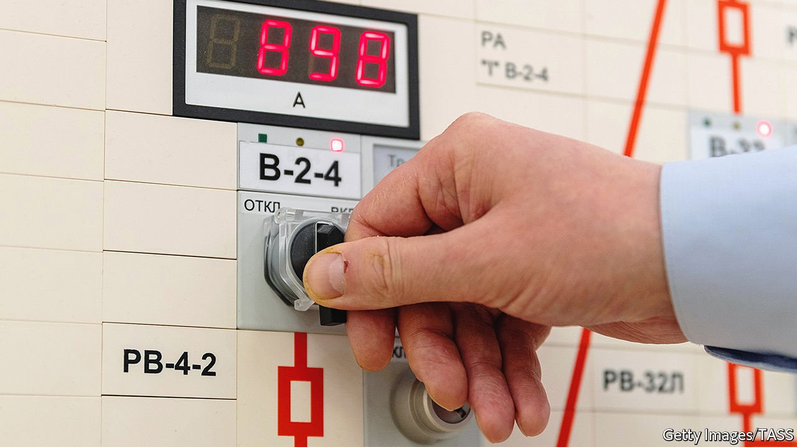

###### Small reactors are beautiful

# The discreet charm of nuclear power 

##### It makes fighting climate change a lot easier 

 

> Nov 13th 2021 

IN THE NEGOTIATIONS which led up to the Rio Earth Summit in 1992, Saudi Arabia spent a great deal of time attempting to insert the term “environmentally safe and sound” in front of references to “energy sources” and “energy supplies”. Given that the oil Saudi Arabia exports in greater quantities than any other country is now understood to be anything but environmentally safe, this seems bizarre. At the time, though, the aim was obvious to all concerned: the phrase was a way to keep nuclear power off the Rio agenda.

The oil shocks of the 1970s had led to many countries increasing their nuclear efforts. In the ten years to 1992 the amount of nuclear energy consumed worldwide had increased by 130%. What was more, some talked of using nuclear plants to produce not just electricity, but also hydrogen which could then form the basis of synthetic fuels. The Saudis may or may not have had real concerns about the environment. But they knew a competitor when they saw one.


Their scheming proved unnecessary. In contrast to the oil shocks, the threat of global warming has not served the nuclear cause well. After peaking in 2006, the amount of nuclear energy consumed in 2019 was just 18% higher than it had been in 1992. As a share of global primary energy, it had fallen from 6.1% to 4.3%.

Because nuclear power is expensive in ways that show up in profits, whereas damage to the climate is not priced into burning fossil fuels, this would be unsurprising even if it were popular with environmentalists—which, by and large, it is not. But it is still too bad. The paradigm-shifting drop in the cost of renewable electricity in the past decade is central to the decarbonisation pathway the world is fitfully following. But a clean-energy system requires redundancy and reliability in its electricity grids that are hard to achieve with renewables alone. It will probably also require lots of hydrogen for, say, powering aircraft and making steel and chemicals, which reactors could provide.

Nuclear power has its drawbacks, as do all energy sources. But when well-regulated it is reliable and, despite its reputation, extremely safe. That is why it is foolish to close down perfectly good nuclear power stations such as , in California, because of little more than prejudice. It is why some countries, most notably China, are building out their nuclear fleets. It helps explain why others—including, as it happens, Saudi Arabia—are getting into the game for the first time. And it is why approaches to reducing nuclear energy’s cost penalty are at last coming into their own.

France, which has found its newest generation of huge reactors impossible to build on time and within budget, and consequently also hard to export, has new plans for small, modular reactors (SMRs) that might do better on both counts. , a British engineering company, is touting a similar approach. On November 4th an American company, NuScale, signed a deal to sell six such reactors to Romania at the COP26 in Glasgow. Russia already has a floating SMR power station.

Such designs can in principle be produced in factories and shipped where they are required, keeping their costs down. These advantages have been extolled for decades without being realised, so caution is in order. But today’s efforts are broader-based and have real impetus. They need regulatory approaches which, while not lax, permit their makers to learn as they build. That will allow competing designs to prove themselves against each other, making nuclear power, once again, a source of innovation—and adding to the world’s capacity to ditch unsafe and unsound fossil energy. ■

For the latest from COP26 see our . For more coverage of climate change, register for , our fortnightly newsletter, or visit our 

