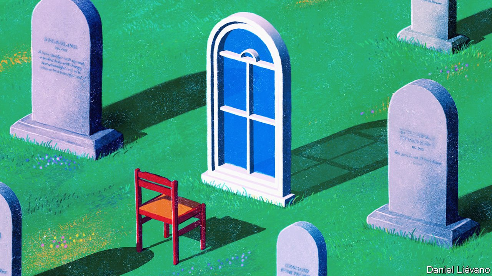

###### A final choice

# The welcome spread of assisted dying 

##### But too many are still denied this basic freedom 

 

> Nov 13th 2021 

IN 1995 AUSTRALIA’S Northern Territory enacted the world’s first law explicitly allowing assisted dying. It said that terminally ill, mentally competent adults who wanted to die could ask a doctor for help, using lethal drugs. The law sparked outrage. Within months the federal government had overturned it. Yet today five of Australia’s six states have assisted-dying laws.

The Economist first made the case for assisted dying in 2015. We argued that freedom should include the right to choose the manner and timing of one’s own death, while also cautioning that the practice should be carefully monitored and regulated to avoid abuses. Since then, it has become more widely available. Assisted dying is now legal in one form or another in a dozen countries, and the trend seems likely to continue. Last week New Zealand enacted a euthanasia law for the terminally ill after 65% of voters backed it in a referendum. The same week Portugal’s parliament passed a broader law. Assisted dying is still illegal in Britain, but the House of Lords is debating a bill to allow it.


The number of people who die this way is increasing, though still small. In the Netherlands it rose from roughly 1,800 in 2003 to nearly 7,000 in 2020, or 4% of all deaths. As more countries liberalise, the global total will rise further.

Many people object to assisted dying on religious grounds: some faiths deem suicide a sin. Others worry that safeguards will prove insufficient, or that legalisation is a slippery slope. Critics have long predicted that families exhausted by the demands of caring for sick, elderly relatives will place undue pressure on them to end their lives, or that cash-strapped states will encourage the most expensive terminally ill patients to hurry up and die.

. In places with the longest experience of assisted dying, charities that represent the elderly or disabled have not reported any abuse. It is conceivable that some has taken place unobserved, but scrutiny has been intense and in most countries permission to help someone die is revoked if there is even a hint of coercion. Fears that the poor and marginalised might be hastened to their ends have also proved to be unfounded. In America, the Netherlands and Switzerland the overwhelming majority of those who choose an assisted death are educated and middle-class.

Far from being too lax, the rules have often been too restrictive. The Australian state of Victoria, for example, bars doctors from mentioning assisting dying to their patients. The aim is to avoid coercion, but the consequence is that many sufferers do not know that it is an option. In some jurisdictions only those with less than six months to live are allowed help to die. Thus, patients can be terminally ill and in intense pain, but unless a doctor estimates that the end is very near, they cannot end their own suffering. In some cases the diagnosis comes too late. In Victoria in the first six months of 2021 no cases were withdrawn because the patient decided not to proceed, but in 90 cases the patient died before receiving relief. Some countries, such as Spain and Colombia, have liberal laws in theory, but in practice health authorities are reluctant to let anyone make use of them. Last week in Spain a desperate 83-year-old threw herself out of a window after her repeated requests for euthanasia were refused.

Canada offers a better model, because it provides more leeway for individuals to make their own choices. Anyone whose suffering is unbearable can choose an assisted death. They do not have to be terminally ill. And, uniquely, the question of what constitutes “unbearable” suffering is for the patients themselves to decide, so long as they are of sound mind. There is a cooling-off period of ten days, in case they have second thoughts. In many cases, simply having the option of an assisted death gives people a sense of comfort and control. In Oregon a third of those people who receive the prescribed lethal medication ultimately choose not to take it.

Even as more societies accept the principle of assisted dying, hard questions remain. Some people worry that its availability may prompt health services to skimp on palliative care. But that is not ordained. Canada’s assisted-dying bill was explicitly linked to increased funding for palliative and long-term care.

If assisted dying becomes common, will old people who require round-the-clock care feel more social pressure to choose death? Many already worry that they are a burden on their children or carers. Some may feel additional guilt if continuing to live is seen as an individual choice, rather than the blind workings of fate. This is a genuine concern. But the possibility that some may agonise over whether to die should not trump the certainty that others will suffer unendurable pain if their freedom to choose is denied.

The trickiest questions arise when an individual’s capacity to make an informed choice is in doubt. Some people with mental disorders have suicidal thoughts that come and go. For them, the bar should be very high. Doctors must be sure they can distinguish between a temporary mental-health crisis and a sustained, considered wish to die. If in doubt, they should offer treatment aimed at helping the patient to live.

Free to choose, to the end

 poses the hardest problem of all. Someone diagnosed with the condition may make a living will, asking for an assisted death when it becomes severe. But they may change their mind. Such a document should never be used to kill someone against their wishes, and if those wishes are unknowable, they should be left to live. Assisted dying should be only for those who can make an informed decision at the time they take the drugs.

No rules in this area are perfect. All should be subject to revision in the light of new evidence about how they work in practice, or to take account of medical advances. But the overall principle—that individuals are entitled to choose how they end their lives—is, we believe, a sound one. The evidence from countries that allow assisted dying is that abuses remain largely hypothetical, whereas the benefits are real and substantial. It relieves suffering, and restores a measure of dignity to people at the end of their lives. ■

