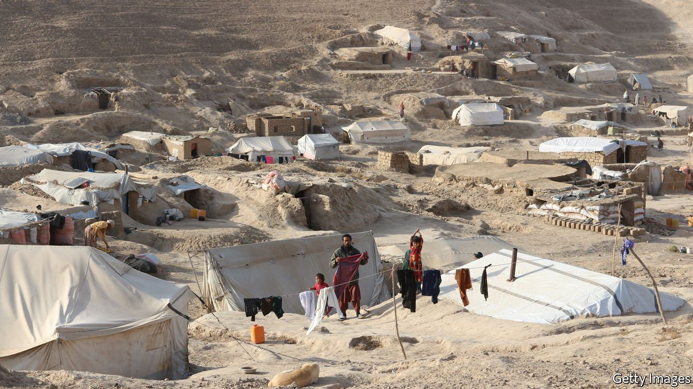

###### War, drought, famine

# The world must act now to stop Afghans starving 

##### That means co-operating with the Taliban, as distasteful as that is 

 

> Nov 13th 2021 

ON NOVEMBER 8TH the World Food Programme (WFP), a UN agency, said that its estimate of people “teetering on the edge of famine” worldwide had risen from 42m earlier this year to 45m. Remarkably, just one country accounts for almost all those 3m additional people. Afghanistan is on the brink of a humanitarian catastrophe.

Some 23m Afghans, in a country of 38m, face acute hunger. Of those, 8.7m are in a state of emergency, the second-highest category in the WFP’s hierarchy of calamity. The classification manual explains that by the time the agency declares a famine, the highest category, it will be too late to avert the worst consequences “because many will have died”.


Many are dying already. More than 3m children are malnourished. Locals report cases of entire families starving to death in their homes. Hospital wards are taking in emaciated children, including 11-year-olds who weigh just 13kg.Poor Afghans are selling their remaining possessions for food. Some are selling their daughters. The misery is as bad in the cities as it is in the countryside. As the winter sets in, the agony will only deepen.

Afghanistan’s condition was fragile even before the fall of the capital, Kabul, in August. Long periods of below-average rainfall and above-average temperatures have led to poor harvests and high prices. After decades of warfare, around 4m Afghans are refugees in their own country, with little means of support.

The Taliban takeover has made everything worse. Foreign aid, which funded three-quarters of government spending, has dried up. The country’s foreign reserves of some $9bn have been frozen. Half a million soldiers and police have lost their jobs, and civil servants have gone unpaid for months. Half the country was living on less than $1.90 a day before the Taliban came to power. By next summer, reckons the UN, all but 3% of Afghans will be in the same position.

In September the UN held a “flash appeal” seeking over $600m from donors, and received pledges of $1bn. But just a third of it has arrived. The European Union promised €1bn ($1.15bn) in October. Yet €300m of that had already been committed, and much of the remainder will go to Afghanistan’s neighbours. The WFP reckons it may need as much as $220m a month to avert a crisis over the lean winter months.

Even if the money arrives, it is at best a sticking plaster. “No humanitarian organisation can...replace the economy of a country,” says Robert Mardini of the Red Cross. The economy is atrophying. The flow of dollars into Afghanistan has been stanched, the value of the domestic currency has plummeted and the banking system has ground to a halt. The IMF reckons formal businesses will shrink by 30% in the next few months. Nonetheless, if aid were to resume and reserves were unfrozen, the pain would ease.

The trouble is that this would hand billions of dollars to the Taliban, yet to be recognised by any country as legitimate rulers of Afghanistan. The cabinet includes figures such as Sirajuddin Haqqani, whom the West considers a terrorist. America is adamant that the group must form a government that represents all Afghans and guarantee rights for women, girls and minorities.

Those are worthy aims. Yet withholding life-saving aid is reprehensible in almost any circumstances. It makes even less sense given that the Taliban show no signs of bowing to pressure. The West’s demands for basic freedoms for Afghans are entirely justified, but allowing many of the intended beneficiaries to starve to death is not a good way to fulfil them.

There is no choice but to work with the Taliban, as distasteful as that is. That need not mean becoming chummy or supportive—just realistic. The Taliban’s takeover is already terrible for Afghans. For the West to punish them further by leaving them to starve would be as cruel as anything the zealots with guns are likely to do. ■

