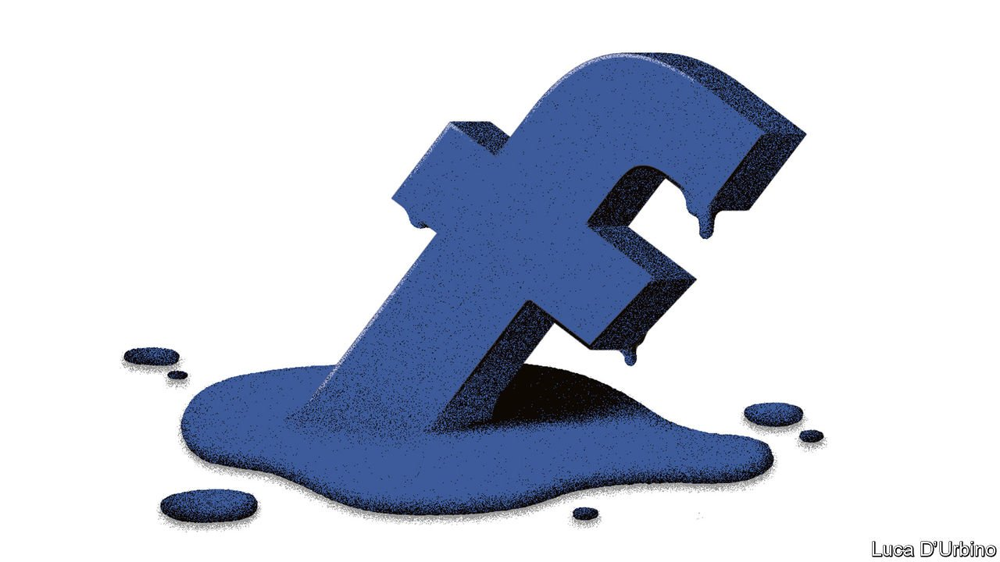

###### On economics, Balkan bridges, Shakespeare, Singapore, mission statements, hydrogen, Expos, Facebook, French, Polexit

# Letters to the editor 

##### A selection of correspondence 

 

> Nov 13th 2021 


Data hoarding

You have a rosy view of the use of timely, high frequency data in economics, which you describe as a “third wave” in the discipline (“”, October 23rd). However, there is a big downside. Not everyone has equal access to these figures, especially to data collected by the private sector. This unequal access will widen the divide between the “haves” and the “have nots”. Democracies cannot work properly if citizens do not have an opportunity to access the economic information that is necessary to make good economic and voting decisions. Basing policy on summary statistics from inaccessible micro data with many possible flaws will only lead to more distrust.


RALPH BRADLEYFormer division chief

Price and Index Number Research

Bureau of Labour Statistics

Washington, DC

The connection you made between the value of real-time information and Salvador Allende’s Project Cybersyn is a reminder of a lost opportunity. One of Allende’s principal advisers when he was president of Chile was Stafford Beer, a visionary cyberneticist, then at Manchester Business School, who came up with the pioneering viable system model. Some of us were not entirely sure about Stafford’s connection with reality, but that was our mistake. Had Allende lived on we might now be much further ahead in this burgeoning field of analysis and administration. Still, better late than never.

TONY ECCLESLondon


Structural differences

Ursula von der Leyen may have been a bit optimistic when she hailed the opening of the Svilaj bridge between Croatia and Bosnia-Herzegovina (“”, October 9th). Bridges in the Balkans have unfortunate connotations. The Peljesac bridge is lauded by its supporters for unifying Croatia but denigrated by its detractors for bypassing Bosnia. The Mitrovica bridge in northern Kosovo exists either as a tenuous link between Serbs and Albanians or as an insuperable barrier, depending on your perspective. The Mostar bridge was blown up in fighting between the Croats and the Bosniaks, who had been allies in the early stages of the Yugoslav civil war.

Before the European Union can even consider enlargement, it needs to deal with these and other festering sores, such as the disputed waters between Slovenia, Italy and Croatia. These may seem minor issues, but they matter hugely to those who live there.

RICHARD SCOTTExeter

Shakespearean phraseology

Echoing Hamlet, you said that vaccine mandates in poor countries are often “honoured in the breach”, suggesting that the edicts are not complied with (“”, October 23rd). Shakespeare’s phrase has a more nuanced meaning. In the passage where Hamlet says that the Danish custom of boozy revelry is “More honour’d in the breach than the observance”, he means that it is more honourable to ignore the custom of drunken carousing than to follow it. So Shakespeare is referring to a practice that is best ignored than followed, not merely one that is often ignored.

JOHN DOHERTYStratford-upon-Avon

SingaporeYou claim that Singapore’s Foreign Interference Countermeasures Act (FICA) would allow the government to compel internet companies to take action against hostile information campaigns “without giving a reason” (“Outside job, October 23rd). 


Under sections 20 and 21 of FICA, the government may only issue directions if such a campaign is undertaken by or on behalf of a foreign principal, and where the direction is necessary or expedient in the public interest. The minister had explained in Parliament that national-security concerns make it impracticable to publish the reasons for actions taken. 


The government’s directions against hostile information campaigns can be appealed to an independent tribunal, which is chaired by a Supreme Court judge and has the power to review and overturn the minister’s decisions. The tribunal would in effect provide similar checks as the court, but without compromising sensitive intelligence. This is similar to the approach taken in some Western countries, where national-security decisions are subject to review outside of the ordinary judicial process. 


All offences under FICA, however, must be prosecuted in court, and proven beyond reasonable doubt, as for any other offence. 


Contrary to the impression you gave, the vast majority of everyday activities, including your reporting on Singapore, will not be caught under FICA. 


T.K. Lim

High commissioner for Singapore

London


Dig deeper

After eight years in the American army followed by 20 years in business, I could not agree more with scepticism about applying military mission values to business (October 30th). Shifting uncertainties and testosterone-infused competition are common to both worlds, but not much else. Over time I have found gardening and cooking metaphors to be more useful for business than fighting and sporting ones.

RAY MORINFrankfurt

Thinking of corporate mission statements reminded me of Charles Mackay’s account of the South Sea Bubble in “Extraordinary Popular Delusions and the Madness of Crowds”, published in 1841. At one point in the frenzy Mackay mentions a bubble company with the mission statement of “carrying on an undertaking of great advantage, but nobody to know what it is”.

AURELIO ORTIZ CAMACHOLa Paz, Mexico


Financing for hydrogen

Uncertainty about future carbon prices can slow private investment in hydrogen (“”, October 9th). The German government has proposed carbon contracts for difference (CCFDs) to mitigate the problem. Under these contracts the government and a company set a price at which its zero carbon hydrogen technology would be competitive. Until the agreed carbon price is reached, the government pays the price difference to the company. Once the price is exceeded, the payment direction is reversed.

CCFDs have three benefits. Carbon prices become predictable for the length of the contract. Subsidised technology can compete with carbon-emitting incumbents. And should carbon prices rise above the set price during the contract period, the government subsidies could be recovered and the necessity for the contract vanishes.

TIMOTHéE HORNEKTuttlingen, Germany

 


Dubai’s Expo

The Economist praised the non-political nature of the Great Exhibition in 1851 (“The Exhibition. The Crystal Palace”, January 4th 1851). Surprisingly, today’s Economist assesses Dubai’s Expo as glossing over politics, based on a patronising interpretation of the first Expo to be hosted in our region (“). Such a saturnine and hypocritical view is no less disappointing for being familiar. 

The Olympics is where the world comes together to compete in sport. The United Nations is where the world comes together to debate politics. Expos are where the world comes together to share ideas, a platform for human progress.

For the first time in Expo history, 192 countries gather in Dubai, each with its own pavilion, meaning they are represented on an equal and dignified footing. How nations and peoples choose to define their achievements and their identity is down to them. Those who have experienced a legacy of conflict, colonialism or adversity merit respect and encouragement. Your article, grounded in caricature of a handful of national pavilions, demonstrates cultural myopia unworthy of our times. For anyone with an open mind, Expos are an opportunity to learn and to be part of a wider human family.

We invite your readers to visit themselves, and to form their opinion.

REEM AL HASHIMY

Director-general of Expo 2020 Dubai

Dubai

 


Facebook fury

Your observations about the incoherence of Facebook’s many critics were helpful as far as they went (“”, October 9th). But the most vexing question is why, after years of frustrated policymakers calling for more regulation, and as many years of Facebook inviting them to dish it up, have lawmakers and regulators produced so little other than noise? Maybe their inaction betrays an implicit recognition that the same human failings that are distorted and amplified on Facebook are already legislated for, and that the social network’s worst transgression is that it is as unflattering but depressingly accurate as any hi-def selfie.

GREGORY FRANCISManaging director

Access Partnership

London


The true romance language

As an adult, I tried to learn the French language (, October 16th). Our teacher, a native French speaker, told us beginners to make over-exaggerated facial gestures in order to produce sounds common in the French language. Her reasoning was that we were trying to pronounce French with an English mouth, and we needed to retrain our mouth to move correctly to produce the right sound.

If we were ever in doubt on how to pronounce something, she had a standing rule: “When speaking French, you must always position your lips, so that if required, they are always in position to give a kiss on a moments notice.”

JIM MILLERMinneapolis


A Polish Brexit?

Discussing Poland’s latest row with the EU, used the term “Polexit” to describe a potential outcome of the stand-off (October 16th). Polexit sounds clunky and doesn’t roll off the tongue. Might I suggest “Pout” instead?

BENJAMIN TENNENBAUMChicago

