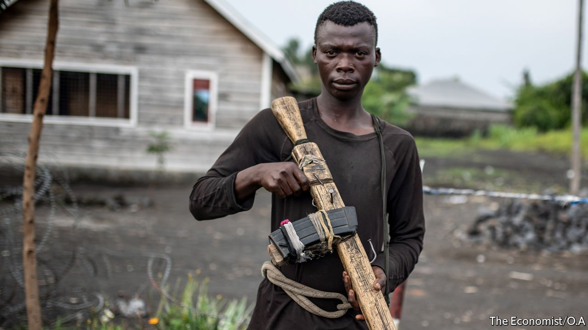
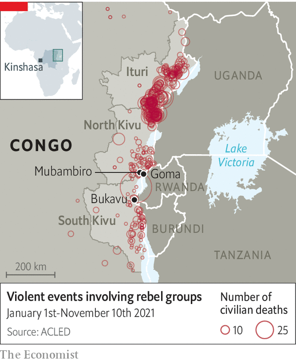

###### No farewell to arms

# Congo does not know what to do with rebels who surrender 

##### It is proving hard to reintegrate them into society 

 

> Nov 13th 2021 

AT THE ENTRANCE to a base for ex-rebels in Mubambiro, a town in the east of the Democratic Republic of Congo, a young man paces to and fro, clasping a wooden replica of an AK-47, the rifle of choice for guerrillas everywhere. “I am the guard here,” he explains, “And I am used to having a gun, it makes me feel comfortable.”

Shukuru Bijadunia, aged 23, handed his real rifle to the Congolese authorities in 2018 and has languished in a dismal camp ever since. He sleeps without a mattress in a shabby tent with other former rebels. Last year no food was provided at the camp for nine months. “I sleep badly, I barely eat and there is no medicine when we get sick,” says Mr Bijadunia. “Life in the bush was better.” Hundreds of other former rebels agree. At its peak, the camp hosted more than 1,700 fighters, from 30 different militias, who had surrendered. Today, fewer than 400 of them remain. Some have gone back into the bush to rejoin their old armed groups. Others have been recruited into new ones.


Conflict has ravaged eastern Congo for over 25 years. More than 120 armed groups hide in the forests. Many are reportedly backed by Uganda and Rwanda, though both countries deny this. Militias that had surrendered or disbanded are regrouping, and new ones are forming. Some groups say they want to overthrow the president, Félix Tshisekedi, though he is usually more than 1,000km (621 miles) away in the capital, Kinshasa. In the meantime, many prey on local civilians or smuggle minerals.

 


On November 7th gunmen attacked two villages near the Ugandan border, killing Congolese soldiers. The attackers are believed to be members of the M23, a militia backed by Rwanda that in 2012 captured Goma, a city of 2m people, before being defeated and forced to surrender a year later by UN forces and the Congolese army. Now it seems to have reassembled. The American embassy recently warned its citizens in Goma to stay at home, fearing another attack on the city.

Also this month, members of a new group calling for Mr Tshisekedi to step down stormed the city of Bukavu. The attacks highlight the president’s failure to make good on one of his main campaign promises before he came to power in 2019—to pacify the eastern parts of Congo. On his first presidential visit to the embattled province of North Kivu, Mr Tshisekedi encouraged rebels to come out of the bush and start new, peaceable lives. “To all my brothers in armed groups, this is the hour for change,” he said. “The government is reaching out its hands to you.” But those who disarmed were left to rot in camps like the one in Mubambiro, which hardly encourages others to do the same.

Foreign donors have pumped millions into dysfunctional disarmament schemes. The World Bank alone has contributed $171m to three programmes. Some have been laughable. The UN once offered rebels $100 for each of their guns. But, as Séverine Autesserre points out in her book, “The Frontlines of Peace”, a Kalashnikov sells for $40 on the black market. So a militiaman could hand in his rustiest gun, buy two more, and still have money left over for beer. Other programmes have been horrific. In 2014 over a hundred rebels and their family members died from starvation and disease at a government camp.

Mr Tshisekedi has recently launched yet another disarmament programme which, this time, is meant to reintegrate rebels back into the villages they came from. Yet the scheme lacks funds. Chastened by the failures of past projects, Western donors are reluctant to pay for it. What is more, the president has chosen a former Rwandan-backed rebel, Tommy Tambwe, to run it. Considering Rwanda’s continued interference in Congo’s conflict, this has been unpopular. Politicians and rebels alike have called on Mr Tshisekedi to change his mind.

When Mr Tshisekedi travelled to the east in June, he did not pay a visit to Mubambiro. However, emaciated former rebels from the camp tried to get his attention by blocking a main road nearby with flaming logs and branches. “We regret coming here, we don’t understand why the president called us here,” says Héritier Bahati, a former fighter, standing in front of the smoking barricade. “It’s as though he called us here to die.” ■

