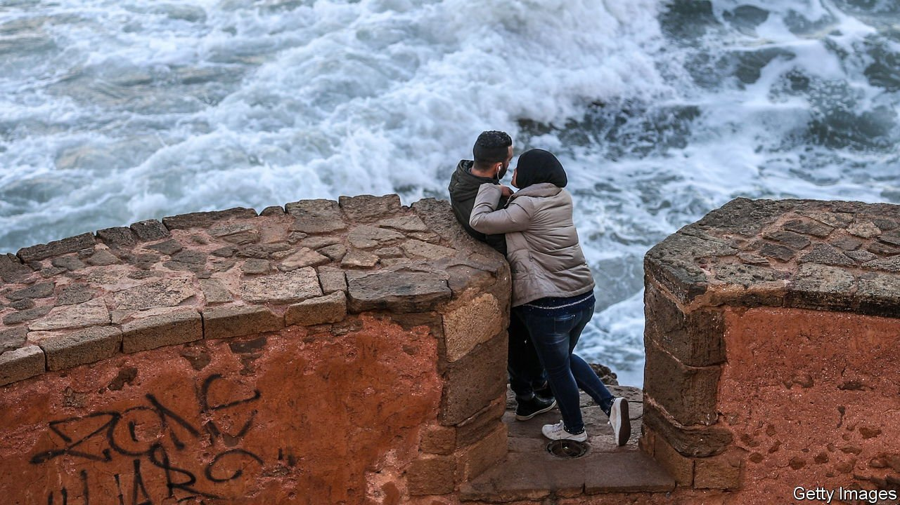

###### Get two rooms

# Hard-up hoteliers want Morocco to legalise premarital sex 

##### No marriage certificate, no room key 

 

> Nov 13th 2021 

IT IS BAD enough that the pandemic cut the number of foreign tourists by 80%; to make matters even worse, Morocco’s ban on extramarital sex is stifling the domestic market in hotel beds. Unmarried couples caught in the same room are liable to jail terms of up to a year under Article 490 of the penal code. Each week the police check hotel records to uphold the law. Receptionists-turned-private detectives require verification of marriage certificates before handing over the keys. “I get more calls from unmarried couples wanting to stay than anyone else,” says Meryem Zniber, who runs a resort in the Rif mountains. “I could fill my hotel 100% if only they’d lift the law.”

Hopes of change rose after the Islamist party heading the government crashed in elections in September, losing 90% of its seats. For a decade its leaders had squelched any policy deemed haram, or contrary to Islamic law. Aziz Akhannouch, the new prime minister, sounds more liberal. His government recently said it would review the entire penal code. But he has left out of his coalition the only party that publicly calls for Article 490 to be repealed.


The interior ministry is a big obstacle. “They fear turning hotels into brothels,” says a former minister. Others say the main concern is pecuniary: officials do not want to lose the bribes they extort from hotels and unmarried couples who canoodle in them.

Travel websites suggest workarounds. One proposes donning a wedding ring. “The offer of an additional payment may carry some weight,” it adds. Another suggests “the two-room method: rent single rooms, then scurry across the corridor after dark”. But others have tired of the expense and the hypocrisy. Hashtag campaigns—“Love is not a Crime” and “Stop490”—proliferate online.

Conservatives urge young Moroccans to respect tradition. Youngsters retort that the precursor to Article 490 was introduced by France in 1953, near the end of the colonial era. And they point to other Muslim countries that are shaking off old mores. The United Arab Emirates decriminalised extramarital sex a year ago. Saudis say their hotels have stopped asking couples to show marriage certificates. Morocco’s latest hashtag campaign implores “Vote4Love”.

