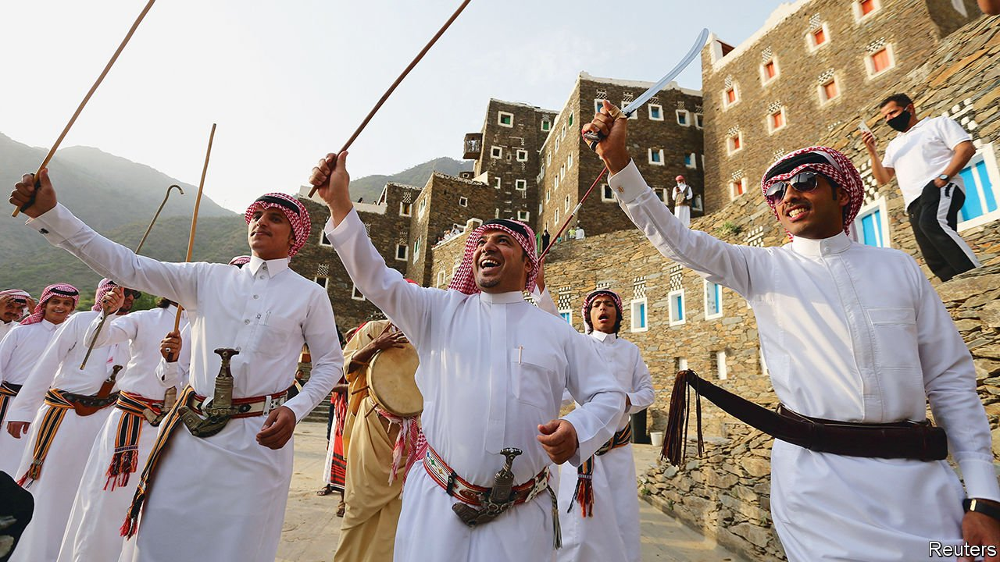
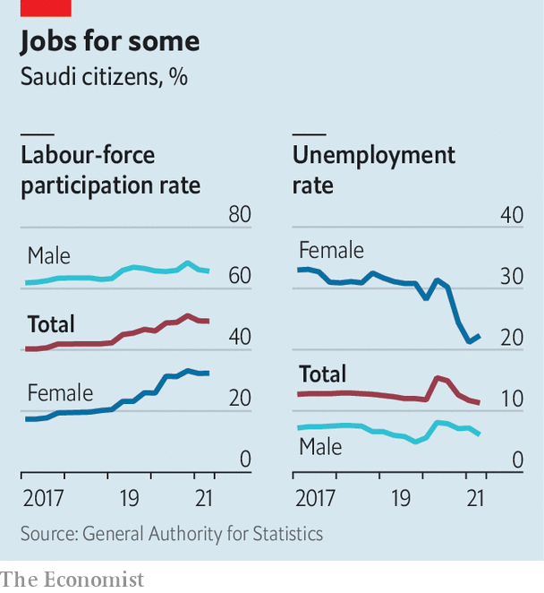

###### No tourist Mecca

# The reinvention of the Saudi economy is going slower than planned 

##### Apart from oil, the desert kingdom does not have many unique selling points 

 

> Nov 8th 2021 

WERE IT NOT for the ubiquitous photos of the royal family, visitors to Abha might forget they were in Saudi Arabia. Gnarled juniper trees dot green mountains; mist clings to valleys where farmers grow crops and raise honeybees on terraced fields. Troops of baboons line the roads, foraging for food and occasionally stealing bags from unsuspecting visitors.

Saudis have long flocked to this city, 870km (541 miles) south-west of Riyadh, the capital, to escape the summer heat. Foreigners will soon discover it, too. The Public Investment Fund (PIF), the main Saudi sovereign-wealth fund, has pledged 11bn rials ($2.9bn) to build 2,700 hotel rooms and dozens of tourist attractions in the region (pictured). By 2030 developers hope to draw 2m visitors annually.


Tourism is a key element of Vision 2030, an economic-reform plan meant to wean the kingdom off oil that was unveiled five years ago by Muhammad bin Salman, the crown prince. The government expects tourism to be the largest source of new jobs in the private sector, accounting for 10% of both GDP and employment within a decade. “The industry is at the top of our 2030 agenda,” says Ahmed al-Khateeb, the tourism minister, who hopes to see 100m local and foreign tourists in ten years’ time.

Saudi Arabia has lots of untapped potential. It did not even offer tourist visas until 2019. But officials struggle to explain why a hoped-for 50m foreign visitors will choose the kingdom over other destinations each year. That points to a bigger question looming over the economic-reform effort. To achieve its goals, Saudi Arabia must attract foreign firms and investors. Yet officials struggle to make a compelling case for why they, too, should choose the kingdom.

Prince Muhammad will be judged largely on whether he can create decent jobs for Saudi Arabia’s 21m citizens, two-thirds of whom are under 35. The pandemic pushed the jobless rate up to 15.4% in the second quarter of 2020. Since then it has fallen (see chart), dropping to 11.3% in the second quarter of 2021, the lowest level in a decade. That is in part because locals are taking low-skilled jobs that used to be the preserve of migrants. Saudis now work tills and brew coffee, sights unimaginable a decade ago. Women, too, are piling into jobs: they are now 28% of working Saudis, up from 16% five years ago.

 


Falling unemployment, however, comes partly from a lower participation rate, which dropped by 1.8 percentage points during the first half of 2021. At the high end of the labour market, there are not enough jobs for educated Saudis. Half of unemployed citizens hold at least a bachelor’s degree. At the other end, grunt work is mostly done by foreigners, who are cheaper. Citizens are still just 24% of the workforce in sales and 20% in hospitality. Over 85% of the jobs in construction, the industry that employs the most people, are done by foreigners.

As the economy grows, the labour market will grow with it. But the foreign direct investment (FDI) needed for growth remains sluggish. By 2020 the kingdom had hoped to attract $10bn in annual inflows. It fell far short, bringing in $5.5bn last year. No matter: last month Prince Muhammad announced a new investment strategy that promised $100bn in annual FDI by 2030 (more than the total for the past decade). This is a problem across the government. Officials set ambitious targets, miss them, then simply aim higher. “The crown prince doesn’t have enough feedback,” says a consultant to multinational firms. “There are too many yes-men.”

In private, would-be investors fret about the business climate in a country dominated by one man. They were unnerved in 2017 when Prince Muhammad detained dozens of businessmen and royals for alleged corruption (many traded assets for freedom). Tax was a big concern at this year’s Future Investment Initiative, a glitzy annual conference in Riyadh. The government has served several firms, including Uber (and Careem, its subsidiary in the Middle East), with hefty bills for unpaid taxes. Some executives wonder if this portends a private-sector shakedown.

Multinationals have already been told to move their regional headquarters to the kingdom by 2024 or risk losing juicy state contracts. Last month the Saudi government said that 44 such firms, including Siemens and Unilever, would open offices in Riyadh. The pressure has prompted grumbling from executives based in places like Dubai, which are less conservative and offer better amenities.

To Saudi Arabia’s credit, it continues to ease once-draconian social restrictions. The weekend before Halloween, young Saudis crowded a party-supply store, its shelves stocked with monster masks, devil tridents and sexy-nurse outfits. Not long ago such merchandise would have prompted a visit from the religious police. “They have no control over us now,” beams the store’s owner (whose only concern was that his “very, very conservative” relatives might discover what he does for a living).

Partitions that separated single men from families have come down in smart restaurants. Young Saudis crowd cinemas, banned for decades, to watch films like “Dune”, about a prince tapped to rule a resource-rich desert. On October 20th hundreds of thousands of people in Riyadh attended a concert by Pitbull, an American singer who is not for the prudish.

The government hopes fun will be lucrative. With few diversions at home, Saudi holidaymakers do most of their spending abroad. The pandemic offered hints of how much business escapes to London and Dubai. In the second quarter of this year, Saudi hotels logged 2.2bn rials ($590m) in point-of-sale transactions, a 7% increase over the same period in 2019—even though the kingdom was largely shut to visitors. “It was pure Saudi spend,” says Princess Haifa Al Saud, who oversees the national tourism strategy. Yet there will be less money for them to spend as Saudis take lower-paid jobs and the government cuts once-generous benefits. Petrol prices have more than doubled since 2015. The government introduced a 5% value-added tax in 2018 and raised it to 15% last year.

The tourism industry needs foreign visitors. Apart from Abha, they may come to enjoy long stretches of unspoilt Red Sea coast and historic sites like the Nabataean ruins at Al Ula. No one can accuse tourism bosses of lacking creativity. In October the PIF announced “The Rig”, a plan to repurpose an offshore oil platform into a resort and theme park.

But officials seem blithe about how all of this will compete with other destinations. The first hotels to open on the Red Sea will be luxury brands, pricing out many prospective visitors. Officials are coy about whether they will legalise alcohol. “We know we have to be competitive in every aspect,” says one. Even if they do, some tourists may be put off by a sun-and-sand holiday in a country with such a conservative image. In the “halal tourism” market, meanwhile, Saudi Arabia faces stiff competition from cheaper, more established places like Turkey and Malaysia.

The same goes for the broader economy. Lower subsidies, higher taxes and pricier labour have eroded some of Saudi Arabia’s traditional selling points for firms. It is unclear what will replace them.

Until the government banned the practice, residents of Abha would chop down juniper trees for firewood, to stave off the winter chill. As part of the regional tourism project, developers plan to plant 1m trees to reforest the mountains. It will be a long time before visitors can appreciate them: they grow just 5cm a year in the region’s dry climate, says Turki al-Bishri, a local guide. For all the talk of rapid change, the slow-growing juniper may offer a better glimpse of Saudi Arabia’s economic future. ■

