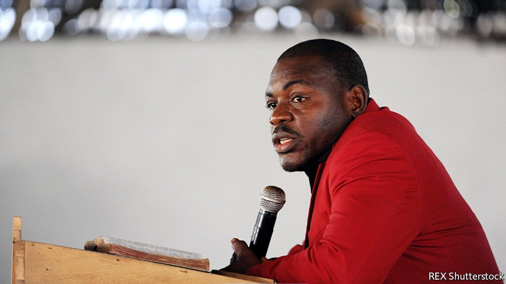

###### Time and punishment

# Victims of Liberia’s civil war are still waiting for justice 

##### Would a war-crimes court allow the country to move on? 

 

> Nov 13th 2021 

“THERE WAS a lot of blood all over the place,” remembers Patricia, her voice cracking. She survived the night in 1990 when government soldiers shot and chopped to death about 600 civilians who had been sheltering from Liberia’s civil war in the Lutheran Church in Monrovia, the capital. “We saw the pregnant women, their stomachs open, the children on their mother, sucking, crying.”

Today, not far from the bullet-scarred church, gold letters on the Temple of Justice declare: “Let Justice Be Done To All”. Yet not a single person has been convicted in Liberia for the massacre—or for any war crimes committed during the back-to-back civil wars between 1989 and 2003, in which about 250,000 people were killed.


Much has changed since the conflict ended. Clinics and schools have sprung up, tarred roads hum with traffic and, above all, peace has endured. Yet Afrobarometer, a pollster, found that in 2018 half the population had paid a bribe in the previous year. Rapes of women and children are all too common. So are murders. Two sons of former presidents have been killed since September. Some human-rights activists blame a culture of impunity that dates back to the wars.

Impunity is not hard to spot. Prince Johnson, an influential senator, is a former warlord who, in a video available on YouTube, can be seen drinking a Budweiser beer and barking instructions as his men cut off the ear of a former president, Samuel Doe, in 1990. Mr Johnson, who has admitted that his men killed Doe, has declined to comment beyond saying, “There is no need to dwell in the past.”

George Boley, a congressman, is another former rebel leader who was deported from America because of allegations that his men had burned captives alive and raped villagers before slitting their throats. Charles Taylor, a warlord and former president, was convicted of war crimes at the International Criminal Court in The Hague for atrocities in neighbouring Sierra Leone’s civil war. He is now in prison in Britain. But he has never faced justice for his alleged crimes in Liberia itself.

In 2009 the country’s Truth and Reconciliation Commission (TRC) recommended that some of the most violent warlords face trial. But that recommendation was not acted upon by the government of Ellen Johnson Sirleaf, who was then president. Activists and politicians, including Rustonlyn Dennis, a congresswoman, are trying to revive the idea, through protest and by proposing draft legislation. “This country will never go forward if people don’t take responsibility,” says Ms Dennis. Others say a court is needed to deter people from taking up arms again. “In absence of punishment there will not be peace,” says Dempster Brown of Liberia’s Independent National Human Rights Commission.

Yet not everyone favours trials. Sam Walker of Liberia Peace and Reconciliation Forum, a group opposing the tribunal, says it would be a “witch hunt” and even claims it could renew conflict. He prefers alternatives, such as getting victims and perpetrators to talk. Others worry about the price tag, given that Sierra Leone’s special court cost about $300m. “What do we prioritise?” asks Meo Beyan, the assistant minister of justice, listing pressing needs such as jobs, education and health care.

Still, many suspect President George Weah’s own worries are the real barrier. His run for president in 2017 was backed by Mr Johnson, whose support Mr Weah is thought to want in the next election, in 2023. In 2019 he tried to kick the question of a tribunal to the Senate, which advised against “reopening old wounds”.

Though the government drags its feet, a tribunal has some odd supporters. Joshua Blahyi (pictured), known as General Butt Naked, led a group of drugged child soldiers who often fought wearing nothing but sneakers and charms. He told the TRC he was responsible for the deaths of 20,000 people. Today he claims to be a repentant Christian and, despite his documented history of almost incomprehensible violence, is entirely at liberty. Is he in favour of a war-crimes court, even if it might jail him for the rest of his life? “Definitely,” he says. “It’s Liberia’s only hope.” ■

