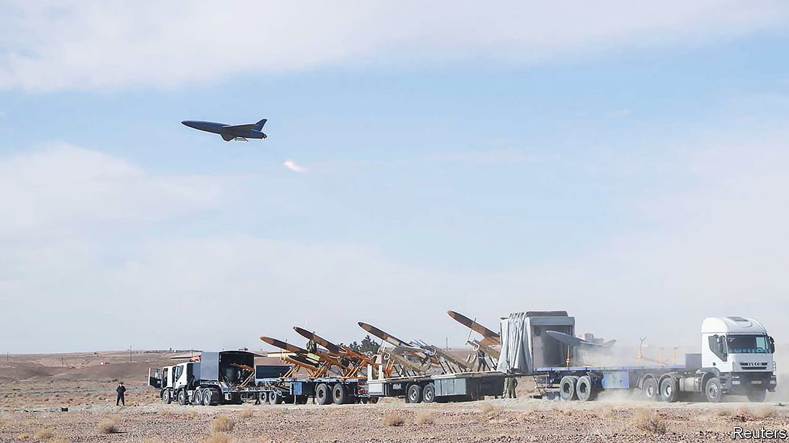

###### The new predators

# Why drones are becoming Iran’s weapons of choice 

##### The attempt to kill Iraq’s prime minister highlights how Iran’s unmanned aerial vehicles are changing the military balance in the Middle East 

 

> Nov 10th 2021 

USING DRONES to assassinate people has long been the preserve of the most advanced armed forces, such as America’s and Israel’s. But the attempt on November 7th to kill Iraq’s prime minister, Mustafa al-Kadhimi, was a dramatic demonstration of how such “precision strike” capabilities are spreading to less advanced countries and even shadowy militias.

Several of Mr Kadhimi’s bodyguards were hurt when at least one drone hit his home in the protected “Green Zone” of Baghdad (more drones may have been shot down). The prime minister survived and, apparently nursing a wounded wrist, soon appeared on television to denounce the “cowardly” attack.


The hit was so rudimentary—apparently involving quadcopters of the sort that can be bought by hobbyists and rigged with small bombs—that it could have been staged by any one of Iraq’s many armed groups. “If you can deliver pizza with a drone, you can drop a grenade,” says James Lewis of the Centre for Strategic and International Studies, a think-tank in Washington.

Yet suspicion immediately fell on Iran and its proxies, for two reasons. The first is that Fatah, the political arm of Shia militias aligned with Iran, is furious at losing most of its seats in Iraq’s election last month. Loyalists have staged unruly protests and on Friday attempted to burst into the Green Zone. The following day, at the funeral of a protester killed by security forces, militia leaders vowed revenge against Mr Kadhimi. “The blood of martyrs will hold you accountable,” one said. That night the drone attack took place.

The second reason is that Iran has become the most assiduous provider of drone and other military technology to its proxies and friends, not only in Iraq but also in Yemen, Syria, Lebanon and the Gaza Strip. Drones are fast becoming Iran’s favoured weapon of asymmetric warfare, unnerving its enemies and threatening to change the balance of power in the region. These are not the sophisticated machines operated by America, such as the Predator and the Reaper. Nor are they akin to the Israeli and Turkish combat drones that allowed Azerbaijan to defeat Armenian forces in Nagorno-Karabakh last year.

Instead, they are often “craptastic” knock-off versions, made with commercially available components, explains Aaron Stein of the Foreign Policy Research Institute in Philadelphia. But Iran is also making improvements, not least by reverse-engineering captured drones, such as America’s stealthy RQ-170.

Lacking a modern air force—Iran’s jets date to the time of the Shah before his overthrow in 1979—the clerical regime has invested heavily in ballistic missiles, cruise missiles and drones. Like unmanned aerial vehicles (UAVs) from advanced countries, Iranian ones are used for both surveillance and strikes (not least against ships). Unlike them, Iranian UAVs do not usually carry precision-guided munitions. Instead the drone itself is the guided bomb, flying into the target and detonating like a robotic kamikaze. Iran dispenses with the satellite links that allow Western forces to control drones from the other side of the world. Instead its UAVs are typically operated through line-of-sight radio controls, or can guide themselves with GPS devices of the sort used for retail sat-nav machines.

Iran achieves great range by distributing UAVs (or the techniques to make them) to its allies across the Middle East, thereby threatening targets from the Mediterranean to the Persian Gulf. The drones are often delivered in kits and assembled locally with minimal help from Iran, notes Mr Stein. “These drones allow Iran to orchestrate attacks while maintaining deniability and ambiguity,” says an Israeli military official.

The simplicity belies the threat that the drones pose. Last month an American outpost in Tanf in Syria was hit by five GPS-guided drones. Nobody was hurt—the Americans apparently had warning and got out of harm's way—but American officials later blamed Iran and the Biden administration imposed sanctions on people and firms associated with the drone programme.

“We no longer have air superiority in the theatre,” laments a senior American military source, “Americans got used to owning the skies.” What is more, drones are exposing the vulnerability of vital installations across the region. In 2019 several drones struck Saudi Arabia’s oil facilities at Abqaiq and Khurais, interrupting about half of the country’s oil output for a time. The Houthi militia in Yemen, which is allied to Iran and has been fighting against a Saudi-led coalition since 2015, claimed responsibility. But Western military sources believe the drones were dispatched from Iraq, or perhaps even from Iran.

Israel, for its part, has been grappling with drones since 2004, when an Iranian-made drone flew over the country without being intercepted. Hizbullah, a Shia militia, later broadcast footage of the event. Since then Israel has intercepted about a dozen drones—including one that appeared to be heading for Israel’s nuclear reactor in Dimona in 2012. It also destroyed, via air strikes, Iranian drones and their control systems on the ground in Syria in 2018.

As the country that pioneered the use of disposable and suicide drones to destroy Arab air defences in the 1970s and 1980s, Israel is among those working hardest to defend against them. It has resorted to everything from F-16 fighters to the Iron Dome anti-rocket system, but is looking for a better response. Drones can be hard to detect because they are often small, fly low and slowly, and might not broadcast any signals. They “get lost in the clutter”, notes an official at Israel Aerospace Industries, a state-owned firm that has developed anti-drone systems. “Hard kills” (ie, shooting down the drones) can cause damage on the ground, particularly in built-up areas; jamming radio and GPS signals disrupt civilian life; and lasers-based systems are still in development. “Drone defence is an expensive business as countries have a large number of facilities to protect,” says the official. He points to the spread of 5G mobile-phone networks that might give future attackers the option of controlling drones remotely, akin to having satellite links. “It’s a crazy arms race because the technological possibilities for drone use continue to increase.”■

