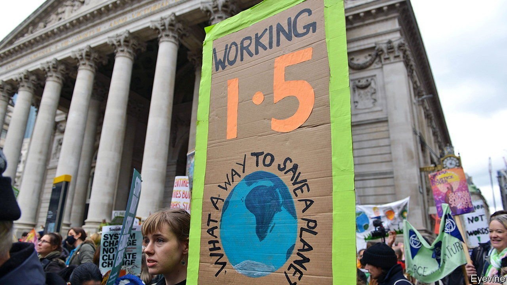
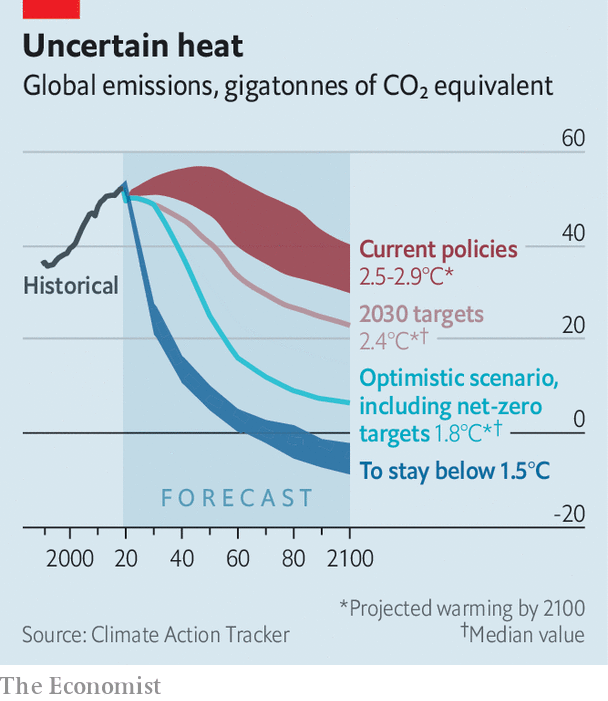

###### COP26

# Are climate goals set in 2015 dead or alive? 

##### The pledges made in Paris seem like being left behind 

 

> Nov 13th 2021 

“AT THE END of the COP we need to be in a position to say ‘We are still on track to be well below 2 degrees, we still have a shot at the 1.5 degrees.’ All our efforts this week should be directed at that.” Thus spoke Frans Timmermans, an EU commissioner, as the COP26 climate summit in Glasgow rolled into its final week. Unfortunately for Mr Timmermans, political resolve and climate plans do not currently add up to the demanding goals set out by the Paris agreement of limiting global warming to “well below 2°C” above preindustrial averages, let alone to keeping it as low as 1.5°C. Instead, the latest number-crunching suggests that the plans of the 193 parties to the agreement collectively carve a path to approximately 2.4°C of warming by the end of the century.

That is only a modest improvement on where things stood when the Paris agreement was being negotiated in 2015. Under the deal that was struck at the time, governments offered up pledges to reduce their national emissions. Toiling away in the background, climate modellers estimated that the cumulative consequence of these pledges would be to bring about roughly 2.7°C of warming by 2100. Aware of the disconnect between this figure and the agreement’s overall goals, negotiators said they would present new, hopefully improved decarbonisation plans every five years, in the hopes that this “ratchet mechanism” would bring the overall 1.5-2°C Paris goals closer.


Hence the flurry of climate pledges that were made over the past year. They focus on what will be done by the end of the decade, by which time global greenhouse gas emissions must be roughly half what they were in 2010 in order to have a good chance of limiting warming to 1.5°C. So far, no country is on track to do this, says Niklas Höhne of NewClimate Institute, a think-tank. Dr Höhne is part of a consortium of researchers called Climate Action Tracker, which plugs national climate policies and pledges into models in order to give an idea of how they translate into temperatures. The group’s latest results (see chart), published on November 9th, say that if all 2030 decarbonisation plans were to be carried out as advertised but no further efforts were made, there would be a 68% chance that global average temperatures in 2100 would be between 1.9°C and 3.0°C warmer than pre-industrial times, with a median estimate of 2.4°C.

 


At first glance this seems considerably more pessimistic than what the International Energy Agency (IEA), a think-tank that works for governments, said earlier: “COP26 climate pledges could help limit global warming to 1.8°C”. “BIG NEWS,” tweeted the agency’s director, Fatih Birol, “#COP26 climate pledges mean Glasgow is getting closer to Paris!”. In fact, the two numbers are entirely consistent with each other. It is just that the IEA’s modellers assumed not only that countries would deliver on their 2030 promises but also that those who said they would reach net-zero emissions by mid-century or soon after would actually do so.

Yet for now, talk of net-zero is mostly just that: talk. China, for instance, has said it would ensure its emissions hit a peak before 2030 and reach net-zero by 2060 in spite of the fact that it still generates more than 60% of its electricity from coal. Many other countries have made similar net-zero promises with very little if any detail of how they plan to get there.

COP26 has also seen plenty of multilateral deals and agreements announced on the sidelines of the UN talks. These dealt with some headline issues, like curbing methane emissions, deforestation and phasing out coal use, but none were reached unanimously. More than 100 countries have so far signed up to cut their collective methane emissions by 30% by 2030. Another group agreed to quit using coal in two decades. Last week, a team of independent climate researchers found that pledges to cut methane could shave 0.12°C off temperature projections for the second half of the century compared with cuts embedded in nationally determined contributions—but only if every country signed up. China, India and Russia, the three largest emitters of methane, have yet to do so. Phasing out coal by 2040 would further reduce temperature projections by 0.28°C, but again only if it were a global effort. Yet China and India, the two most coal-hungry nations, have not joined the “powering past coal alliance”.

COP26 was never meant to deliver the whole package—pledges sufficient to keep global warming to well below 2°C and national strategies to back up those promises—in one fell swoop. It was always going to be one in a series of stepping stones. Nevertheless, the slow pace of global climate ambition has left a huge gap between where the world needs to be in order to keep the hope of a 1.5°C world alive and where it is. If the gap is not rapidly reduced, which would require all large emitters around the globe to drastically accelerate decarbonisation, then all hopes will rest on wholly infeasible options to draw carbon dioxide out of the atmosphere.■

For the latest from COP26 see our . For more coverage of climate change, register for , our fortnightly newsletter, or visit our 

