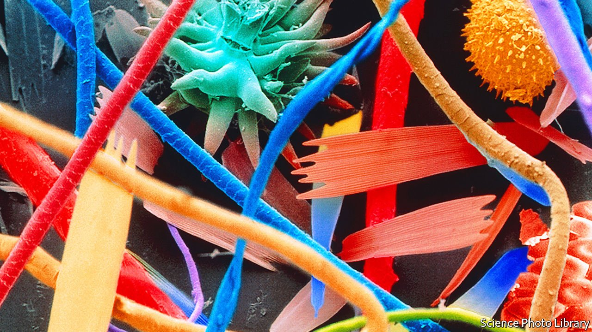

###### Perilous plastic


# Microplastics in household dust could promote antibiotic resistance 


##### Polyester and nylon seem to be common sources 

 


> Nov 10th 2021 


PLASTICS ARE man-made materials that are unnatural to this world, but that does not stop the natural world from interacting with them. Indeed, dozens of studies show that when plastics get into the sea many ocean-dwelling microorganisms aggressively colonise them. This might help break plastics down, but these oceanic colonies are also hotbeds of antibiotic-resistant genes. Now, it seems, something similar might be going on in the dark recesses of your home.


Lei Wang suspected as much, and along with his colleagues at Nankai University in Tianjin, China, set out to gather the necessary evidence. Their search began at an apartment building in Tianjin. The plastics Dr Wang was concerned about are the tiny bits that break away from synthetic fibres, like polyester and nylon, commonly found in clothing and other textiles. The microplastics then accumulate around the home as dust. He reasoned that if these particles were being colonised by bacteria then they too might be harbouring antibiotic-resistant genes.



The researchers chose ten homes in the apartment block, each with just one male tenant. Each apartment had hard flooring, rather than any carpets, and a similar general layout. A team used sterilised brooms to sweep the bedrooms and to collect dust samples as they went. These samples were then brought back to the lab and analysed for microplastics, bacteria and antibiotic-resistant genes.


As they report in Environmental Science and Technology, 21 types of microplastics were found, the most common from polyester and nylon. Using DNA extracted from microbes, they identified 1,385 genera of bacteria along with 18 genes associated with antibiotic resistance.


The analysis also revealed that the apartments with dust that were rich in microplastics had bacterial communities that were different from those apartments with dust that did not contain as many microplastics. Crucially, the work also showed that the relative abundance of antibiotic-resistant genes was higher in the presence of microplastics than it was when these were less common.


Precisely why microbes dwelling with plastics are more likely to carry antibiotic-resistant genes is not clear. It is possible that plastics themselves are driving bacteria to develop this trait. The researchers suggest, however, that it is more likely that specific groups of bacteria are capable of eking out a living on plastics, and these bacteria also happen to be of a type that more readily develop antibiotic resistance.


To support this argument, Dr Wang points out that Proteobacteria is both highly antibiotic-resistant and also commonly found encrusting oceanic plastics. Members of this same phylum were the most common type found among the polyester and nylon fibres swept up in the apartments, too. This suggests that, just as plastics are changing the nature of bacterial communities out at sea, they are also changing them within homes. How much of a threat this will ultimately be to human health is not known, but it cannot be doing people much good. ■

