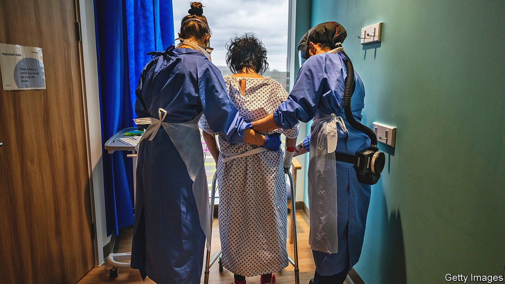

###### Covid-19

# New antiviral drugs mark a big turning point in the covid-19 pandemic 

##### The highly effective drugs can be taken as pills 

 

> Nov 13th 2021 

THE LATEST news in the fight against covid-19 is encouraging. Two new antiviral drugs have been deemed so effective that clinical trials ended early. Data from these trials have not yet been published. However, regulators are moving swiftly to consider general use of the drugs. They will fill a large gap in the toolkit doctors are using to fight the virus, and could well help end the global pandemic.

The new drugs are molnupiravir (Lagevrio), developed by Merck, a pharmaceutical company, working with Ridgeback Biotherapeutics, a biotech firm, and Paxlovid, which was developed by Pfizer. All three are American companies. Those most at risk from the serious effects of covid are far less likely to be hospitalised, or die, if they take a course of either of these pills in the five days after symptoms first appear.


Merck said in October that molnupiravir reduced the risk of hospitalisation or death by about half, when given to patients with one risk factor for covid, such as obesity or heart disease. Regulators in America, Europe and at the World Health Organisation are assessing the drug. Britain has approved it and will start using the treatment next month. On November 5th Pfizer said its pill reduced the risk of hospitalisation or death by 89% if taken within three days. (In fact, during its trial no patient died at all when taking Paxlovid within five days of symptoms.)

Molnupiravir is what is known as a prodrug, which means that it is converted into its active form when it arrives inside cells. Once there, it is incorporated into the genetic material of the virus whereby it disrupts its ability to replicate. Errors accumulate in the virus’s genetic material, a process known as “error catastrophe”. Trials in animals have raised concerns that the drug might pose risks to unborn children, hence the British government has advised against its use during pregnancy, or while breastfeeding. Other regulators may issue similar warnings.

Paxlovid is in fact a combination of two drugs: an existing one called ritonavir, which is given alongside a novel protease inhibitor known asPF-07321332. The protease inhibitor was designed to bind and block the protease enzymes that sars-cov-2 uses to replicate. Ritonavir prevents the protease inhibitor from being broken down too quickly in the body.

Molnupiravir and Paxlovid are also known as “small molecule” drugs. These are molecules that are easy to make. Both firms say the price of the drugs will vary according to the wealth of the nation buying them. That will likely mean that rich countries will pay $700 for a five-day course of pills, while poorer ones might pay around $20, and maybe less as the cost of manufacturing comes down.

Although both firms have said they intend to make these drugs widely accessible around the world, Merck already has an edge. It has signed a number of licences which allow other manufacturers to produce the drug, and it has reserved 3m doses for low- and middle-income countries. This is to ensure that rich countries do not monopolise the supply of the new medicines as they have done for vaccines. Merck expects to make 10m doses this year, and 20m next year. Generic manufacturers will make many more. Pfizer, which has not yet received any regulatory authorisations, expects 180,000 packs of pills to be produced by the end of this year, and 21m in the first half of 2022.

These drugs herald a second big turning point in the pandemic (the first being vaccines). Rising case numbers across Europe suggest there will be a strong demand for such medicines to keep people out of hospital. While patients wait for them to arrive, it is also possible that doctors might consider the use of fluvoxamine, an antidepressant medicine which also appears to lower the risks from covid.

As the new treatments roll out for use, there will be concern among some scientists and doctors about the virus developing resistance, particularly if patients do not complete their course. Keeping one step ahead of sars-cov-2 will require planning for such an eventuality. That means deducing which antiviral drugs can be given in combinations to create a therapy that the virus will struggle to defeat. ■

