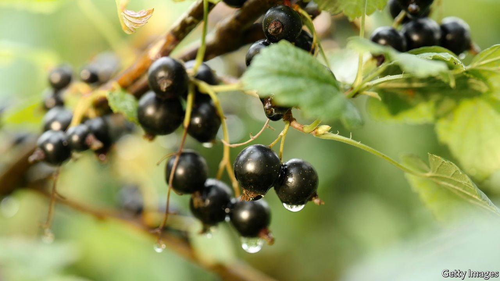

###### Probiotic berries

# Researchers have found a way to grow better blackcurrants using probiotics 

##### And still rich in health-promoting compounds 

 

> Nov 13th 2021 

FEW FRUITS carry more health-promoting antioxidants than blackcurrants. Widely grown in cooler parts of Europe, they are in high demand from consumers seeking pesticide-free juices made from the berries. Farmers, though, can struggle to boost yields without relying on chemicals. That could change, not just for blackcurrants but other fruit too, with the judicious use of probiotics.

Probiotics is mostly known for its use of microorganisms, including certain bacteria, to restore or improve the gut flora in people and animals. But plants can benefit from a collaborative arrangement with bacteria too. Among other things, bacteria help plants produce antibiotics that keep disease-causing microbes off their leaves, support them in collecting nitrogen from the environment and help them dissolve minerals found in the soil.


Knowing all this, Virgilija Gaveliene and Sigita Jurkoniene, of the Institute of Botany Nature Research Centre in Lithuania, set out to find a way to use probiotics to boost the yield of blackcurrant bushes, which are grown in that country. The researchers also knew from other work that the production of strawberries and raspberries could be increased by exposing plants to a carefully selected mix of bacteria from families like Bacillus, Acinetobacter and Pseduomona. And they were aware of preliminary evidence that probiotics had the potential to enhance production of certain antioxidants, like anthocyanins and flavonoids.

Working with colleagues, they set up an experiment. Four blackcurrant fields, each one hectare in size, were exposed to different probiotic treatments. These were applied first when shoots were just starting to grow and then again as buds were beginning to flower. One field was sprayed with a mix of bacteria that the team suspected would improve growth and yield. Another field was sprayed with a mix of organic fertilisers and bacteria that the researchers expected would enhance the chemical composition of the berries and improve their nutrient content. The third field was sprayed with both mixtures while the fourth was left as a control and sprayed only with water. After the harvest, the team measured the biomass of the freshly picked berries and studied their chemistry.

As they report in Agricultural Science and Technology, the results were impressive. While a thousand blackcurrants collected at random from the control plot weighed just over 538 grams, the same number from the field exposed to both treatments weighed nearly 783 grams. A similar increase was also true for the field sprayed with the yield-enhancing bacteria.

The team were, however, concerned that enhanced berry growth might be coming at a cost of less antioxidant. To this end, their analysis showed that exposure to either of the probiotic mixtures on their own did significantly lower blackcurrant antioxidant activity from the control level of 73% to 65% and 60%. Only exposure to both probiotic mixtures allowed blackcurrant growth to be enhanced while maintaining a statistically identical level of antioxidant activity of 72.7%

All told, Drs Jurkoniene and Gaveliene are convinced that the right mix of bacteria can help blackcurrant farmers meet demand without using chemicals. And it could help other growers. What works for berries should, in theory, work for other fruit, like apples, pears and oranges. More experiments are needed to be sure. ■

