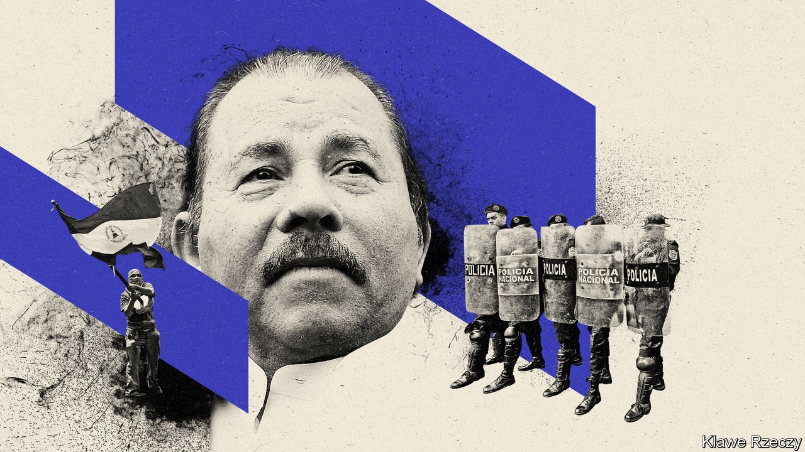

###### Great thugs think alike

# Other despots help Daniel Ortega stay in power in Nicaragua 

##### His allies in Venezuela, Cuba and Russia supported a fake election 

 

> Nov 13th 2021 

MONTHS BEFORE the polls in Nicaragua on November 7th the outcome was all too clear. Daniel Ortega, a former guerrilla, won his fourth consecutive term as president after jailing most of his potential opponents and forcing others into exile. With his vice-president, Rosario Murillo, who is also his wife, he will rule the country of 6.6m for an unbroken two-decade stretch.

“The election had no legitimacy,” says María Lilly Delgado, a journalist. Hard men from the ruling Sandinista party, who had gone from house to house telling people to vote, hung out at polling booths, menacingly. President Joe Biden denounced the poll as “a pantomime”. Several countries have refused to recognise the result. One organisation reckons that 80% of Nicaraguans boycotted the vote.


In the run-up to the election the regime acted with a brazenness not seen in Latin America since the 1970s and 1980s, an era of military dictatorships. Since May it has arrested at least seven potential presidential candidates and scores of other critics, including former Sandinista comrades, charging them with vague offences such as “undermining sovereignty”. They include Cristiana Chamorra, the daughter of Violeta Chamorra (to whom Mr Ortega lost in 1990 after his first stint in power). At the time of her arrest she was the most popular opposition politician, and might have won the election, had it been fair.

The regime spreads disinformation. On November 1st Facebook said that, in the month before, it had shut down a “troll farm” of more than 1,000 fake social media accounts operated by state employees. Most media are controlled by the children of the Ortegas or their allies. Independent journalists are mostly in exile.

All this is the culmination of years of creeping authoritarianism. Mr Ortega looks more and more like Anastasio Somoza, the widely loathed dictator the Sandinistas overthrew in 1979. In 2000 he changed the law so that the presidency can be won with as little as 35% of the vote. This let him return to power in 2007. He subsequently increased his control over the police, armed forces and the courts.

Since 2018 the regime has relied more on brute force, says a political scientist (who, like many Nicaraguans, did not want to be named in this article). That year thousands of young people took to the streets to protest against proposed changes to welfare payments. Police and pro-regime thugs opened fire on them. More than 300 people died. Many more were locked up. Political prisoners are deprived of food and subjected to constant bright lights.

Since the regime has shown its willingness to kill, most Nicaraguans are now too scared to take to the streets to protest. But it was an important sign that so many abstained from the vote, thinks Ms Delgado.

The ruling couple will shrug off criticism from abroad. The United States and the European Union have already imposed sanctions on the regime’s inner circle, including Ms Murillo and at least three of the couple’s nine children, and may add more. Mr Biden’s administration is considering expelling Nicaragua from Central America’s free-trade agreement, but rather than harm Mr Ortega, that would mostly affect the lives of ordinary folk.

The Biden administration faces a quandary. It does not want to destabilise the country and send more Nicaraguans fleeing. Since 2018 at least 80,000 have requested asylum in Costa Rica, the nearest place of refuge. Almost 50,000 were apprehended at the United States border this year, up from just over 2,000 in 2020.

Several leaders in Latin America have refused to condemn Mr Ortega; some because they like his methods. Nicolás Maduro, Venezuela’s despot, congratulated Mr Ortega on his win. Mr Maduro’s regime has provided cash to help the Ortegas consolidate their control of the media. Cuba’s communist regime, too, has sent words of support. Cuban police have helped train their Nicaraguan peers in “self-defence” and interrogation techniques. Farther afield Sergey Lavrov, Russia’s foreign minister, harrumphed at Mr Biden’s criticism of the election. (His country supplies 90% of Nicaragua’s military imports.) With friends like these, Mr Ortega and Ms Murillo’s grip on power seems secure.■

