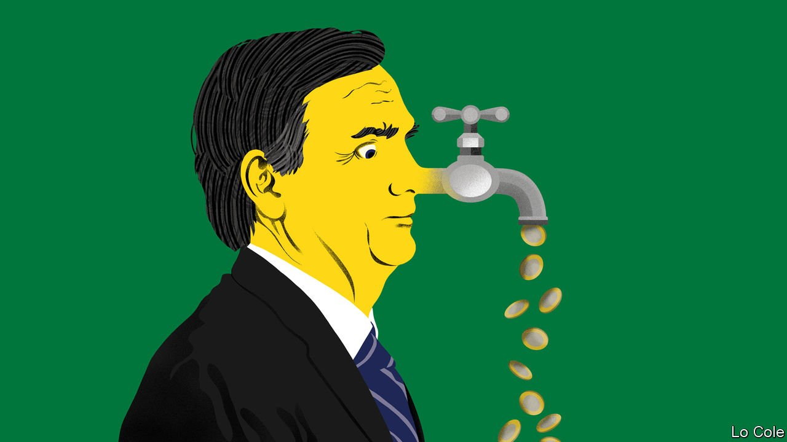

###### Bello

# President Jair Bolsonaro is bad for Brazil’s economy 

##### A constitutional amendment marks a return to fiscal incontinence 

 

> Nov 13th 2021 

IN SEPTEMBER 2019 Paulo Guedes, Brazil’s economy minister, told Congress that it could “make history” by keeping the budget under control, adding that “the political class shouldn’t be chasing ministers, begging for money.” Now Mr Guedes is backing an underhand government attempt to bypass the constitutional cap on public spending set in 2016, which was a crucial step towards righting the country’s finances. He and Jair Bolsonaro, the president, are presiding not just over a return to fiscal incontinence but also to other economic ills that have dogged Brazil: rising inflation, high interest rates and low growth. And the budget shenanigans have in turn created uncertainty about the future of the country’s flagship social programme.

In the election in 2018 Mr Bolsonaro’s alliance with Mr Guedes, a free-market economist, did much to persuade business people to vote for a former army officer of the hard right who had never before shown any interest in liberal economics. Mr Guedes promised radical reform of Brazil’s swollen and inefficient state. But this pledge has resulted only in some useful savings on pensions, legal independence for the central bank and minor regulatory simplifications. Now the reform drive is over, replaced by Mr Bolsonaro’s scramble for money to buy political support and popularity.


To stave off impeachment over his mismanagement of the pandemic and his family’s misdeeds (which they deny), Mr Bolsonaro allied with the centrão, a big coalition of conservative pork-barrel legislators. When covid-19 struck the government declared “a state of calamity”, allowing it to offer big temporary handouts despite the spending cap. Poverty fell in Brazil in 2020, bucking the regional trend, and Mr Bolsonaro’s popularity rose. In March the government won an emergency constitutional amendment, punching a hole in the spending cap, to allow at least some payments to continue. Now the president’s plunging approval rating is reducing his chance of a second term in next year’s election.

A new constitutional amendment would punch two further holes. It would allow the government to delay making payments ordered by courts (such as refunding excess taxes collected). And it would exploit a recent leap in prices by indexing the budget to December’s annual inflation figure (likely to be over 10%) rather than to June’s (8.4%). These changes would give the government an extra 100bn reais ($18.2bn) to play with next year, reckons Marcos Mendes, a former economic adviser to the Senate.

Some of this money would go to Auxílio Brasil, a revamped anti-poverty programme. This will incorporate Bolsa Família, the successful anti-poverty scheme launched in 2003 by the president at the time, Luiz Inácio Lula da Silva. But it will add complexity and uncertainty to it, notes Marcelo Neri, a poverty specialist at the Getulio Vargas Foundation, a think-tank. The government has raised the average permanent benefit by 18%, to 217 reais per month. However, Mr Neri points out that inflation had eroded 32% of its real value since 2014. Mr Bolsonaro has also promised a temporary bonus, so that all 17m families in the scheme will get at least 400 reais a month, but only until December 2022. Not coincidentally, that is just after the election.

Another large chunk of the extra money would go on less worthy causes, including around 18bn reais to finance opaque budget amendments that grant overpriced public-procurement contracts to individual legislators in return for their support for Mr Bolsonaro. These were an innovation devised by the centrão. This week a majority of the Supreme Court ruled these secret clauses illegal. That did not stop the lower house of Congress approving the constitutional amendment on November 9th. Whether it will get through the Senate is unclear.

Either way there will be costs. Defeat would cast doubt on the financing of Auxílio Brasil in the future. But victory would be pyrrhic. Four of Mr Guedes’s senior aides resigned last month because they opposed the amendment (the official gloss was for “personal reasons”). Concern about fiscal policy is the “main fuel for inflation”, says Zeina Latif, an economist in São Paulo. The purpose of the spending cap was to halt the remorseless rise in public spending to satisfy insiders, which is neither redistributive nor efficient in overcoming the bottlenecks that hold back growth. Its weakening shows that Mr Bolsonaro is not just bad for the environment, for human rights and for democracy, but also for Brazil’s economy.

