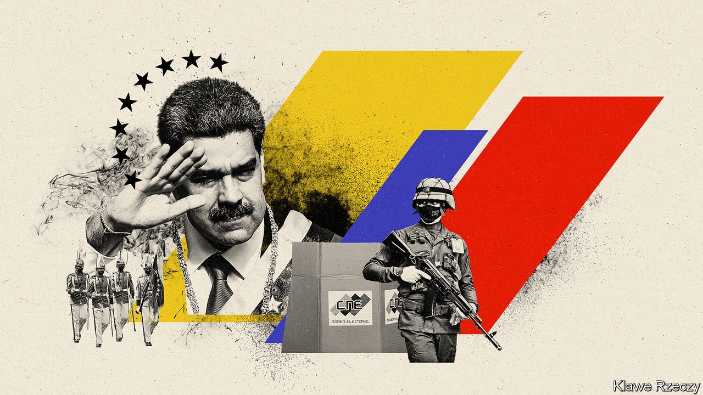

###### How to be a dictator

# Six ways Nicolás Maduro stays in power in Venezuela 

##### With an approval rating of around 15%, he could not possibly win a fair election 

 

> Nov 9th 2021 

“I DON’T SEE how Nicolás Maduro has the capacity to stay for an extended time in government,” said Henrique Capriles, a former presidential candidate, in 2013. “It’s near the end for Maduro,” concluded Ian Bremmer, a political scientist, in 2017. “Maduro’s days are numbered,” promised Mike Pompeo, then the United States’ secretary of state, in 2019.

Venezuela’s president has had the satisfaction of proving them all wrong. Mr Maduro’s demeanour during broadcasts on state TV these days is one of avuncular calm. In October he took viewers on a tour of the presidential palace to show off garish Christmas decorations. “How cute!” he exclaimed, as he pointed at a plastic deer.


Such festive cheer is rare outside the palace. Mr Maduro has overseen one of the worst recessions in world history. Under his incompetent management, Venezuela’s economy has shrunk by 75%. Some 6m people have emigrated: more than a fifth of the population. If fair elections for president were held, it is almost inconceivable that he would win. His support in opinion polls hovers near 15%. But Mr Maduro doesn’t let the little people tell him what to do. Over the past five years his regime has turned from somewhat authoritarian to blatantly so. When Venezuelans go to the polls for municipal elections on November 21st, it is highly unlikely that —who, for a change, are taking part—will get very far. Here are six steps Mr Maduro has taken on the path to autocracy.

Step by step

Most importantly, he has continued and extended the subversion of institutions that began under his predecessor, Hugo Chávez, who was president from 1999 to 2013. After Mr Maduro’s United Socialist Party lost control of parliament in 2015 (in what most observers rate as the last remotely fair election), various measures were put in place to stop the opposition from achieving anything. The Supreme Court was stuffed with loyalist judges. In 2017 the elected parliament was dissolved and replaced with a rubber-stamp constituent assembly. The parliament was later re-established, with a socialist majority, . The electoral authority which oversaw all these changes is flagrantly biased.

Meanwhile, the regime has tightened its grip on broadcast media. Private channels are run by people who sympathise with the regime or who have decided to toe the line. The government has closed down almost all newspapers. Opposition parties are meant to be given equal access to the media ahead of elections, such as those in November, but in practice they are almost completely excluded. An analysis of recent coverage by the main state-owned television channel found that the opposition was not mentioned at all on three of the nine days examined. The rest of the time it is referred to only briefly and disparagingly, as “radical” or “extreme”. Several websites that are critical of Mr Maduro’s regime are blocked.

Having inherited his job from a military man who was both the perpetrator (in 1992) and target (in 2002) of attempted coups, Mr Maduro is keen to avoid any similar unpleasantness. Chávez, while president, created an army loyal to himself, not Venezuela. Mr Maduro gets help from Cuban spies to find and purge potentially troublesome officers. “Believe me, he can be totally ruthless if he needs to be,” says a former government official.

Dozens of officers have been locked up. Some have allegedly been tortured. Last month General Raúl Baduel died in a detention centre run by the security services. A former defence minister, who helped reinstate Chávez as president after the coup plot in 2002, he began to disagree with his former boss in 2007. For most of the rest of his life he was imprisoned on unproven corruption charges, despite pleas from his family for mercy. His daughter says he was murdered. (The government says he died of .)

Officers who support the regime tend to prosper. Under Mr Maduro, the armed forces have informal control of gold- and diamond-mining, for reasons no one can quite explain. Venezuela’s oil industry is not as lucrative as it used to be, thanks to sanctions and mismanagement, but the regime has other ways to reward loyalty. One is to grant cronies permission to build homes in national parks. Officers and officials are thought to be among the owners of lavish mansions that have sprouted in areas supposedly off-limits to construction, including the Caribbean archipelago of Los Roques and the supposedly protected mountain above Caracas.

Some speculated that when Mr Maduro wrecked the economy, it would provoke a mass uprising against his regime. It did not. Many of the angriest and most energetic Venezuelans fled abroad, and now send home cash that helps their relatives survive. Those who stayed have become increasingly dependent upon the state. If they were to rebel, they fear it would let them starve. In 2016 Mr Maduro introduced bi-monthly hand-outs of food. To qualify, recipients need to have an identity card which party loyalists often inspect on election days. The message is clear: with loyalty comes food.

Perhaps Mr Maduro’s most surprising move has been his embrace of the US dollar. Having previously denounced the currency as an imperialist tool, he now says “thank God” it exists. The change , during a six-day power cut which made electronic payments impossible. That forced people to accept the dollar, technically in breach of the law. Since then, the regime has abandoned price controls and a fixed exchange rate and instead embraced the greenback. As of June around 70% of transactions were carried out in dollars. The policy has reduced annual inflation from a peak of over 2,000,000% in 2019 to under 2,000%, which by Mr Maduro’s standards is a success.

The use of dollars has helped simplify the sending of remittances. It has also made life for middle-class folk slightly more tolerable. Across the country, casinos are being re-opened. In the relatively wealthy bubble of eastern Caracas hard-currency stores sell everything from designer ski-wear to organic maple syrup. Cynics call the process pax bodegónica, or peace through delicatessens.

Unlike, say, Saudi Arabia or Afghanistan, Venezuela still pretends it is a democracy. At the start of the 24-day campaigning period before the elections this month Mr Maduro implored people to participate. Voting was “the best demonstration of love for Venezuelan democracy”. But his regime has also shown that, when it is at risk of losing an election, it will cheat, ignore the results, or both.

The tactic has not only enabled the regime to survive. It also appears to have convinced a lot of Venezuelans that democracy does not work. In a survey in October by the Andrés Bello Catholic University in Caracas, just half of respondents said democracy was their preferred form of government, a fall of 18 percentage points since Mr Maduro took office.■

