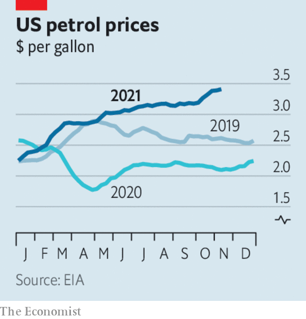

###### The world this week

# Business 

#####  

> Nov 13th 2021 

After years of complaints from investors that its sprawling empire of businesses was hindering profits,  decided to split into three, independently run companies. Its health-care assets will be spun off in 2023; energy and power will be rolled into one and spun off in 2024; and aviation is to remain the sole focus of today’s GE. The conglomerate has been shedding businesses for over a decade. The decision to split heralds the end of arguably the world’s best-known conglomerate, a titan of American business throughout the 20th century.

On the road


 backed by Amazon, had a successful stockmarket debut on the Nasdaq. Its stock rose by 30% above the offer price, giving it a market capitalisation of over $100bn, more than either Ford or General Motors. The company raised around $12bn, making it the biggest IPO in America since Alibaba’s listing in 2014.

At the opposite end of the motoring business, Hertz’s share price fell by 10% on its first day on the stockmarket since the company emerged from bankruptcy.

The European Union’s General Court, the lower tribunal of the Court of Justice, dismissed Google’s appeal against the €2.4bn ($2.8bn) fine that the European Commission imposed on the company in 2017 for anti-competitive practices that favoured its own comparison-shopping service. In the one ray of light for Google, which is also appealing against two other blockbuster antitrust fines in Europe, the court said that general search is not included in its ruling.

Rolls-Royce said it had received enough investment from private partners to start building small modular reactors, or small , in Britain. The government is contributing towards the project as part of its “green industrial revolution”.

Britain’s economic growth rate slowed in the third quarter, to 1.3%. As in other countries, supply-chain problems are hindering the recovery. GDP is still 2.1% smaller than in the final three months of 2019.

Oil prices climbed higher, with Brent crude once again over $85 a barrel. In America the price of petrol at the pump hit an average seven-year high of $3.41 a gallon. California remains the most expensive state in which to fill your car, with petrol averaging $4.64 a gallon, according to the American Automobile Association.

The price of fuel is a big factor behind . The annual rise in the government’s consumer-price index leapt to 6.2% in October, up from 5.4% in September, the largest jump since late 1990. Stubborn inflation is putting pressure on the Federal Reserve to bring forward an interest-rate rise.

Government relief

Meanwhile, the pace of hiring picked up in America, with employers creating 531,000 jobs in October. That is closer to the monthly average for this year and comes after two months of lower-than-expected jobs growth.

The board of Sydney Airport agreed to a A$23.6bn ($17.5bn) buy-out from a consortium of investors. The deal comes amid a sense in the aviation industry that business is really taking off following 20 months of pandemic gloom. America reopened its borders to most travellers this week. Emirates, one of the world’s biggest airlines, reported that passenger numbers were up by 319% from April 1st to September 30th, year on year, though it still made a net loss in the first six months of this year.

After a little over a year as a publicly listed company,  McAfee agreed to a buy-out from a consortium of private-equity firms, in a deal worth $14bn. The computing-security company is to refocus entirely on the consumer market, having sold its enterprise business in July.

Consumers’ voracious appetite for ordering grub from home is feeding a wave of consolidation in the sector. This week DoorDash, America’s largest food-delivery platform, agreed to buy Wolt, based in Helsinki and with operations in 23 countries, for €7bn ($8bn).

Viasat, a satellite company based in California, is to take over Inmarsat, a British rival that counts the American armed forces among its customers, in a $7.3bn transaction. The combined company will compete in the increasingly crowded space for providing satellite broadband.

 


Markets were once again left scratching their heads about the motives behind Elon Musk’s latest stunt, when he asked his Twitter followers whether he should sell 10% of his stake in Tesla to pay tax, in a dig at a Democratic proposal to tax unrealised capital gains. They said yes. Tesla’s share price swooned. Mr Musk then started selling stock. He had planned to sell at least some of his shares before seeking advice from the Twitterati.

