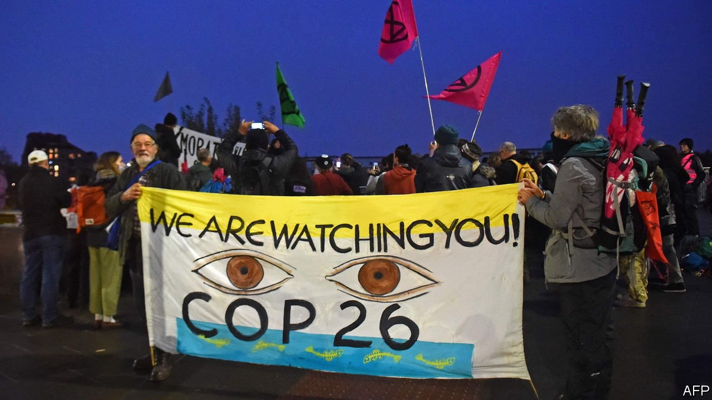
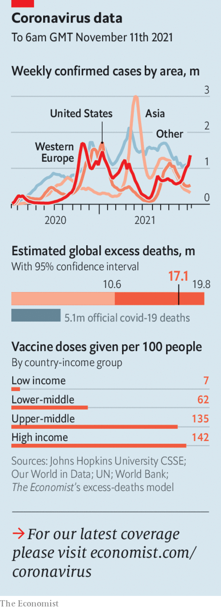

###### The world this week

# Politics 

#####  

 

> Nov 13th 2021 

As delegates haggled over the final drafts at the  in Glasgow, America and China issued a joint declaration to work together to reduce emissions. The two countries said they were committed to keeping the increase in Earth’s mean surface temperature to “well below” 2C compared with pre-industrial levels. China said it would come up with a national plan to curb methane emissions. Time will tell whether their statement was diplomatic showboating or the start of something more substantive.

 at the border with Poland and barring them at gunpoint from retreating. It has been luring them onto flights from the Middle East with false promises of easy passage to the European Union. The migrants cannot enter Poland, and with winter coming, may soon freeze. The despotic regime of Alexander Lukashenko apparently hopes to cause another political crisis in the EU about refugees. Poland has sent 15,000 troops to the area.


The British government announced that National Health Service frontline staff in England will need to be vaccinated against covid-19 by April 1st. The latest government data show that 10% of all NHS employees are not fully jabbed. This week was the deadline for care staff to meet the requirement; around a quarter of those workers have not received their full dose.

The White House urged large companies to press ahead with plans to ensure their staff are vaccinated by early January, after a federal appeals court temporarily suspended Joe Biden’s  vaccine mandate. The court said it had “grave statutory and constitutional” concerns about the order. The government asked it to reverse its decision.

Mr Biden was able to claim a big victory when the House of Representatives at last passed his $1trn . The bill had seemed in peril when left-wing Democrats insisted that welfare legislation should come up for a vote at the same time.

It’ll still be there

NASA pushed back its planned mission to land astronauts on the Moon, its first since 1972, by at least a year, to 2025. A lawsuit brought by Jeff Bezos’s Blue Origin over the contract awarded to SpaceX to build the Moon lander was one reason for the delay (a judge recently dismissed the suit).

, the authoritarian president of Nicaragua, won a fourth consecutive term. Joe Biden called the election a “pantomime”. Over the past six months Mr Ortega has imprisoned some of his potential opponents and forced others to flee. Many hundreds of ordinary people who have protested against his regime in the past remain behind bars.

Chile’s Chamber of Deputies approved impeachment proceedings against Sebastián Piñera, after leaked documents raised more questions about a mining deal that the president’s family signed during his first term in 2010 (he denies wrongdoing). But the opposition will struggle to obtain the two-thirds majority needed to impeach Mr Piñera formally in the Senate.

The Central Committee of China’s Communist Party held an annual meeting at which delegates discussed a resolution on the party’s history, the first of its kind in 40 years. It appeared to be aimed at justifying an extension of Xi Jinping’s rule beyond a party congress in 2022.

America urged China to release Zhang Zhan, a citizen journalist who was sentenced to four years in prison for her reporting on the early days of the covid-19 pandemic in Wuhan. The government continued to battle a new outbreak of the disease that began in mid-October and has caused hundreds of infections.

Thailand’s constitutional court ruled that three activists who called for reforms to the country’s monarchy during protests last year were guilty of attempting to overthrow the king. The court focused on whether the speeches were constitutional, so no penalty was imposed, but the ruling will stifle debate about the monarchy’s role.

The Duterte dynasty

Sara Duterte, the daughter of Rodrigo Duterte, president of the Philippines, withdrew her candidacy for re-election as mayor of Davao City, kindling speculation that she intends to run for a national post in the presidential election next year. Her father will have served the full presidential term allowed.

Mustafa al-Kadhimi, , was the target of an assassination attempt. The attack reportedly involved drones, one of which reached Mr Kadhimi’s home. He was unharmed, though six of his guards were wounded. Suspicion has fallen on Iranian-backed militias.

Iran’s top nuclear negotiator, Ali Bagheri-Kani, visited European capitals ahead of talks with America and European powers aimed at resurrecting the nuclear deal that Iran signed in 2015. Mr Bagheri-Kani seemed to rule out any discussion of Iran’s nuclear activity at the talks, and said that instead they should focus on lifting sanctions. America, which walked away from the deal in 2018, disagrees.

 


France formally handed back to  26 precious artefacts, including statues and a royal throne, that it had taken when it colonised the west African country in the late 19th century. Other former colonial powers are also under pressure to return looted items. These include Britain, which holds more than 900 “Benin bronzes” that were taken from Nigeria.

A South African court said that Manuel Chang, Mozambique’s former finance minister, could be extradited to America. He faces charges there related to kickbacks from loans that funded, among other things, a tuna-fishing firm.

F.W. de Klerk, the last white president of apartheid South Africa, died at the age of 85. He once said that he should not be given the honour of ending apartheid, though Mr de Klerk was instrumental in laying the ground for Nelson Mandela’s release and the subsequent transfer of power.

